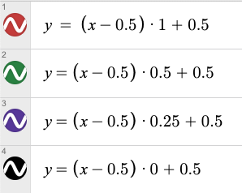
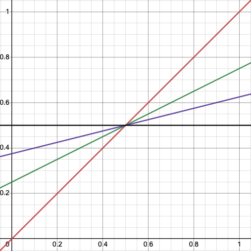
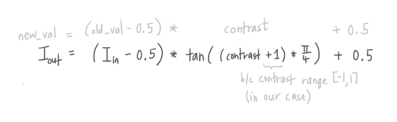
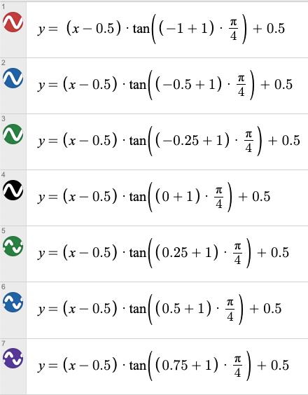
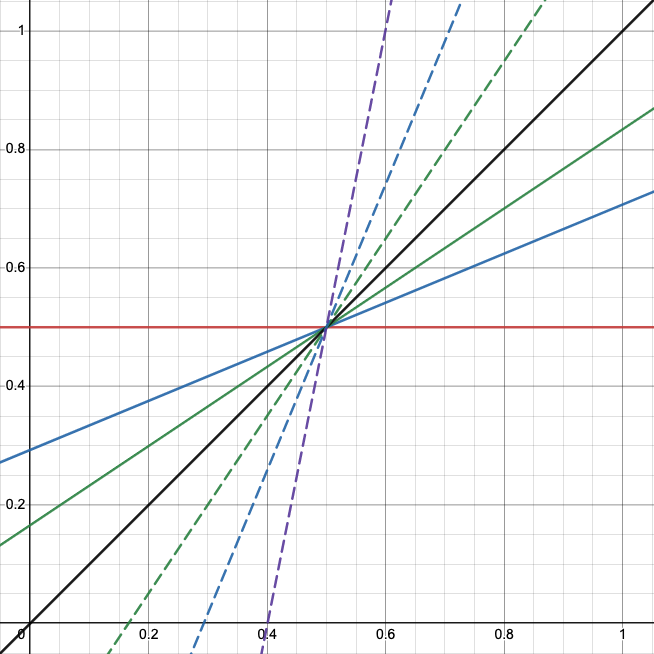
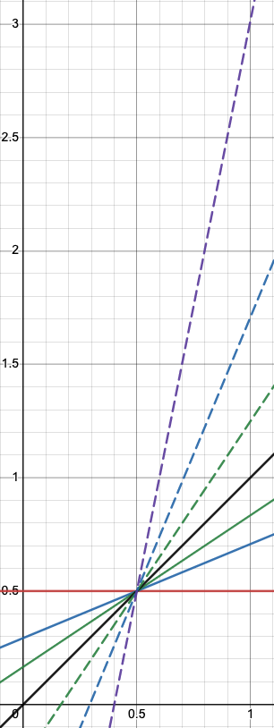

# Notes

Making sure I obtain the *mathematical intuition* behind each image processing filter instead of code-monkey copy-pasta-ing off the internetz.

## Luminance Operations

### Contrast

There are [various formulas for adjusting contrast](https://en.wikipedia.org/wiki/Contrast_(vision)#Formula) and various mathematical definitions of what *contast* is.
* [GIMP formula for contrast](https://en.wikipedia.org/wiki/Image_editing#Contrast_change_and_brightening)

**Luminance contrast** is defined as:
```
luminance_difference / average_luminance
```

Recall, **luminance** is how dark/bright an image is, specifically the value of each color channel: Red, Green, Blue. 

Recall that [**grayscale**](https://en.wikipedia.org/wiki/Grayscale) images only displays the light intensity of each pixel.
* So we can get the average luminance from a grayscale image (according to [this MatLab post](https://www.mathworks.com/matlabcentral/answers/109662-how-to-write-the-code-for-the-average-luminance-of-input-image#answer_118293))

[Another way to think of contrast (GIMP)](https://pippin.gimp.org/image-processing/chap_point.html): changes the range of possible luminance values.
* If you visualize a histogram of luminance values in an image, changing the range of luminance values mean compressing or expanding the histogram around the midpoint value.
* Here the midpoint is `0.5` which corresponds to 50% gray
  * When we add/subtract the midpoint value `0.5`, we are centering the compression/expansion of the histogram around the midpoint
```
new_value = (old_value - 0.5) × contrast + 0.5
```

* When `contrast > 1`, the brighter pixels become brighter and the darker pixels become darker, which expands the range of the luminance histogram
  * The steepness of the function that computes the `new_value` influences how drastic the brightness and darkness becomes
* When `contrast < 1`, the range of possible luminance shrinks

We can visually see the contrast vs. range (possible y values) changes (graphed on [Desmos!](https://www.desmos.com/calculator)):




Back to this funky formula:



In essense, it's the same as `new_value = (old_value - 0.5) × contrast + 0.5`, but we just use an extra fancy function (`tan()`) to mess with the `contrast` value before we compute the new value. 

The luminance histogram ranges still increases linearly:




Now it makes sense that:
* `contrast=0` (black graph) returns the original image
* `contrast=-1` (solid red graph) gives a completely gray image (all possible pixel values map to `0.5` which is middle gray)
* Larger the contrast value, the steeper the function gets, which gives us a larger range of possible values



* The function is undefined when `contrast` reaches `1`
  * This is because `tan()` is undefined at `pi/2`

Makes sense!!! ✨🌈💃


## Color Operations

### Grayscale

[**Grayscale**](https://en.wikipedia.org/wiki/Grayscale) images display the light intensity/luminance of each pixel.

To [convert from color to grayscale](https://en.wikipedia.org/wiki/Grayscale#Converting_color_to_grayscale), we compute the linear luminance (`Y`, from CIE XYZ):

```
(Red, Green, Blue) = pixel
Y = luminance = 0.2126*Red + 0.7152*Green + 0.0722*Blue
```

The coefficients that are multiplied to each color channel is related to how sensitive the average human eye is to the intensity/luminance that color.
* For example, human vision is most sensitive to green (so in the luminance equation, it has the highest coefficient: `0.7152`), and the least sensitve to blue.
* If we add the coefficients, we get `1`:

```
0.2126 + 0.7152 + 0.0722 = 1
```

## Resources

* [Short explanations on GIMP image processing implementations](https://pippin.gimp.org/image-processing/) and other notes on GIMP

