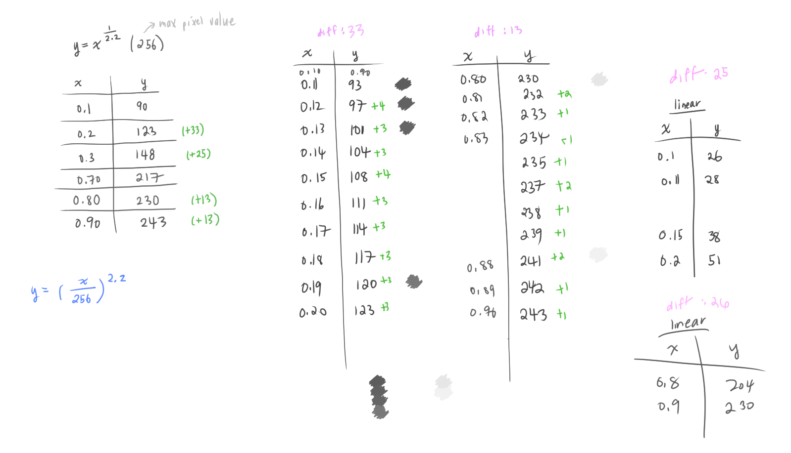

# Notes

Making sure I obtain the *mathematical intuition* behind each image processing filter instead of code-monkey copy-pasta-ing off the internetz.

## Luminance Operations

### Contrast

There are [various formulas for adjusting contrast](https://en.wikipedia.org/wiki/Contrast_(vision)#Formula) and various mathematical definitions of what *contast* is.
* [GIMP formula for contrast](https://en.wikipedia.org/wiki/Image_editing#Contrast_change_and_brightening)

**Luminance contrast** is defined as:
```
luminance_difference / average_luminance
```

Recall, **luminance** is how dark/bright an image is, specifically the value of each color channel: Red, Green, Blue. 

Recall that [**grayscale**](https://en.wikipedia.org/wiki/Grayscale) images only displays the light intensity of each pixel.
* So we can get the average luminance from a grayscale image (according to [this MatLab post](https://www.mathworks.com/matlabcentral/answers/109662-how-to-write-the-code-for-the-average-luminance-of-input-image#answer_118293))

[Another way to think of contrast (GIMP)](https://pippin.gimp.org/image-processing/chap_point.html): changes the range of possible luminance values.
* If you visualize a histogram of luminance values in an image, changing the range of luminance values mean compressing or expanding the histogram around the midpoint value.
* Here the midpoint is `0.5` which corresponds to 50% gray
  * When we add/subtract the midpoint value `0.5`, we are centering the compression/expansion of the histogram around the midpoint
```
new_value = (old_value - 0.5) × contrast + 0.5
```

* When `contrast > 1`, the brighter pixels become brighter and the darker pixels become darker, which expands the range of the luminance histogram
  * The steepness of the function that computes the `new_value` influences how drastic the brightness and darkness becomes
* When `contrast < 1`, the range of possible luminance shrinks

We can visually see the contrast vs. range (possible y values) changes (graphed on [Desmos!](https://www.desmos.com/calculator)):


Back to this funky formula:


In essense, it's the same as `new_value = (old_value - 0.5) × contrast + 0.5`, but we just use an extra fancy function (`tan()`) to mess with the `contrast` value before we compute the new value. 

The luminance histogram ranges still increases linearly:


Now it makes sense that:
* `contrast=0` (black graph) returns the original image
* `contrast=-1` (solid red graph) gives a completely gray image (all possible pixel values map to `0.5` which is middle gray)
* Larger the contrast value, the steeper the function gets, which gives us a larger range of possible values


* The function is undefined when `contrast` reaches `1`
  * This is because `tan()` is undefined at `pi/2`
* We only care about `x: [0, 1]` since that's the range of each pixel value
  * The different `contrast` values yield a different *function*

Makes sense!!! ✨🌈💃

Why `tan()`?
* It maps more nicely to the [-1, 1] range
  * Ex) `new_value = (old_value - 0.5) × contrast + 0.5` can take really large positive or negative numbers forever
* There's probably a better explanation...


### Gamma Correction

I saw gamma correction briefly in the [ray tracer!](https://github.com/atskae/computer-graphics/blob/master/ray-tracing-in-one-weekend/README.md#83-gamma-correction)

[A nice post on gamma correction](https://www.cambridgeincolour.com/tutorials/gamma-correction.htm)
* This is in the context of *cameras*, not a commputer screen...


**Why do we need gamma correction?** Our eyes do not experience brightness the same way cameras do.
* Cameras sense how many photons hit its sensors
  * So twice the # of photons -> twice the resulting brightness
    * To a camera, brightness is linear
    * [Gamma correction (video)](https://www.youtube.com/watch?v=wFx0d9c8WMs&ab_channel=VideoTechExplained)
* Humans are more sensitive to luminance changes in darker tones than in lighter tones
* Humans can percieve darker regions much brighter than they truly are ([Scratchapixel](https://www.scratchapixel.com/lessons/digital-imaging/digital-images)) 🤯
* *Lightness* is how humans percieve the actual luminence
```
lightness ~= luminance ^ (1/3)
```

[Displaying images to the screen (Scratchapixel)](https://www.scratchapixel.com/lessons/digital-imaging/digital-images/display-image-to-screen)
* Now our screen's light intensity is linear (unlike CRTs which has a non-linear function of input voltage vs luminance)
* But we still apply gamma correction because it allows us to have larger varations of luminance for darker shades than lighter shades: **gamma encoding**
  * Apply a gamma `1/γ` to the intensity value, convert it to a byte `[0. 255]` and store this value in the image file
    * Actual luminance goes from `0.1` -> `0.2`, the percieved lightness difference is much larger than actual luminance increasing from `0.8` -> `0.9`



*Gamma encoding* is different from actually displaying the image
* Once we applied *gamma encoding* to an image, we want to display it on a screen *in linear space*
* Apply the inverse gamma to the gamma-encoded image so that we can *perceive* the image brightness as increasing linearly
* Gamma encoding is applied *independent* of the display technology!!
  * It is merely a tool to encode the brightness more efficiently for human perception


TILs
* [**psychophysics**](https://en.wikipedia.org/wiki/Psychophysics) tries to quantify the relationship between physical stimuli and how we perceived them / sensations
* The brightness humans perceived is part of [**Stevens Power Law**](https://en.wikipedia.org/wiki/Stevens%27s_power_law)


I think nothing above had anything to do with the filter OTL

We apply `e^x` to the value from the UI `x`. If `x` is negative, we get a fractional exponent, and otherwise we get a postive value > 1. This gives us to exponent to raise each pixel value (`gamma` value):


With a fractional exponent, we get brighter images, and exponents > 1, we get darker images:


### Vignette
We have the diagonal of the image `D`. Everything outside of `outerR` is black. Everything inside of `innerR` is clear/untouched. The color values between `innerR` and `outerR` slowly become darker.


For **linear falloff**, we see how far the point `(x,y)` is along the image's half-diagonal `D/2`, then we get the proportional of where the point is in the ring that `innerR` and `outerR` creates.

We subtract 1 from the result so that the pixels are brighter toward the center.


## Color Operations

### Grayscale

[**Grayscale**](https://en.wikipedia.org/wiki/Grayscale) images display the light intensity/luminance of each pixel.

To [convert from color to grayscale](https://en.wikipedia.org/wiki/Grayscale#Converting_color_to_grayscale), we compute the linear luminance (`Y`, from CIE XYZ):

```
(Red, Green, Blue) = pixel
Y = luminance = 0.2126*Red + 0.7152*Green + 0.0722*Blue
```

The coefficients that are multiplied to each color channel is related to how sensitive the average human eye is to the intensity/luminance that color.
* For example, human vision is most sensitive to green (so in the luminance equation, it has the highest coefficient: `0.7152`), and the least sensitve to blue.
* If we add the coefficients, we get `1`:

```
0.2126 + 0.7152 + 0.0722 = 1
```

## Resources

* [Short explanations on GIMP image processing implementations](https://pippin.gimp.org/image-processing/) and other notes on GIMP

