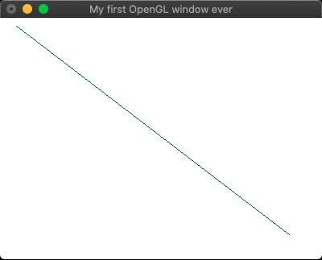

# Introduction to OpenGL

This is just to run the code from the CGOGL textbook, not actually start writing anything useful.

Apparently GLU/GLUT are oooold.

To compile the code on MacOS, run:
```
g++ main.cpp -o test.o -framework OpenGL -framework GLUT
```

Then to run the program, run:
```
./test.o
```

Wahoo!



## Links
* [OpenGL on MacOS](https://methi1999.github.io/2020/08/19/opengl.html)
