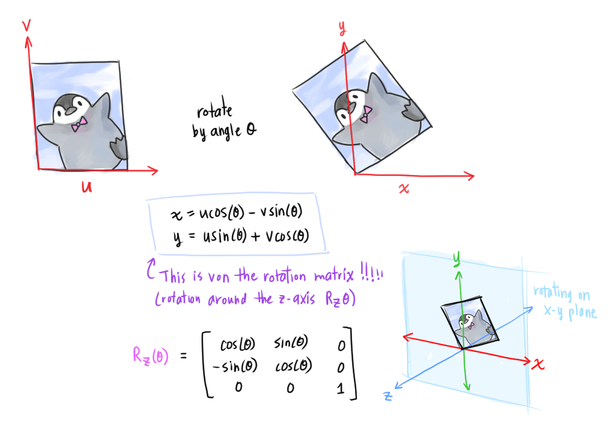
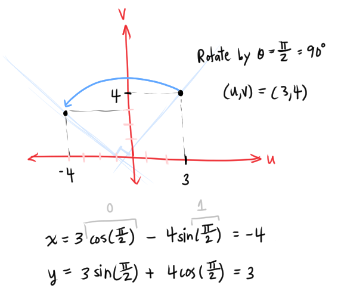
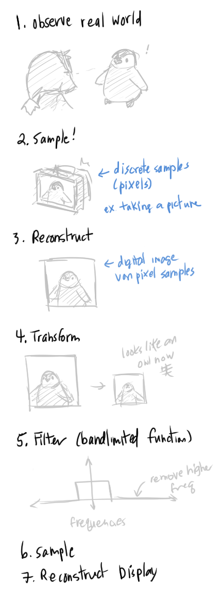
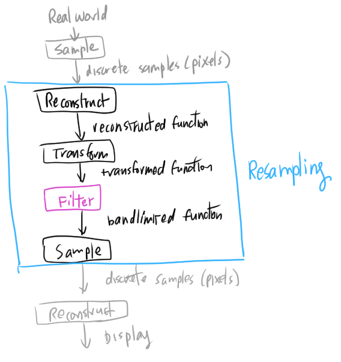
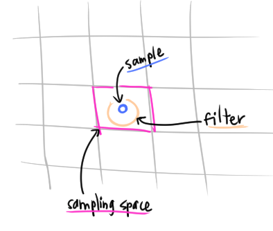
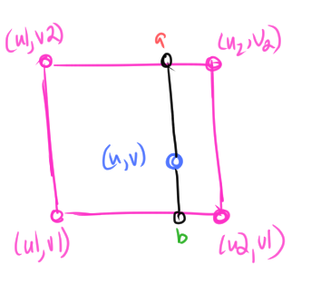

# Sampling, Resampling, and Warping

~~Gonna try notebook and pen for this one... Except for adding links.~~ Ok nevermind hmmm need a besser System.
## Parametric Mappings

Any function of the image pixels `(u, v)`:
```
x = f_x(u)
y = f_y(v)
```

Operations on image with dimensions `(u, v)`:
* Scale by a `factor`
```
x = factor * u
y = factor * v
```

* Rotation ()
```
x = u*cos(θ) - vsin(θ)
y = usin(θ) + vcos(θ)
```



(Ok this was just an excuse to draw a penguin omg so cuute あああああ!!!!! I wasted a good 30 minutes just looking at cute penguin pictures uhhg so cute　あ笑OTL)

The math comes from the [rotation matrix that we derived months ago](https://github.com/atskae/computer-graphics/tree/master/scratch-a-pixel/notes/02-geometry/04-matrices#the-rotation-matrix)!!! 😲 It all makes sense... amazing 😭

Some actual math example



[Shear mapping](https://en.wikipedia.org/wiki/Shear_mapping)
* How we get *italics* (oooooh)

## Digital Image Processing
Recall, digital images are *sampled* versions of continuous ones.

* **Sampling Theory**
  * **Aliasing**: when high frequency signals masquerade as lower frequencty signals

## Temporal Aliasing
Can make an object that is moving in a cycling motion suspended in air.
* [Levitating water drops](https://www.youtube.com/watch?v=LqMFiVkvxQw&ab_channel=isaac879)
* [Stroboscopic effect](https://en.wikipedia.org/wiki/Stroboscopic_effect#:~:text=The%20stroboscopic%20effect%20is%20a,the%20period%20of%20the%20motion.)
  * Illuminate/display objects at a certain frequency relative to the object's motion to create visual illusions
  * [Wagon wheel effect](https://en.wikipedia.org/wiki/Wagon-wheel_effect)
    * A wheel appears to be rotating backwards

Flickering

## Spectral Analysis
* Spacial domain, frequency domain
* Any signal can be written as a sum of periodic functions
* [Fourier transform (3b1b ❤️)](https://www.youtube.com/watch?v=spUNpyF58BY&ab_channel=3Blue1Brown)
    * *Center of mass* is the average position of all parts in a system

* [Nyquist-Shannon sampling theorem](https://en.wikipedia.org/wiki/Nyquist%E2%80%93Shannon_sampling_theorem)
  * A signal is **bandlimited** if it has an upper bound on the highest frequency in the signal
    * The highest frequency in the signal is called the **bandwidth**
    * The sampling rate must be > `2 * bandwidth`
    * The minimum sampling rate required to reconstruct a bandlimited signal with no loss is called the **Nyquist rate**


* [`sinc(x)`](https://en.wikipedia.org/wiki/Sinc_function) (NOT a typo of `sine(x)` OTL)


### Anti-Aliasing
* **Aliasing** when high-frequency signals become computed as low-frequency signals after reconstruction
  * We lose information about the original signal
  * Solutions:
    * Sample at a higher rate, above the Nyquist rate (2*bandwidth)
      * Not always possible
    * Apply a *pre-filter* to the original signal to create a *bandlimited* signal (a signal with an upper bound)
      * Apply a *low-pass filter* to remove high frequencies above the threshold
        * < 1/2 sampling rate
      * We get an image *blur* instead of aliasing

## Image Processing Steps



* **Recontruction** filter import for *magnifying*
* **Bandlimiting** filter important for *minifying*

### Ideal Image Processing filter

* Frequency domain
  * Bandlimit - remove higher frequencies
  * Multiplication
* Spatial domain
  * Convolution!

### Practical Image Processing filter
* **Resampling**: discrete convolution to prevent artifacts
* Finite low-pass filters
  * Point sampling (👎)
    * Round/use nearest sample -> causes aliasing
  * Filters - take the *weighted* average of neighboring samples (*weight*: some pixels are more important thean others in the average)
    * Box filter
    * Triangle filter
    * Gaussian filter



* Triangle and Gaussian filter
  * Width of the filter affects blurriness

Reconstruction filter
* Use if filter is *smaller* than the sampling spacing (the grid bounds)
  * If filter width < 1



* *Use bilinear interpolation*! ([I did this before!!](https://github.com/atskae/computer-graphics/blob/master/ray-tracing-in-one-weekend/README-ray-tracing-the-next-week.md#52-smoothing-out-the-result))



You can also just force the filter width > 1 to not have to lerp(!)

Sampling trade-offs
* Aliasing vs blurring
* Computational speed

### Forward vs Reverse Mapping

(I still don't get how you do *reverse* mapping to do a transform... like start with the result image ??? huh?)

Two options to warp an image:
* Forward mapping
* Reverse mapping

keine Ahnung (aa.)

