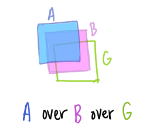
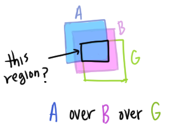
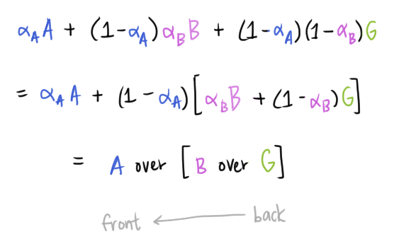

# Compositing and Morphing

## Types of Transparency
* Refraction 🐌: light is bent as it goes through a different medium
  * Caustics: *focus* light
    * ex) Underwater light patterns
  * Dispersion: refraction based on color
    * ex) Glass prism splitting white light into different colors
* [Subsurface scattering](https://en.wikipedia.org/wiki/Subsurface_scattering)
  * Light leaves the transparent medium at a different point from where the light entered
  * ex) a backlit hand...
  * TODO draw some examples!

**Compositiing**: Separating an image into *layers* of known order
* *pixelwise* combination*: each layer can have varying opacities

Image composition main goals:
* Separating image components into layers
* Blend layers into a single image seamlessly

## Image Matting
**Image matting** is trying to separate out the foreground objects from the background

* *Chroma keying* (green screen)
  * Photograph object in front of a screen with known color
* Can do this manually (draw around the object)
* Separate out object by detecting edges
* [Flash matting](http://www.jiansun.org/papers/FlashMatting_SIGGRAPH06.pdf)
* [Portrait mode on smartphones](https://arxiv.org/abs/1806.04171)

## Image Blending

Components:
* Foreground objects (with 1-color backgrounds)
* Background image

### Blending with the Alpha channel
* *Alpha channel* is the transparency of the pixel
  * Implementation: a linear interpolation between the foreground and background pixel
* `α=1`: opaque (not see-through)
* `α=0`: transparent (completely see-through)

[Alpha blending "Over" operator](https://en.wikipedia.org/wiki/Alpha_compositing)
```
C = A over B
C = α_A*A + (1-α_B)*B
```

### Compositing Algebra

Let's say we have `A over B over G`:



* How much of `B` is blocked by `A`? `α_A`
* How much of `B` shows through `A`? `(1-α_A)`
* How much of `G` shows through `A` and `B`? `(1-α_A)*(1-α_B)`
  * Multiplication, not addition...





We apply the "over" operator starting from the back of the image and going toward the front of the image
* Right-associative

Other composition operations
* Composition algebra
* How the mask operation works in Photoshop! and other layer operations
* [Porter/Duff Compositing and Blend modes](http://ssp.impulsetrain.com/porterduff.html)

### [Poisson Image Blending](https://www.cs.jhu.edu/~misha/Fall07/Papers/Perez03.pdf)
* "Elipses tool -> copy -> paste to new image -> blend into image!"

## Morph
* Animate transition between two images

Cross-dissolving
* Blend images with the "over" operator over time
* Bottom image starts at `α=1` and top image starts at `α=0`
  * By the end of the time duration, bottom image is `α=0` and the top image is `α=1`
  * Transition over time
```
blend(i, j) = (1-t)src(i, j) + t*dst(i, j) # (0 <= t <= 1)
```

*Image morphing* uses both cross-dissolving and warping.

[Feature-based Image Metamorphosis](https://www.cs.princeton.edu/courses/archive/spring22/cos426/readings/Beier92.pdf)
* [Implementation notes from Brown University](http://cs.brown.edu/courses/csci1950-g/results/proj5/edwallac/)

### Image Composition Applications
* **Computational photography**
  * Photographic effects that use multiple images and computation
* Example use-cases
  * Stitching images in a panorama
  * Stoboscopic iamges
  * Extended depth of field

[Scene completion using millions of photographs (2007)](http://graphics.cs.cmu.edu/projects/scene-completion/)
* Take an image, crop out an object
  * Fill in the image seamlessly with what was underneath the object
    * Using millions of images to figure out what is underneath?
 