# 3D Modeling

**3D modeling**: representing 3D objects
* How to store/transport these representations
* How to manipulate the models

## Modeling Background

A *scene* is approximated by 3D primitives:
* Points, vectors, lines (line segments and lines), rays, planes, polygons

### 3D point `(x,y,z)`

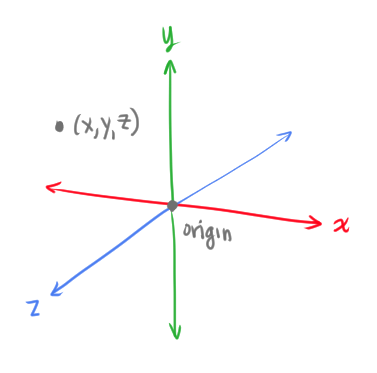

### 3D vector

`V = (dx, dy, dz)`
* Indicates a direction and magnitiude
* Magnitiude = `||V|| = sqrt(dx^2 + dy^2 + dz^2)`
* Has no location

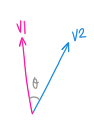

The **dot product** of two 3D vectors
```
V1 ⋅ V2 = ||V1|| ||V2|| cos(θ)
```
*  The dot product of two vectors is zero if they are *orthogonal*

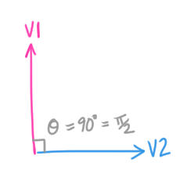

The **cross product** of two 3D vectors gives us a vector that is perpendicular to the two vectors
```
V3 = V1 x V2 
``` 
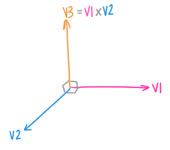

```
|| V1 x V2 || = ||V1|| ||V2|| sin(θ)
```
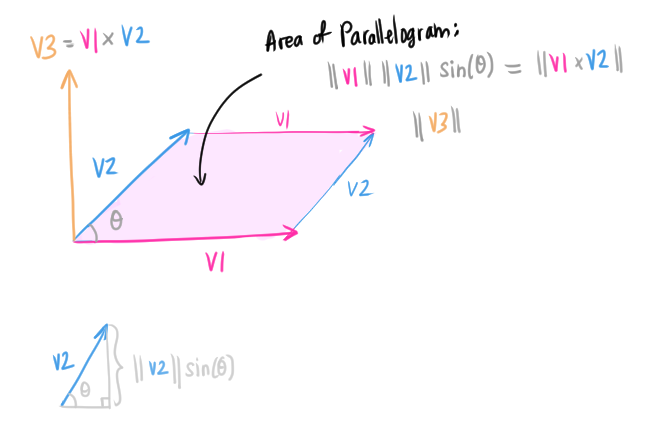

### Line segment
A line between two points

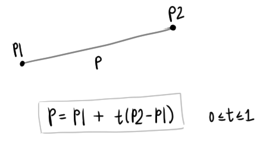

### 3D ray
* A line segment with one endpoint at infinity
* Represent as a point `P` and a vector `V`

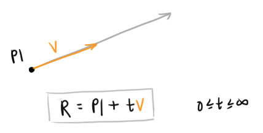

### 3D line
A line with both endpoints at infinity

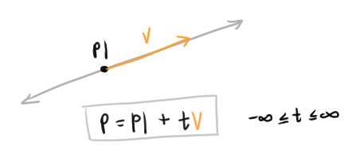

### 3D Plane
Represented by three 3D points in 3D space
* The 3D plane is a *linear combination* of the three points
* Vector `N` is the plane's **normal** vector
  * Unit length, perpendicular to the plane

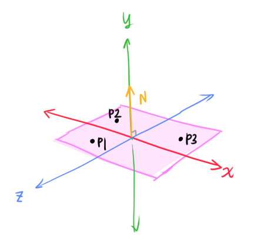

Implicit representations of a plane 🤷‍♀️
```
# Dotting any of the points on the plane with the normal vector gives you zero
# because N is perpendicular to the plane
P⋅N - d = 0

# (P-P1) is any vector on the plane
N⋅(P-P1) = 0

# Plane equation
# Ex. x + 2y - 3z + 1 = 0
ax + by + cz + d = 0
```

where `d` is the distance from the origin, and normal vector `N = (a,b,c)`.

A plane representation in code:
```cpp
typedef struct {
    Vector N;
    Distance d;
} Plane;
```

### Polygon
A set of points in the same plane
* Points are ordered *counter-clockwise*

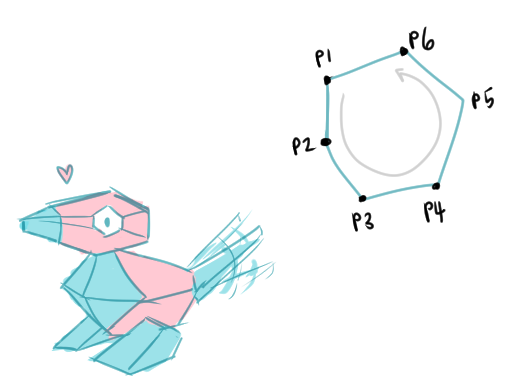
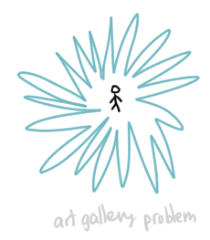

## 3D Object Representation
Possible ways to represent a 3D object:
* Points
* Surfaces
* Solids
* High-level structures

**Equivalence of representations**: each representation is able to model any geometric object
* Similar to the idea of *Turing Equivalence*
  * Ex. we can use different programming language to implement the same problem
    * But different languages have their own unique benefits
* (Sep 7: crazy that I *just* read about Turing equivalence this morning in The Biography of a Pixel 🤖!)
* We can use different representations to perform different tasks more efficiently
  * Ex tasks: rendering, animation, analysis, ...
  * *Data structures determine algorithms*

Graphics tasks:
* **Acquisition**: capturing images/visual data
  * Ex. range scanning, computer vision, tomography (generate a 3D model of a cross section, ex. X-rays)
* **Analysis**
  * Ex. *Fairing*: make a surface smooth to remove noise

(There's a whole bunch more! Too lazy to write them out :oD)

Back to the 3D object representations.

### Points

* **Range Image**: A set of 3D points that map to pixels in an image
* **Point cloud**: Unstructured set of 3D points samples from acquisition

### Surfaces

* **Polygon mesh**: a connected set of polygons (often triangles)
* [**Subdivision surface**](https://en.wikipedia.org/wiki/Subdivision_surface)
  * Sub-divide the polygons to create a smoother surface
* [**Parametric surfaces**](https://en.wikipedia.org/wiki/Parametric_surface#:~:text=A%20parametric%20surface%20is%20a,as%20well%20as%20implicit%20representation.): represent a surface with a parametric equation
  * Tensor-product spline patches
    * Each patch is parametric function
* [**Implicit surface**](https://en.wikipedia.org/wiki/Implicit_surface)
  * A set of all points where `F(x,y,z)=0`
    * A set of zeros of a function
  * Examples
    * The sphere `x^2 + y^2 + z^2 - 4 = 0`
    * The plane `x + 2y - 3z + 1 = 0`

### Solids

* **Voxel grid**: uniform 3D grid of samples
  * Each voxel can contain information such as:
    * Occupancy (object or empty space)
    * Density
    * Color
    * Speed, temperature, other stuffz
  * Often acquired by simulation or CAT, MRI, ...
  * **Octtree**: space-efficient voxel grid
 * **BSP tree**: hierarchical **B**inary **S**pace **P**artition
   * Each cell is labeled "solid" or "empty"
* CSG: **C**onstructive **S**olid **G**eometry
  * Set operations: union, difference, intersection, applied to simple shapes

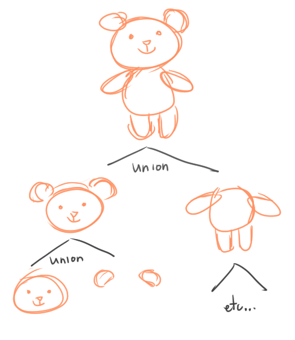

### High-level Structures
* Particle simulation, architectural floorplans
* Application-specific representations

### Taxonomy of 3D representions

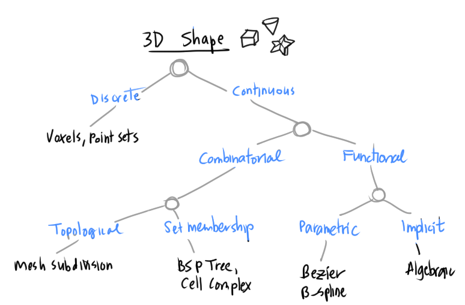

**Equivalence of Representations**: any model can be expressed with any of these 3D representions
* All geometric operations can be done to any representation
* The *Turing-equivalence* for 3D models

Computational differences for each 3D representation
* Efficiency
  *  How complex the representation is
  *  Computational complexity, runtime
  *  Space/time trade-offs
  *  Numerical accuracy
*  Simplicity
   *  How easy it is to acquire the 3D model
   *  Software creation/maintenance
*  Usability
   *  UI, computational engine

