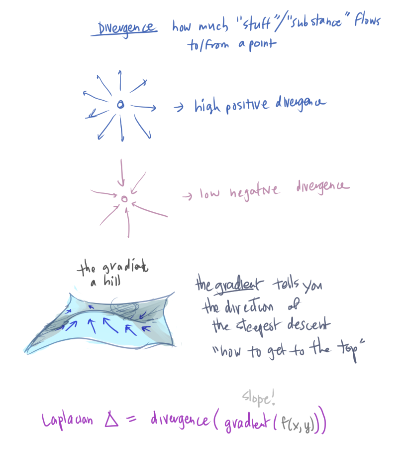
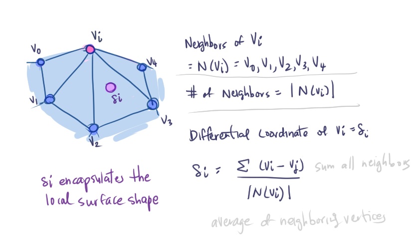
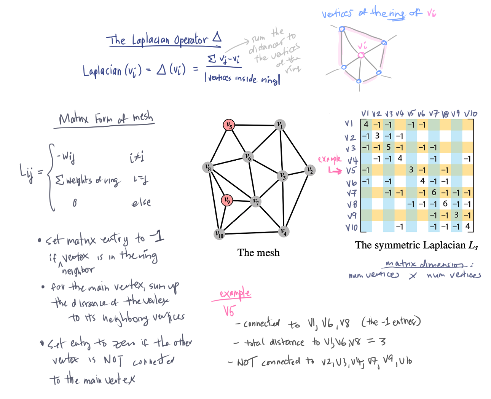
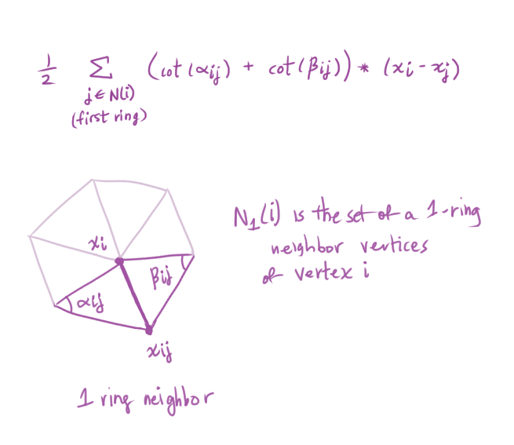
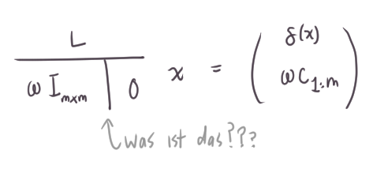
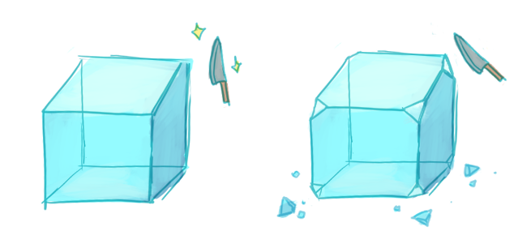
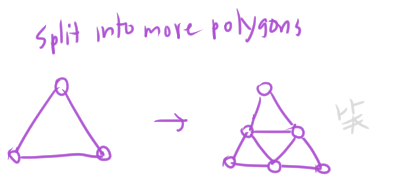

# Polygon Meshes

*Polygon mesh*: a 3D surface represention
* A set of polygons representing a 2D surface in 3D

[**Platonic solid**](https://en.wikipedia.org/wiki/Platonic_solid)
* TIL a *geometer* is someone who studies geometry
* The name *platonic* comes from the philosopher Plato

The platonic solids:


Why are polygon meshes used?
* Simple, common representation
* Hardware support for efficient rendering
* Many acquisition tools generate polygon meshes

General pipeline: acquisition -> representation -> processing

## Acquisition

* Interactive modeling tools
  * Ex. SketchUp, Blender
* 3D scanners
* [Procedural generation](https://en.wikipedia.org/wiki/Procedural_generation)
* Simulations
    * [symscape](https://www.symscape.com/): computational fluid dynamics
 
## Representation

Concerns of representing polygon meshes
* Can quickly traverse and update topology
* Efficient use of memory

**Independent faces**
* Have a list of vertice for each polygon face
* [Polygon soup](https://en.wikipedia.org/wiki/Polygon_soup)


**Vertex and face tables**
* Store vertex points in vertex table, and the vertices of faces in face table


**Adjacency list**
Use adjacency list to store vertices, edges, and faces. Store adjacent elements for each.


**Partial adjacency lists**: store adjacency information of some elements and derives others later
* Use [winged edge data structure](https://en.wikipedia.org/wiki/Winged_edge#:~:text=In%20computer%20graphics%2C%20the%20winged,edge%20records%2C%20and%20face%20records.)


References that each element (vertex, face, edge) holds:

```cpp
// An entry in the Vertex Table
class Vertex {
    // Position
    float x, y, z;
    // Incident edge
    // Other edges could be found by following the references to this edge
    Edge* edge;
}

// An entry in the Face Table
class Face {
    // An edge surrounding this face
    // Can figure out CW or CCW by comparing this edge's left and right faces
    Edge* edge;
}

// An entry in the Edge Table
// A directed edge
class Edge {
    // Vertices that make up this edge
    Vertex* vertex_origin;
    Vertex* vertex_destination;

    // Faces on both sides of this edge 
    Face* face_left;
    Face* face_right;

    // Four edges to the previous and next edges that surround the left and right face
    // cw = clockwise
    // ccw = counter-clockwise
    Edge* cw_left_edge;
    Edge* ccw_left_edge;
    Edge* cw_right_edge;
    Edge* ccw_right_edge;
}
```

[**Half edge data structure**](https://en.wikipedia.org/wiki/Doubly_connected_edge_list)


Every node and edge is associated with a half-edge (no need for "ifs")

What each element stores in the half-edge setup:
```cpp
class Vertex {
    HalfEdge* outgoing_half_edge;
}

class Face {
    HalfEdge* adjacent_half_edge;
}

class HalfEdge {
    HalfEdge* twin_half_edge;
    
    // Counter-clockwise direction
    HalfEdge* next_half_edge;
    
    Vertex* next_vertex;
    Face* incident_face;   
}
```

Another view of the relationship (I stole this diagram from [this explanation](https://jerryyin.info/geometry-processing-algorithms/half-edge/))


* Can find adjacent edges, faces, vertices, in O(1) time

## Processing


Processing polygon meshes involve:
* Analysis
* Warps
* Filters

### Analysis

* Normals
* Curvature

Finding the normal vector of each face (**face normals**)
  * Use cross product


Face normals vs vertex normals:


* [**Vertex normal**](https://en.wikipedia.org/wiki/Vertex_normal)
* To calculate the vertex normal of a vertex, we sum up the face normals of the faces adjacent to the vertex, then normalize
  * (how does this math work out...)

Curvature maps, color-coded curvatures
* Find best-fit circle of a curve ???

### Warps

* Rotate
* Deform

### Filters

* Smooth
* Sharpen
* Truncate
* Bevel

Smoothing out a surface
* The Laplacian Operator
  * [Laplacian intuition (video by サンダアサンさん!)](https://www.khanacademy.org/math/multivariable-calculus/multivariable-derivatives/laplacian/v/laplacian-intuition)
  * Ok I think is is slightly different

    

[**Laplacian Mesh Processing (Sorkine 2005)**](https://people.eecs.berkeley.edu/~jrs/meshpapers/Sorkine.pdf)

* Uses the [**Discrete Laplacian operator**](https://en.wikipedia.org/wiki/Discrete_Laplace_operator), which is the Laplace operator on a discrete graph/grid



Laplacian Operator in matrix form:



Preguntas:
* Aren't the vertices in the ring of `v_i` = the neighbors of `v_i`? Why introduce a new term for the same(?) thing?

Meshes are irregular, so **cotangent weights** can be used as weights that are correlated to the angles opposite of an edge.
* This creates a better approximation of the geometric attributes (ex. normal vectors, curvature) of the triangle mesh
* Proposed in [Discrete Differential-Geometry Operators
for Triangulated 2-Manifolds](http://multires.caltech.edu/pubs/diffGeoOps.pdf)
* [**Differential geometry**](https://en.wikipedia.org/wiki/Differential_geometry): the study of smooth shapes and smooth spaces



-shrug- ...

Solve constrained Laplacian Optimization
???!
* In the [same paper (Sorkine 05)](https://people.eecs.berkeley.edu/~jrs/meshpapers/Sorkine.pdf)

What is this operator?



How do I even look this up? I tried:
* "What is a vertical line in denominator"
* "Linear system bar operator"
* "Linear system notation"
* "What is | in math?"
  * [Glossary of Mathematical symbols](https://en.wikipedia.org/wiki/Glossary_of_mathematical_symbols)
  * Discovered the [Bourbaki dangerous bend symbol](https://en.wikipedia.org/wiki/Bourbaki_dangerous_bend_symbol)
    * "Marks passages as tricky on the first reading or with an especially difficult argument"
    * "...designed to forewarn the reader against serious errors, where he risks falling;"
* "Linear system symbol"

Ok I give up for now OTL

`<edit>`

OK this vertical bar means add a column of zeros to the matrix!!
TODO: go back to this formula thing and figure out what's it's doing

At a high level, the formula is trying to find the original coordinates of the polygon mesh given the approximation represented by the differential coordinates

`</edit>`

Laplacian Operator applications
* Deformation
* Blending by concatenating rows in matrix (?)
* Hole filling
* Coating, detail transfer
  * Adding surface textures on top of another surface?
* Spectral mesh processing through eigen analysis
  * [**Spectral method**](https://en.wikipedia.org/wiki/Spectral_method) are techniques to solve certain differential equations
    * Write a solution of the differential equation as a sum of "basic" functions
      * Ex. fourier series as a sum of sinusoids
    * Then choose coefficients in the sum to satsify the differential equation as best as possible
    * Examines the eigen-values/vectors/space projections
      * [Math is fun](https://www.mathsisfun.com/algebra/eigenvalue.html) on eigenvalues and eigenvectors in general:
        * It allows us to do transformations in space
        * Eigenvector is "the direction that doesn't change direction" in a (stretch?) transformation
        * Eigenvalue is the scale of the stretch
          * 1 means no change, 2 means double in length, -1 means point backwards...
  * [Spectral mesh processing](https://www.cs.sfu.ca/~haoz/pubs/zhang_cgf10_spect_survey.pdf)
    * A survey paper on a variety of spectral methods in general

Back to other Polygonal Mesh Processing

Filters
* Sharpen 3D models
* Truncate
  * *Truncating a polyhedra* means the corners are cut off
    
    
    
    * [Nice visual here!](http://www.matematicasvisuales.com/english/html/geometry/space/truncatedcubeoctahedron.html#:~:text=Truncating%20a%20polyhedron%20means%20that,(semi%2Dregular%20polyhedra).)

  * [Archimedean solid](https://en.wikipedia.org/wiki/Archimedean_solid)

## More Polygonal Mesh Processing

Remeshing, topological fixup, boolean operations

### Remeshing
Subdivide, [subdivision surface](https://en.wikipedia.org/wiki/Subdivision_surface)
* Coarser polygon mesh



* [Fractal landscapes](https://en.wikipedia.org/wiki/Fractal_landscape)
  * Apply subdivide to mimic the appearance of natural terrain
  * Fractal behavior
  * [Terragen](https://en.wikipedia.org/wiki/Terragen) software for scenery generator

Resampling
* Create more uniform distribution of polygons

Simplify
* Opposite of subdivide? Combine polygons

### Topological Fixup

Filling holes
*  [Fill gaps of a polygon mesh with polygons](https://knowledge.autodesk.com/support/maya/learn-explore/caas/CloudHelp/cloudhelp/2020/ENU/Maya-Modeling/files/GUID-83ECB78E-950F-455D-B43E-47D76F3F9912-htm.html)

Fix self-intersections

### Boolean Operations
* Crop, subtract, etc.
* Intersection, subtraction, addition

## Summary

Pros/cons of polygon meshes

Pros:
* Efficient display, HW support
* Aquisition tools capture in polygon mesh

Cons:
* Not accurate? Difficult to edit and validate, not guaranteed smoothness, ...

