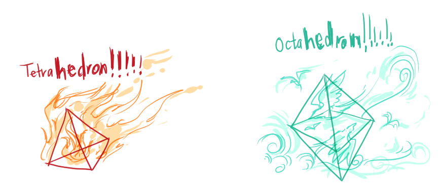
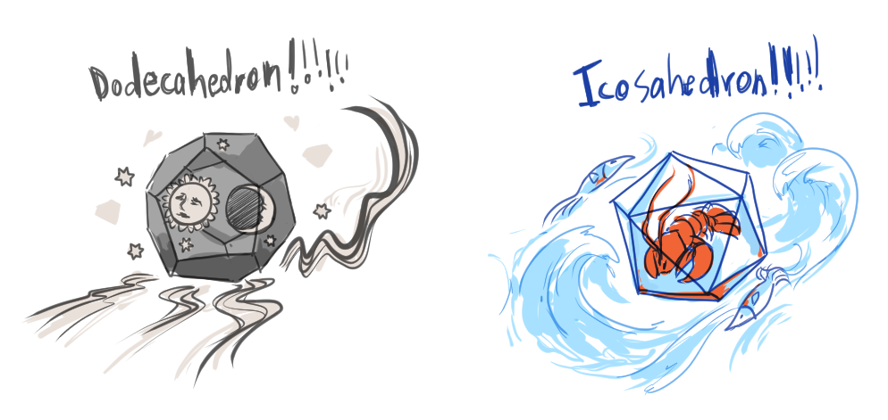
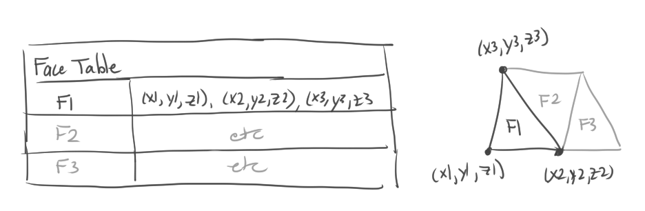
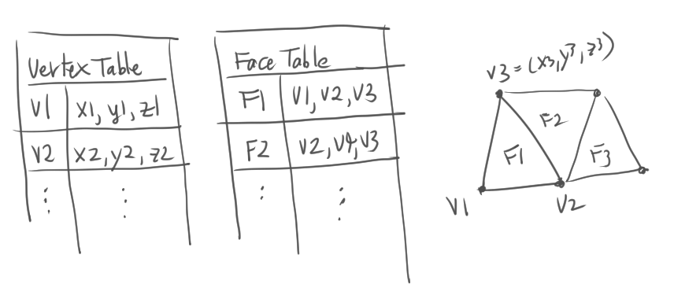
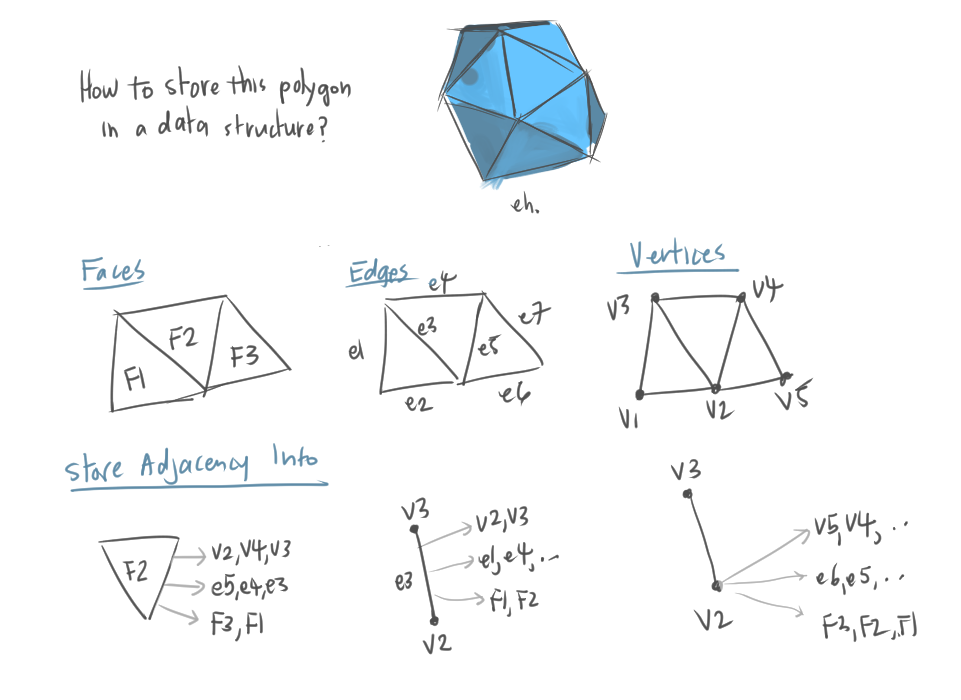
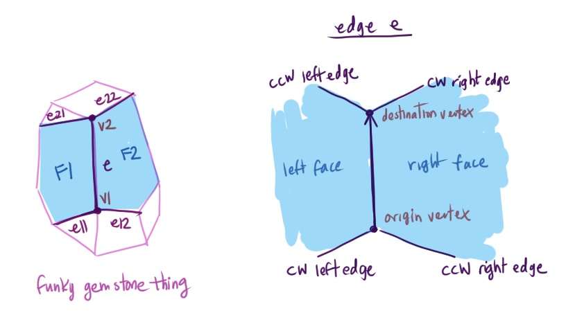
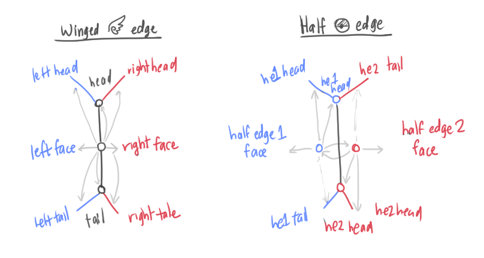
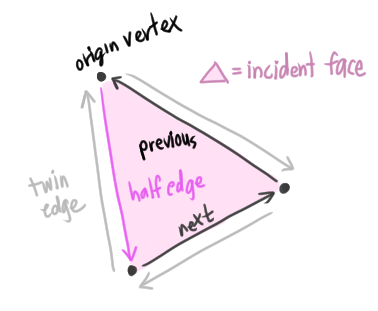
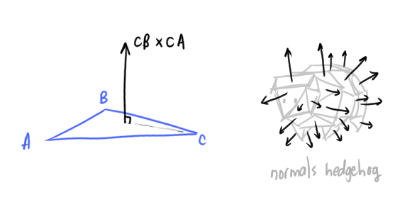
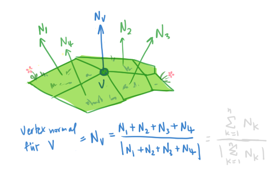

# Polygon Meshes

*Polygon mesh*: a 3D surface represention
* A set of polygons representing a 2D surface in 3D

[**Platonic solid**](https://en.wikipedia.org/wiki/Platonic_solid)
* TIL a *geometer* is someone who studies geometry
* The name *platonic* comes from the philosopher Plato

The platonic solids:






Why are polygon meshes used?
* Simple, common representation
* Hardware support for efficient rendering
* Many acquisition tools generate polygon meshes

General pipeline: acquisition -> representation -> processing

## Acquisition

* Interactive modeling tools
  * Ex. SketchUp, Blender
* 3D scanners
* [Procedural generation](https://en.wikipedia.org/wiki/Procedural_generation)
* Simulations
    * [symscape](https://www.symscape.com/): computational fluid dynamics
 
## Representation

Concerns of representing polygon meshes
* Can quickly traverse and update topology
* Efficient use of memory

**Independent faces**
* Have a list of vertice for each polygon face
* [Polygon soup](https://en.wikipedia.org/wiki/Polygon_soup)



**Vertex and face tables**
* Store vertex points in vertex table, and the vertices of faces in face table



**Adjacency list**
Use adjacency list to store vertices, edges, and faces. Store adjacent elements for each.



**Partial adjacency lists**: store adjacency information of some elements and derives others later
* Use [winged edge data structure](https://en.wikipedia.org/wiki/Winged_edge#:~:text=In%20computer%20graphics%2C%20the%20winged,edge%20records%2C%20and%20face%20records.)



References that each element (vertex, face, edge) holds:

```cpp
// An entry in the Vertex Table
class Vertex {
    // Position
    float x, y, z;
    // Incident edge
    // Other edges could be found by following the references to this edge
    Edge* edge;
}

// An entry in the Face Table
class Face {
    // An edge surrounding this face
    // Can figure out CW or CCW by comparing this edge's left and right faces
    Edge* edge;
}

// An entry in the Edge Table
// A directed edge
class Edge {
    // Vertices that make up this edge
    Vertex* vertex_origin;
    Vertex* vertex_destination;

    // Faces on both sides of this edge 
    Face* face_left;
    Face* face_right;

    // Four edges to the previous and next edges that surround the left and right face
    // cw = clockwise
    // ccw = counter-clockwise
    Edge* cw_left_edge;
    Edge* ccw_left_edge;
    Edge* cw_right_edge;
    Edge* ccw_right_edge;
}
```

[**Half edge data structure**](https://en.wikipedia.org/wiki/Doubly_connected_edge_list)



Every node and edge is associated with a half-edge (no need for "ifs")

What each element stores in the half-edge setup:
```cpp
class Vertex {
    HalfEdge* outgoing_half_edge;
}

class Face {
    HalfEdge* adjacent_half_edge;
}

class HalfEdge {
    HalfEdge* twin_half_edge;
    
    // Counter-clockwise direction
    HalfEdge* next_half_edge;
    
    Vertex* next_vertex;
    Face* incident_face;   
}
```

Another view of the relationship (I stole this diagram from [this explanation](https://jerryyin.info/geometry-processing-algorithms/half-edge/))



* Can find adjacent edges, faces, vertices, in O(1) time

## Processing


Processing polygon meshes involve:
* Analysis
* Warps
* Filters

### Analysis

* Normals
* Curvature

Finding the normal vector of each face (**face normals**)
  * Use cross product



Face normals vs vertex normals:



Curvature maps, color-coded curvatures
* Find best-fit circle of a curve ???

### Warps

* Rotate
* Deform

### Filters

* Smooth
* Sharpen
* Truncate
* Bevel

Smoothing out a surface
* The Laplacian Operator
* 