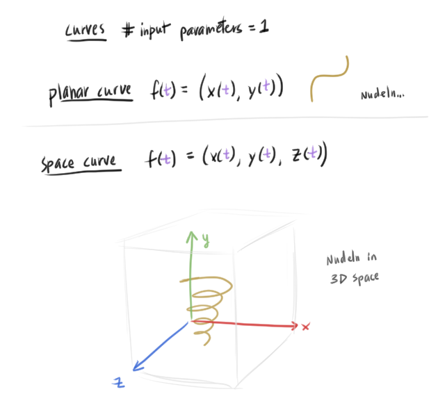
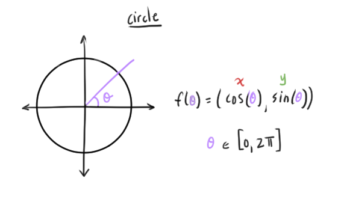
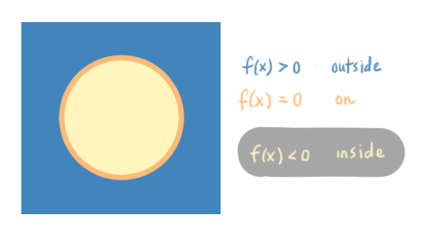

# 01 Shape Representation

## Object source

Depending on the domain, objects are obtained:
* From the real world (ex. scanning physical objects)
* Create in the digital world (modeling digitally)
* Procedurally generated

## Shape Representation/Data Considerations

Needs:
* Stored digitally on a computer
* Shape data easily opened, modified, and saved
* Modification operations: smoothing, repairing, etc.
* Can be rendered
  * Rasterization
  * Ray tracing

Shapes are represented by:
* Points
* Polygon meshes
* Parametric surfaces
* Implicit functions
* Subdivision surfaces

### Points

A **point** is a tuple of 3 values representing a position in space.

* Points are the typical representation of objects obtained from 3D scanners
  * Later converted to other shape representation (ex. meshes)

### Spatial Data Structures
* Regular uniform 3D lattice
* Octree
  * Splits cells into 8, regardless of where the points are
* Kd-tree (how natskash)
  * Splits the space based on the median of the points (balanced tree)

## Parametric Curves and Surfaces

A **parametric equation**, in the context of shape representation, describes where a point is, as a function of one or more *parameters*.

With one parameter, we get a *parametric curve*.
With two parameters, we get a *parametric surface*.

### Parametric Curves

* Planar/plane curve - a curve on a plane (2D)
  * ex) parabola, circle, hyperbola, bézier curves, splines
* Space curve  - a curve in 3D space
  * ex) helix (a spring-like curve)

### Parametric Surfaces
* Sphere
* Bézier surface

### Pros/Cons 

* Easy to compute points
* But hard to determine if, given a point, if that point is on/inside/outside the curve/surface

## Implicit Curves and Surfaces

Implicit curves/surfaces are represented by a scalar function (output is scalar):
* Curve in 2D: `f((x,y)) | f((x,y)) = 0`, point `p=(x,y)`
* Surface in 3D: `f((x,y,z)) | f((x,y,z)) = 0`, point `p=(x,y,z)`

Example implicit curves:
* Lines `x + y - b = 0`, scalar `b`
* Circles `x^2 + y^2 - r^2 = 0`, with radius `r`

Example implicit surface:
* Sphere `x^2 + y^2 + z^2 - r^2 = 0`, with radius `r`

The function determines where a point `p` is relative to the curve/surface:
* f(p) > 0 -> point is outside
* f(p) == 0 -> point is on the curve/surface
* f(p) < 0 -> point is inside

### Normal

The normal of a surface/curve is the gradient of the implicit function.
