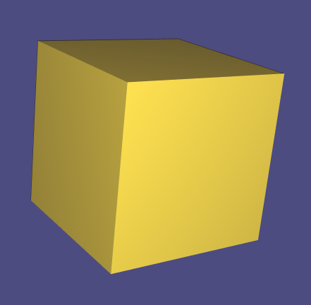
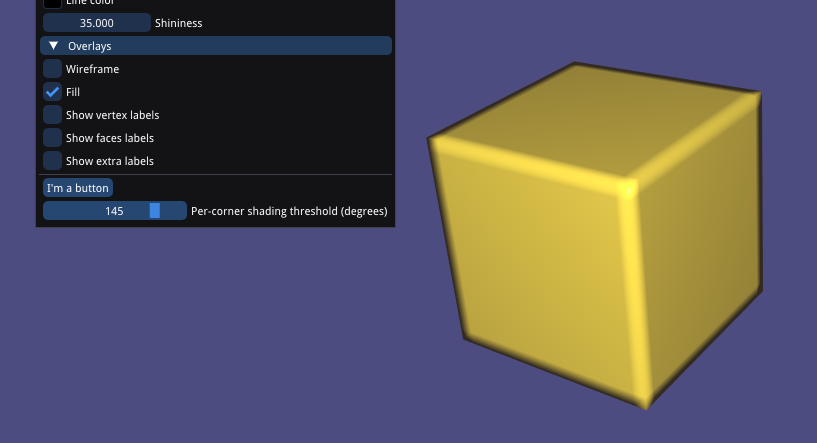

# Exercise 1

## Build and Run

First configure CMake in the `e1` directory:
```
mkdir build
cd build
cmake -DCMAKE_BUILD_TYPE=Release ..
```

Then while still in the `build` directory, run:
```
make
```

This will build an executable `e1`:
```
./e1
```

## Adjacent

### Adjacent Faces

We can find all the adjacent faces to a vertex with:
```cpp
igl::vertex_triangle_adjacency(V, F, VF, VFi);
```

Given a matrix of vertices `V` (row = vertex_index, col = actual vertex values themselves) and a matrix of faces `F` (for each face (row), a list of indices into `V` - these are the vertices of the face), `VF` will be populated with all adjacent faces for each vertex.

`VF` is an adjacency list, with:
```
VF[vertex_index] = [list of adjacent faces]
```

A verbose log of one vertex (of `cube.off`):
```
Vertex #1511 (-2.40159 0.608307  4.81405): 6 adjacent faces:
Face 357: (-2.40159 0.608307  4.81405), (-2.40159 0.608307  4.68905), (-2.52659 0.608307  4.68905), 
Face 1455: (-2.40159 0.608307  4.93905), (-2.40159 0.608307  4.81405), (-2.52659 0.608307  4.81405), 
Face 1456: (-2.27659 0.608307  4.93905), (-2.27659 0.608307  4.81405), (-2.40159 0.608307  4.81405), 
Face 1893: (-2.52659 0.608307  4.81405), (-2.40159 0.608307  4.81405), (-2.52659 0.608307  4.68905), 
Face 2992: (-2.40159 0.608307  4.93905), (-2.27659 0.608307  4.93905), (-2.40159 0.608307  4.81405), 
Face 2993: (-2.40159 0.608307  4.81405), (-2.27659 0.608307  4.81405), (-2.40159 0.608307  4.68905), 
```

Just logging the indices:
```
Vertex #1511
Face 357: 1511 1118  110
Face 1455:  396 1511  398
Face 1456:  108 1120 1511
Face 1893:  398 1511  110
Face 2992:  396  108 1511
Face 2993: 1511 1120 1118
```

The vertex index (so `1511` in the example above) is in every adjacent face (as expected).

The last parameter into `vertex_triangle_adjacency()`, `VFi`, tells us for each adjacent face, which vertex in the face is the vertex that we are inquiring about.

So for the example above:
```
Vertex #1511
Face 357: 1511 1118  110
Face 1455:  396 1511  398
Face 1456:  108 1120 1511
Face 1893:  398 1511  110
Face 2992:  396  108 1511
Face 2993: 1511 1120 1118
Index of incidence: 0, 1, 2, 1, 2, 0
```

For the first face (Face 357), Vertex #1511 is at index 0 of the face's vertices.
For the second face (Face 1455), Vertex #1511 is at index 1 of the face's vertices.
For the fifth face (Face 2992), Vertex #1511 is at index 2 of the face's vertices.

### Adjacent Vertices

To find all the vertices adjacent to a given vertex, we can create an adjacency list `A`:
```cpp
adjacency_list(F, A)
```

where the ith row of `A` is a list of adjacent vertices to vertex `i`.
```
...
Vertex #1509 adjacent vertices: 40, 376, 563, 592, 1115, 1116, 
Vertex #1510 adjacent vertices: 104, 112, 392, 400, 1115, 1117, 
Vertex #1511 adjacent vertices: 108, 110, 396, 398, 1118, 1120, 
Vertex #1512 adjacent vertices: 36, 377, 568, 588, 1119, 1120, 
Vertex #1513 adjacent vertices: 278, 280, 758, 760, 1119, 1121, 
Vertex #1514 adjacent vertices: 156, 280, 568, 636, 1122, 1124, 
Vertex #1515 adjacent vertices: 18, 378, 432, 444, 1123, 1124,
...
```

### Verify Results

To verify, we can look at the mesh viewer and enable labels of vertices and faces (this is `cube.off`):


```
Vertex #25
Face 22: 1176  479   25
Face 1036:   25  433 1371
Face 1481: 480  25 478
Face 1558:  480 1176   25
Face 2572:  478   25 1371
Face 3045:  25 479 433
Index of incidence: 2, 0, 1, 2, 1, 0, 
```

```
Vertex #25 adjacent vertices: 433, 478, 479, 480, 1176, 1371,
```

Looks good ✅

## Shading

### Per-face

Also called flat-shading. Here we use the normal vector of the face to compute lighting/shading.

```cpp
igl::per_face_normals(V, F, N)
```
where `N` is a matrix with # Faces amount of rows, where row `i` is the normal vector computed for Face `i`.

Cube:
Default shading:


Flat shading:


Bunny:

Default shading:


Flat shading:


Sphere
Default shading:


Flat shading
(looks like a golf ball)


### Per-vertex

In per-vertex shading, given a face, we compute the *average* normal vectors of the surrounding faces, and use the average for lighting calculations.

We can call[`per_vertex_normals`](https://github.com/libigl/libigl/blob/main/include/igl/per_vertex_normals.h):
```cpp
igl::per_vertex_normals(V, F, N)
```

`N` is a matrix of # Vertices amount of rows. Row `i` contains the average normal vector for Vector `i`.

Looks like the default shading *is* per-vertex shading!

### Per-Corner
To preserve sharp edges, we define a threshold in angle degrees. When comparing two faces, if the angle between the normal vectors of the faces are greater than the threshold, we use per-face shading (simply use the face's normal vector as is for shading). If the angle is less than the threshold, we use per-vertex shading (taking the average of the normal vectors of the surrounding faces).



