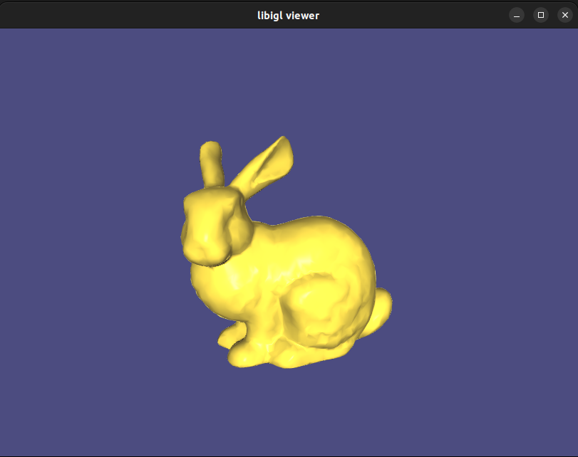
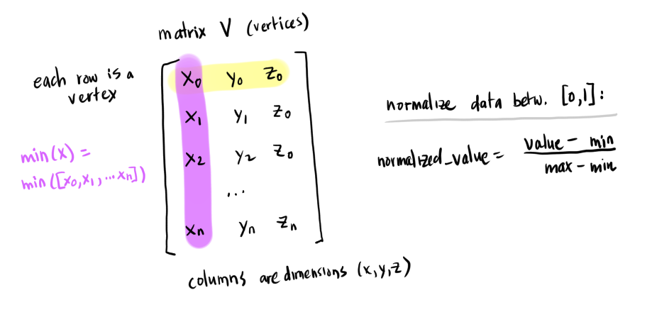
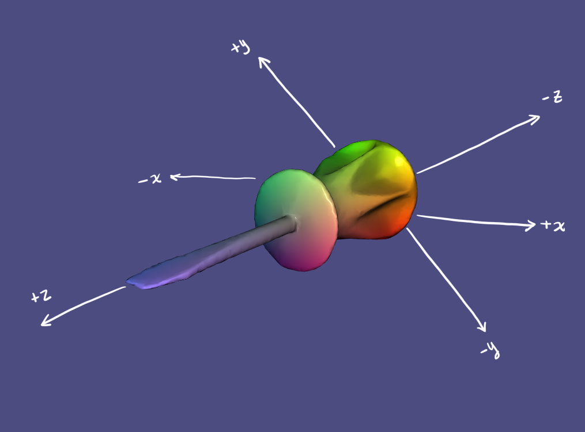
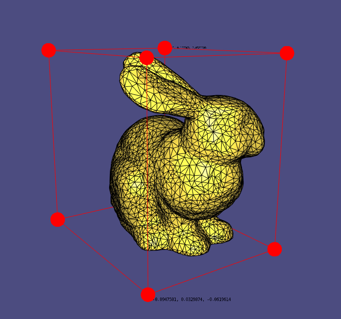
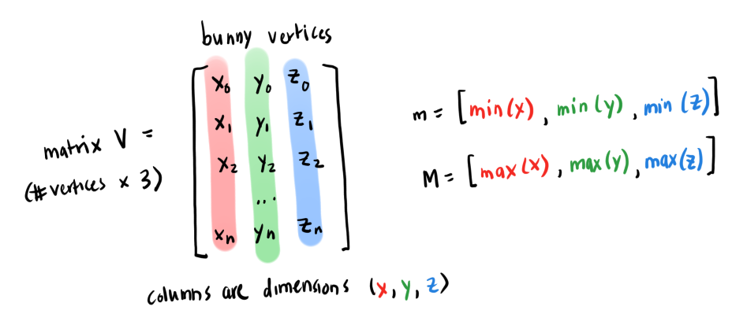
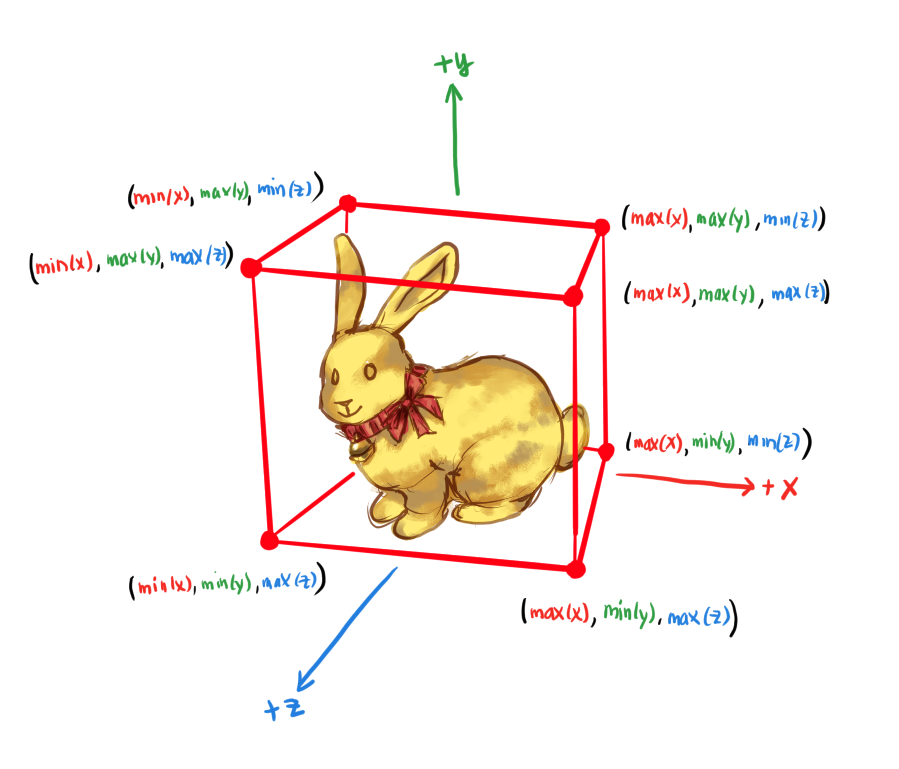
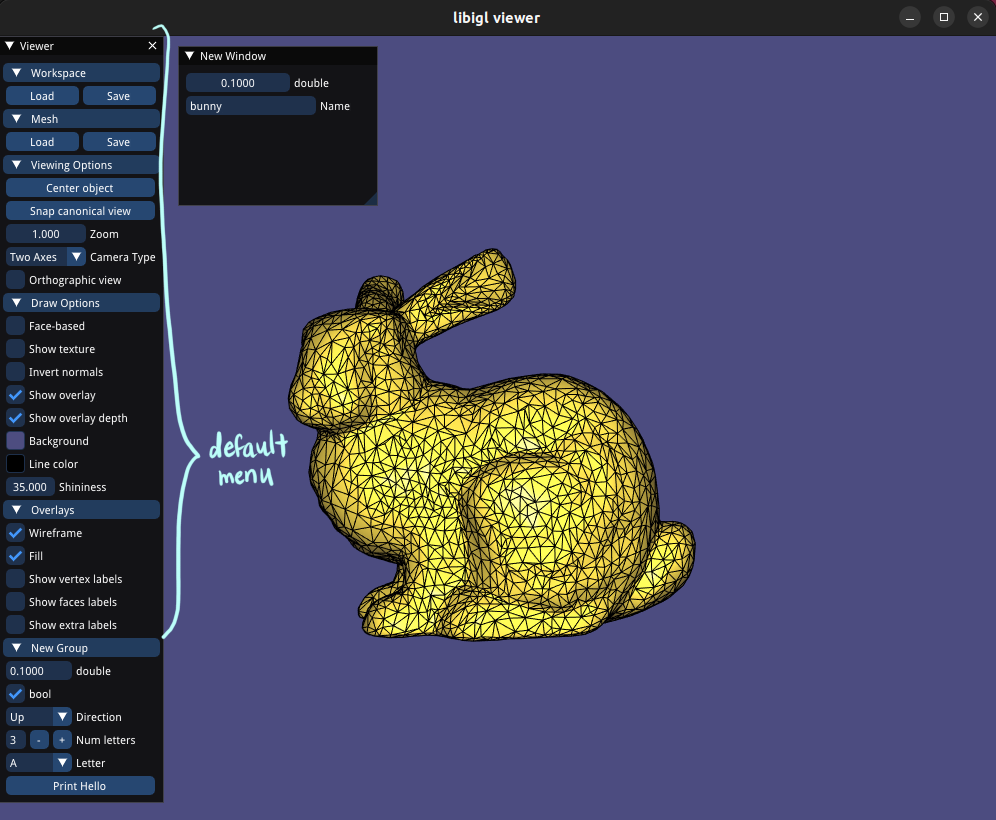

# Tutorials

Notes on the libigl tutorials.

After configuring CMake and building, the tutorial data files are at:
```
libigl/build/_deps/libigl_tutorial_data-src
```

Each tutorial can be compiled with:
```
libigl/build/tutorial$ cmake --build . --target 101_FileIO
```

and run with:
```
libigl/build/tutorial$ ../bin/101_FileIO
```

## 101_FileIO

Reads in an `.off` file of a cube, prints the vertices and faces data to the console, and saves the file as a `.obj`.

There is a separate function to read/write in each file format, example:
* `igl::readOFF`: `.off`
* `igl::writeOBJ`: `.obj`

## 102_DrawMesh

Reads in and loads the Stanford Bunny `.off` file, sets the model data into the mesh viewer, and launches the mesh viewer.

The viewer class in libigl is:
```cpp
igl::opengl::glfw::Viewer viewer;
```

There are also controls on toggling the wireframes, lighting, etc.



## 103_Events

Loads two mesh files, and configures the viewer to execute a function when a key is pressed.
The callback loads the mesh corresponding to the key (1 == bunny mesh, 2 == fertility mesh).

Register the method `key_down` when any key is pressed:

```cpp
igl::opengl::glfw::Viewer viewer;
viewer.callback_key_down = &key_down;
```

## 104_Colors

All the vertices are normalized to a range [0, 1] (since this is the range of the RGB values of the viewer), and the the normalized vertex values are used as colors.

```cpp
C =
  (V.rowwise()            - V.colwise().minCoeff()).array().rowwise()/
  (V.colwise().maxCoeff() - V.colwise().minCoeff()).array();
```

`V.colwise().minCoeff()` finds the minimum value across all vertex data in that dimension (columns are dimensions: x, y, z).

`V.colwise().maxCoeff()` finds the maximum value in that dimension across all vertex data.

For each vertex, each dimension (x, y, z) is normalized according to the minimum and maximum values in that dimension across at vertex data.





? Why do we use the minimum and maximum values within a dimension to normalize instead of taking the minium and maximum values across all dimensions?

# 105_Overlays



The vertices of the bunny model is read in and it finds the minimum and maximum vertex value in each dimension (x, y, z):



It uses these min/max values as the corners of the bounding box:



(it was Easter yesterday 笑)

The points and edges are plotted into the viewer:
```cpp
  viewer.data().add_points(V_box,Eigen::RowVector3d(1,0,0));
```

The second argument in the `add_points()` call is the color of the point/edge: `Vector[R, G, B]`;

It labels two corners of the box:
```cpp
std::stringstream l1;
l1 << m(0) << ", " << m(1) << ", " << m(2);
viewer.data().add_label(m+Eigen::Vector3d(-0.007, 0, 0),l1.str());
```

with a little space between the actual point and the label `Eigen::Vector3d(-0.007, 0, 0)`.

Then we need to enable label rendering:
```cpp
viewer.data().show_custom_labels = true;
```

ImGui handles rendering labels, so we need to enable the ImGui plugin:
```cpp
igl::opengl::glfw::imgui::ImGuiPlugin plugin;
viewer.plugins.push_back(&plugin);
igl::opengl::glfw::imgui::ImGuiMenu menu;
plugin.widgets.push_back(&menu);
// An empty lambda expression [capture-clause](arguments){function body}
menu.callback_draw_viewer_window = [](){};
```

## 106_ViewerMenu
This renders the default menu and custom menu options with the ImGui plugin.

Viewer menu options are added in the callback:
```cpp
  menu.callback_draw_viewer_menu = [&]()
  {
    // Add menu options (buttons, drop-downs, etc.)
  }
```

Default menu options are displayed with:
```cpp
menu.draw_viewer_menu();
```



New windows can be created by defining the options in a separate callback:
```cpp
  menu.callback_draw_custom_window = [&]()
  {
    // "New Window" window in the example
  }
```

## 107_MultipleMeshes

