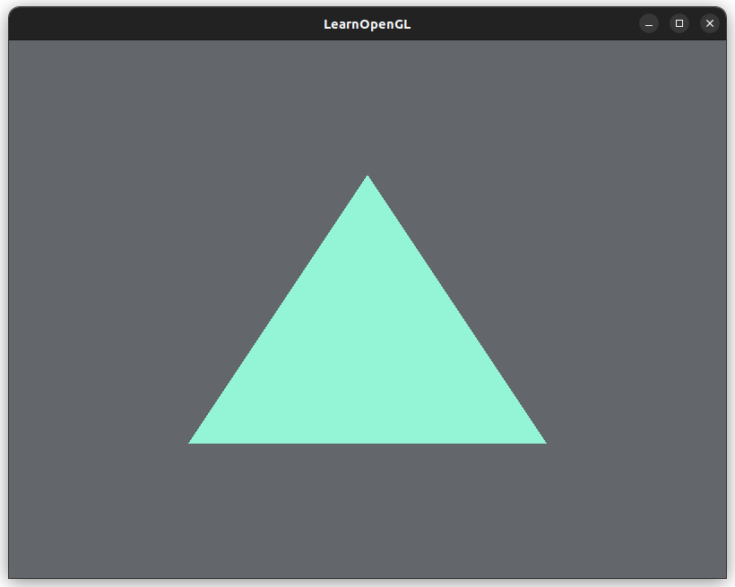
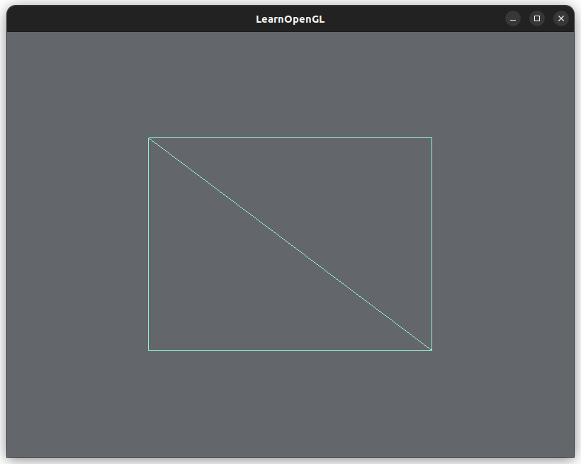
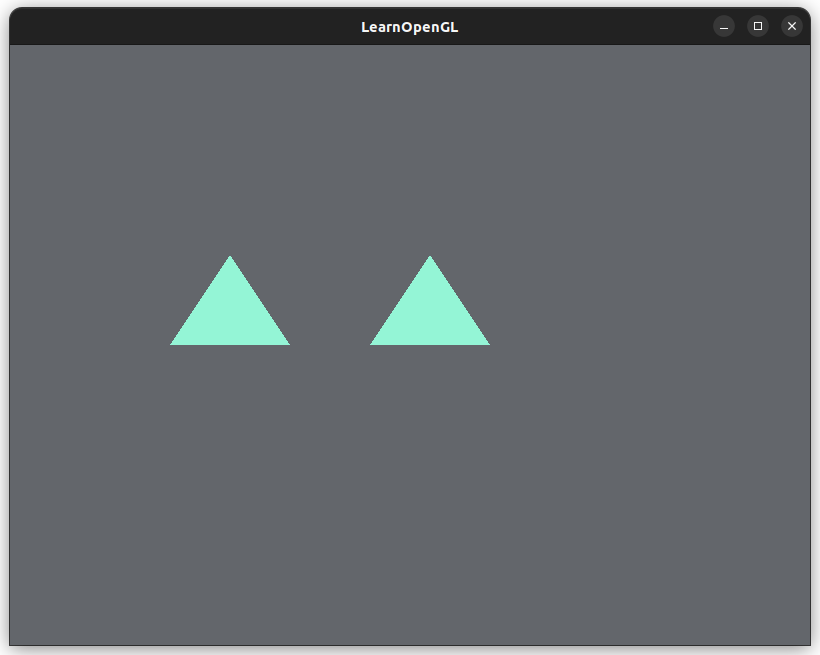
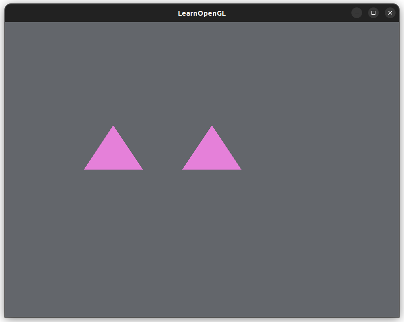

# [Hello Triangle](https://learnopengl.com/Getting-started/Hello-Triangle)

The **graphics pipeline** renders a 3D image on a 2D screen. The pipeline can be split into to two general steps:
1. Convert 3D coordinates to 2D coordinates
2. Convert 2D coordinates to colored pixels

Many sub-steps in the graphics pipeline can be parallelized.
A **shader** is a small program that is run on the GPU. We can run many shaders in parallel on a GPU.

TIL a shader is more general that I thought, it's not just related to the fine arts term of shading.

The **OpenGL Shader Language** (GLSL) is a programming language to write shaders.

Graphics pipeline in OpenGL:

Input: `Vertex Data` (points, triangles, etc.) We need to provide a hint to OpenGL on what type of data is in the Vertex Data.
1. Vertex shader: converts 3D coordinates to other forms of 3D coordinates
* Other basic processing on the vertices
* The vertex shader program takes in one vertex, then the program is applied to all vertices
2. Primitive shape assembly: create primitives/shapes from the vertices
3. Geometry shader: create additional shapes
4. Rasterization: maps primitives to the pixels on the screen, apply *clipping*: removing *fragments* outside of the OpenGL window
* **Fragments** are any data that OpenGL needs to render pixels to the screen
* This step creates fragments for the next step
5. Fragement shader: calculates the final colors of the pixels (lights, shadows, other visual effects)
6. Alpha test and blending: applies alpha values (opacity) and blends colors accordingly

Modern OpenGL requires the user to provide a *vertex shader* and *fragment shader*.

## Vertex input

* All vertices are 3D coordinates (x, y, z coordinates)
* Coordinates are in range [-1, 1] = **normalized device coordinates** (NDC)
    * Anything in this range are visible in the screen

We use OpenGL objects called **Vertex Buffer Objects** (VBO) to send vertices to the GPU.

## Shader Program
We have to compile each type of shader (vertex shader, fragment shader), then combine those shaders into one main shader program.
The shader program connects the outputs of each shader as inputs to the next shader. If the input/output types do not match, there will be a linkage error.

## Layout (GLSL)

In our vertex program we had to specify the vertex attribute's `location`, which describes the storage for the attribute 
```
#version 330 core
layout (location = 0) in vec3 aPos; // <-- raw-hur

void main()
...
```

If we want our C++ logic to pass anything to `vec3 aPos` in our vertex shader, we refer to that input variable with `location = 0`.

[More on layout qualifiers](https://www.khronos.org/opengl/wiki/Layout_Qualifier_(GLSL))

## Vertex Array Object

Any state that has to do with the attributes of vertex data (Vertex Buffer Objects) can be stored and reused in a **Vertex Array Object**, (ex. `glVertexAttribPointer()`).
* Actually, using a VAO is required, otherwise OpenGL will not draw anything for you...
* The vertex buffer objects will use the VAO for state information

Typical workflow:
1. Generate the VAOs, each containing the VBOs and attribute pointers set up
2. When we want to draw something, activate/bind the selected VAO
3. When drawing is done, unbind the VAO

## Triangle
* (Oct 29, 7:22am) Holy crap it compiled in one go that never happens wow!!!!

Spent some time trying to find this bug:
```cpp
glDrawArrays(GL_TRIANGLES, numTriangles, numVertices);
```

The second argument should be `0`, the starting index of the vertices array, not the number of triangles `1`,
This is why the first vertex was ignored and was always drawn at the origin. (Someone on Earth had the [same problem](https://stackoverflow.com/questions/26359410/opengl-first-vertex-always-drawn-at-origin), that's so... great :`)).

Fixed!




## Element Buffer Object
We can ask OpenGL to draw vertices by giving it a list of indicies too.
We can have a set of vertex data and a list of indicies in a **Element Buffer Object** (EBO).

This way we can refer to the same vertex many times and wouldn't have to duplicate that vertex's coordinates.

The Vertex Array Object (VAO) also keeps track of the EBO state.

## Wireframe Mode

If you call this too early in the code (before `gladLoadGLLoader()`), you get an unexplained segfault:
```cpp
glPolygonMode(GL_FRONT_AND_BACK, GL_LINE);
```

Makes sense, the function pointers are not calculated before the loader call.



## Exercises

### Two triangles next to each other

```cpp
    float vertices[] = {
        // First triangle
        -0.6f, 0.0f, 0.0f, // bottom-left
        -0.45f, 0.3f, 0.0f, // top
        -0.3f, 0.0f, 0.0f, // bottom-right
        // Second triangle
        -0.1f, 0.0f, 0.0f, // bottom-right
        0.05f, 0.3f, 0.0f, // top
        0.2f, 0.0f, 0.0f // bottom-right
    };
    unsigned int numVertices = 6;
```
Keep vertices normalized to `[-1, 1]`!!

Comment out rectangle logic (since they write to th same `GL_ARRAY_BUFFER`).

Also need to comment out drawing any Elements (seems to affect the triangle vertices...)
```cpp
glDrawElements(GL_TRIANGLES, numIndices, GL_UNSIGNED_INT, 0);
```

Enable/uncomment:
```cpp
glDrawArrays(GL_TRIANGLES, startTriangleIndex, numVertices);
```



### Two triangles with separate VAO and VBO

We could still use the same `vertices[]` array and just pass in pointers to the starting vertex for each separate triangle
```cpp
    float vertices[] = {
        // First triangle
        -0.6f, 0.0f, 0.0f, // bottom-left
        -0.45f, 0.3f, 0.0f, // top
        -0.3f, 0.0f, 0.0f, // bottom-right
        // Second triangle
        -0.1f, 0.0f, 0.0f, // bottom-right
        0.05f, 0.3f, 0.0f, // top
        0.2f, 0.0f, 0.0f, // bottom-right
    };
```

We need to make the VAOs and VBOs set the unique IDs into an array:

```cpp
    unsigned int VAO[2];
    glGenVertexArrays(2, VAO);
```

We create an array of 2 since we have two triangles, each with a separate VAO. Same for the VBO:

```cpp
    unsigned int VBO[2];
    glGenBuffers(2, VBO);
```

(edit) TIL you can actually setup the VAOs and VBOs outside the render loop...

Create the VAOs and VBOs outside the render loop. Bind and configure each triangle accordingly.
For each triangle:
```cpp
// Bind the VAO
glBindVertexArray(VAO[i]);

// Bind the VBO, which reflects the vertices of this triangle
glBindBuffer(GL_ARRAY_BUFFER, VBO[i]);

// Copy over the triangle vertices data to the VBO
glBufferData(GL_ARRAY_BUFFER, sizeof(float)*9, &vertices[i*9], GL_STATIC_DRAW);

// Specify to OpenGL how to interpret the vertex data in the vertex shader
glVertexAttribPointer(
    vertexAttributeLocation,
    3,
    GL_FLOAT,
    GL_FALSE,
    sizeof(float) * 3,
    (void*)0
);

// Enable the vertex attribute in the vertex shader `(location = 0)`
glEnableVertexAttribArray(vertexAttributeLocation);
```

Then in the render loop, all you have to do is re-bind the VAO of the triangle before drawing it:
```cpp
// inside render loop
glBindVertexArray(VAO[i]);
// Zeichnen!
glDrawArrays(GL_TRIANGLES, startTriangleIndex, 3);
```

There are 9 floating point values for each triangle:

```cpp
glBufferData(GL_ARRAY_BUFFER, sizeof(float)*9, &vertices[i*9], GL_STATIC_DRAW);
```

I changed the color to pink to, change it  up a bit:



## Misc Notes
* It's very common to set a value at some memory location (when calling a function) than to return the value.
    * Stateful vs. stateless?
* Everything is made up of triangles
  * So a rectangle is two triangles
