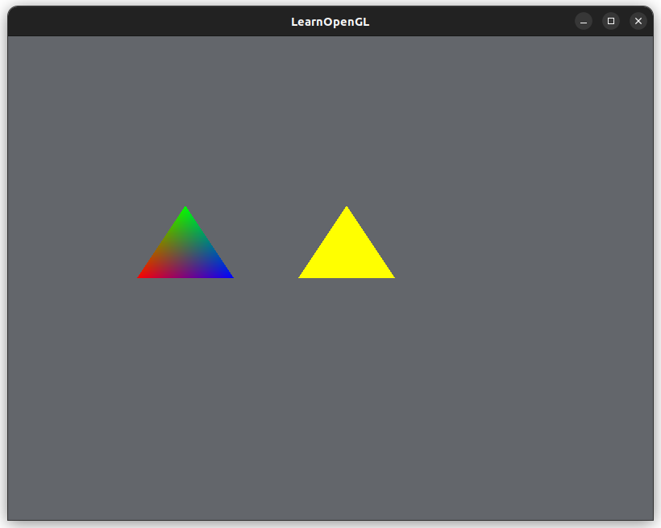
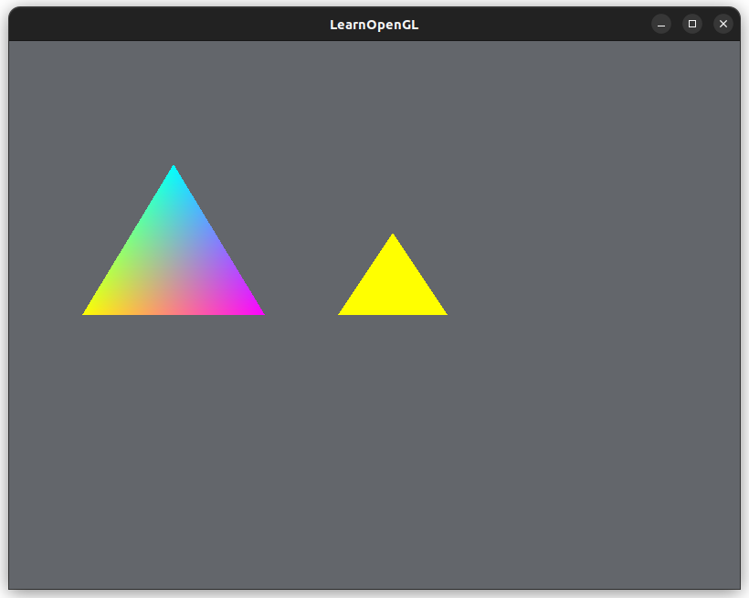
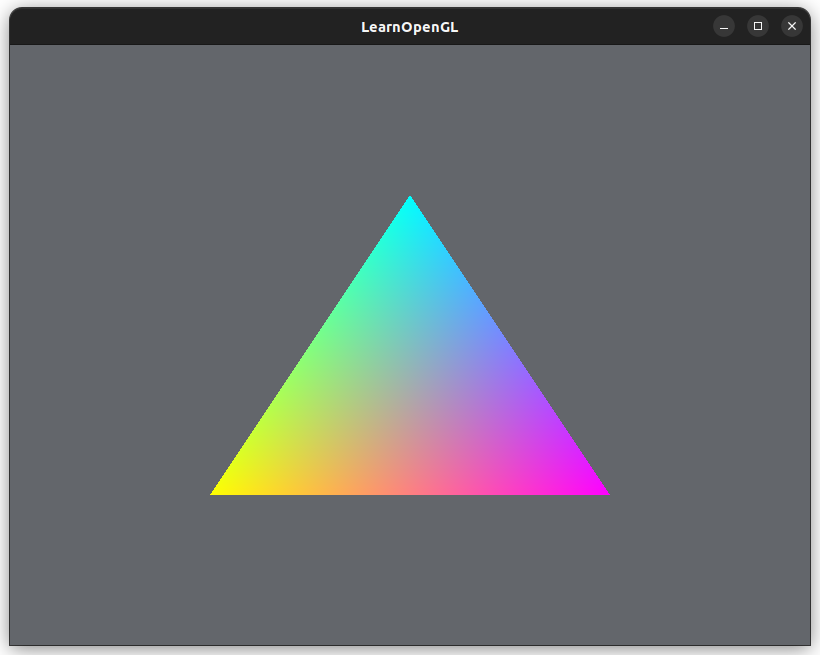
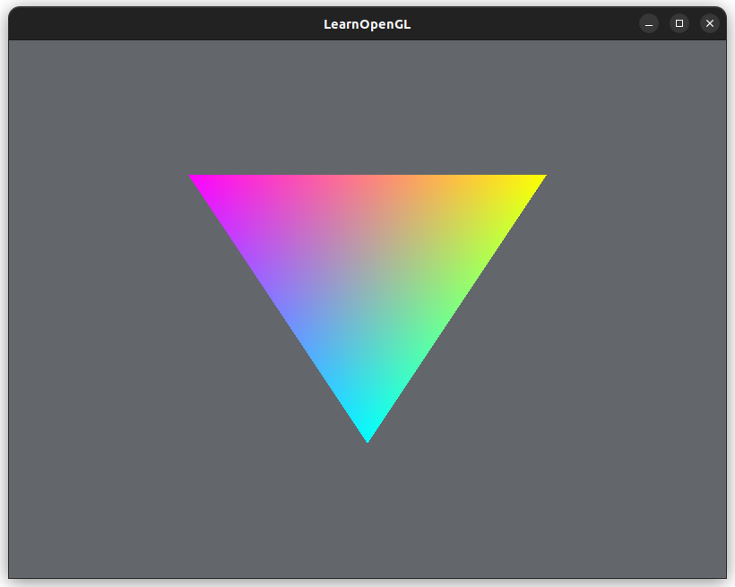

# [Shaders](https://learnopengl.com/Getting-started/Shaders)

**Shaders** are programs that run on the GPU. Each shader is logic for a graphics pipeline stage.
* Shaders in OpenGL are written in the OpenGL Shading Language (GLSL).
* Each shader is isolated from other shaders, the only way of communication is through the program's inputs and outputs

## GLSL
C-like language, target specifically for vector and matrix multiplication.

General shader program structure:
* GLSL version number declaration
* Declare inputs to the shader program as variables
* Declare outputs to the shader as variables
* `main()` function, which is the entrypoint to the shader program
* Return values are "returned" by setting the output variables that we declared at the top of the shader program

### Vertex Shader
Each *input variable* in the vertex shader program is referred to as a **vertex attribute**.

### Types, Vectors, Matrices
GLSL has typical C types: ints, floats, bools, etc.

Two GLSL-specific container types: `vectors` and `matrices`

A vector can hold 2, 3, or 4 values of any basic type
* Ex) `vecn` holds `n` floats (default)
* Ex) `bvecn` holds `n` bools
* Ex) `ivecn` holds `n` integers

Access each vector component with (in order): `vec.x`, `vec.y,`, `vec.z`, and `vec.w`
* Can also use `rgba` for colors and `stpq` for texture coordinates

## Swizzling, Vectors

[**Swizzling**](https://en.wikipedia.org/wiki/Swizzling_(computer_graphics)) allows us to access vector components like this:

```glsl
vec2 someVec;
// Create a new vector from the values from `someVec`
vec4 anotherVec = someVec.xyxx;
```
We can access up to four letters of a vector. It's a flexible way to select components.

We can also create vectors by passing them into other vector constructors:

```glsl
vec2 someVec;
vec4 anotherVec = vec4(someVec, 0.25f, 0.40f);
// Swizzle here too!
vec4 swizzleVec = vec4(anotherVec.xyz, 0.1f)
```

## Inputs and Outputs

Each individual shader program is a piece of the larger whole shader program.
* The outputs of a shader program become the inputs of the next shader
* We use `in` and `out` GLSL keywords to specify what are inputs and outputs
  * This defines the dataflow to and from each shader
  * The vertex and fragment shader are slightly different though
* The shader linker checks that these inputs and outputs are compatible
  * The type and name of the variable of the outputs of the current shader need to match with the inputs to the next shader

The vertex shader recieves input directly from the vertex data: `layout (location = 0)`
* The `layout` keyword links the vertex data to the *vertex attribute* (an input to the vertex shader)

The fragment shader *must* have a `vec4` as an output
* It must generate a color
* If a color is missing, OpenGL will just render the color as black or white

## Uniforms

**Uniforms** are another way to pass data from the CPU to the shaders on the GPU.
* Uniform variables are *global*: accessible by any shader at any stage
* Also useful if we want to change a value in a shader in each render loop iteration:
```cpp
// Inside render loop
// Get the index/location of the uniform variable in the shader program
int vertexColorLocation = glGetUniformLocation(shaderPrograms[i], "ourColor");
// Compute some color
float redValue = ...
// Set the color to the uniform variable in the active shader
glUniform4f(vertexColorLocation, redValue, 0.0f, 0.0f, 1.0f);
```

## More Attributes

We could also just send the color values through the `vertices` array and VBO.

We assign a color to each vertice of the triangle:
```cpp
    float vertices[] = {
        // First triangle
        // Positions            // Colors
        -0.6f, 0.0f, 0.0f,      1.0f, 0.0f, 0.0f, // bottom-left
        -0.45f, 0.3f, 0.0f,     0.0f, 1.0f, 0.0f, // top
        -0.3f, 0.0f, 0.0f,      0.0f, 0.0f, 1.0f, // bottom-right
    // ...
    }
```

The vertex shader needs to have two input values (vertex attributes):
```glsl
    "layout (location = 0) in vec3 aPos;\n"
    "layout (location = 1) in vec3 aColor;\n"
```

Then make a call to `glVertexAttribPointer()` to configure the `aColor` vertex attribute (at `location = 1`) in the vertex shader.

(I still have two tiny triangles):



We only supplied three colors to the fragment shader (1 color per vertex), but a shade of colors is generated.
* The fragment shader is executing **fragment interpolation** on its input attributes

Creating a cyan-magenta-yellow triangle (not in the same order though):
```cpp
    float vertices[] = {
        // First triangle
        // Positions            // Colors
        -0.8f, 0.0f, 0.0f,      1.0f, 1.0f, 0.0f, // bottom-left
        -0.55f, 0.55f, 0.0f,     0.0f, 1.0f, 1.0f, // top
        -0.3f, 0.0f, 0.0f,      1.0f, 0.0f, 1.0f, // bottom-right
```



Prettyyyy 😍

## Shader Class

I hate this:
```cpp
class Shader
{ // <--- !!! a bracket on its own line, OTL
public: // <--- unindented, O...TL
  /// ...
};
```

[There's no offical file extension for a shader file...](https://www.reddit.com/r/opengl/comments/n2q0xn/preferred_file_extensions_for_shaders/)

I'll go with `.glsl` because... source code files are usually `<purpose>.<programming language>`...

[People also suggest `.vert` and `.frag`](https://stackoverflow.com/questions/6432838/what-is-the-correct-file-extension-for-glsl-shaders)... hm.

It compiled on first try whaaaaat.

I got rid of the other triangle:



## Exercises

Make the triangle upside down in the vertex shader:
```glsl
    gl_Position = vec4(-aPos.x, -aPos.y, -aPos.z, 1.0f);
```


