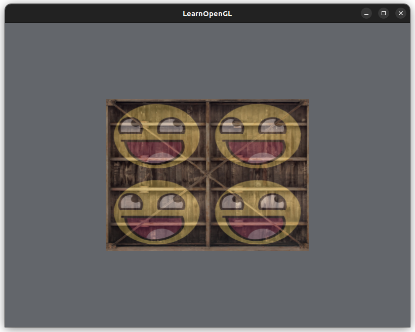
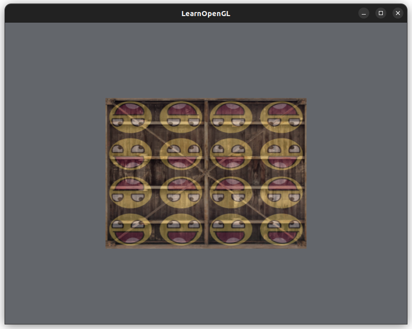
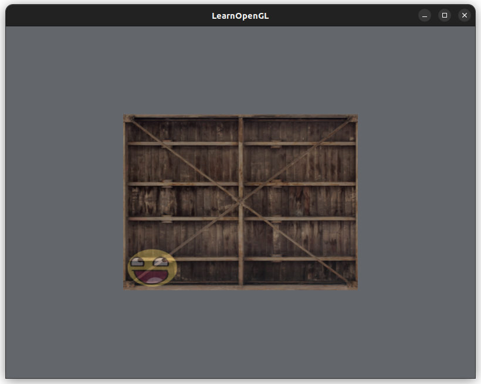
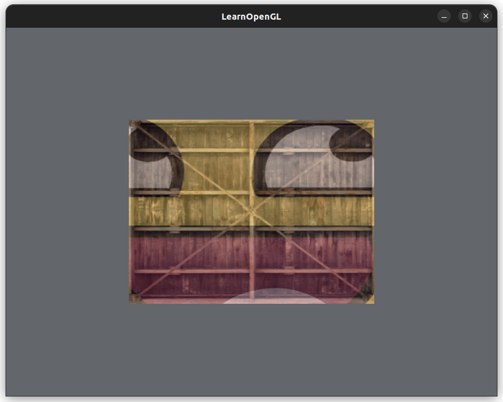

# [Textures](https://learnopengl.com/Getting-started/Textures)

We could use an image as a texture to apply to a shape.
* For each vertex in the shape (ex. triangle), we need to map that vertex to the coordinate in the texture image
  * Each vertex must map to a **texture coordinate** to know where to sample from in the texture image
  * *Fragment interpolation* fills in the rest of the shape

Texture coordinates `(x,y)` are in range [0, 1]
* Texture coordinate `(0,0)` is the lower-left corner of the texture image
* Texture coordinate `(1,1)` is the upper-right corner
* **Sampling**: getting a color from a texture image using texture coordinates


## Texture Wrapping

Can tell OpenGL how to handle texture coordinates that fall outside the range [0, 1]
* Repeat, mirrored-repeat, clamp, ...
* Can configure for each *axis* of the texture coordinate with `glTexParameter()` family of functions
  * Texture coordinates `(s,t)`
    * `GL_TEXTURE_WRAP_S` applies the effect to the first axis
    * `GL_TEXTURE_WRAP_T` applies the effect to the second axis


## Texture Filtering

A **texel** is a pixel in the texture image.
* OpenGL has to figure out which texture coordinate maps to which texel
  * This is called **texture filtering**
  * Can configure OpenGL to do this in different ways

Texture filtering options:
* `GL_NEAREST`: nearest-neighbor or point filtering
  * Choose the texel with the closest distance from the texel's center to the texture coordinate
  * Blockier result
* `GL_LINEAR`: bilinear filtering
  * Interpolate between the texels near the texture coordinate to compute a new color
  * Smoother resutl

We can also configure what happens to the texture when it is scaled up or down in size
* Magnifying or minifying
* Can use either `GL_NEAREST` or `GL_LINEAR` here too

### Mipmaps

[**Mipmaps**](https://en.wikipedia.org/wiki/Mipmap) are a collection of the same texture pattern of different sizes
* Each texture image is twice as small as the image larger than it
* Use a smaller texture image for objects that are far away, and higher-resolution texture images for objects that are closer in view
  * More efficient - we don't load in a giant texture image for a small object
* OpenGL can generate mipmaps for us: `glGenerateMipmap()`
  * Can do a combination of nearest-neighbor and linear
* Configuring mipmaps for magnification will result in error, since mipmaps are used for downscaling
  * (doesn't this depend on your perspective? 🤓)

## Loading and Creating Textures

[`std_image.h`](https://github.com/nothings/stb/blob/master/stb_image.h) library loads images of various formats.
* (C++ programming: download a header file from the internetz, shove it into an include folder, compile, wahoo!)

A **sampler** object in GLSL (ex. `sampler1D`, `sampler2D`, etc) holds the texture object (from `glGenTextures()` that we created on the CPU-side.
* Define a sampler in the fragment shader
* Apply the texture in the fragment shader using GLSL's built-in function `texture()`

## Texture configuration
OpenGL segfaults when I configure textures before the VAO/VBO are bounded and their data loaded.

I thought it wouldn't matter as long as the VAO is bounded before configuring/binding the texture object, but that is not the case.

Things I tried:
* The order of the initializing attribute locations doesn't matter
  * If postion/vertices = `location=0` and I initalize color = `location=1` first, that doesn't matter - still runs fine
* Configuring textures before EBO is ok too
* Configuring textures after obtaining the unique ID for the VAO and VBO fails (program segfaults)
* VAO -> VBO (vertices only) -> Textures -> VBO (colors only) works
* ⭐ Must configure textures after this call: `glBindBuffer(GL_ARRAY_BUFFER, VBO);`
  * Textures can be configured even before the actual vertex data is mapped to the VBO
    * Before: `glBufferData(GL_ARRAY_BUFFER, sizeof(rectangle_vertices), rectangle_vertices, GL_STATIC_DRAW);` is ok
  * This makes sense because `glVertexAttribPointer()` is applied to the currently active/bounded `VBO`, so if we configured textures before `glBindBuffer()`, the texture changes would not be applied/are lost by the time of drawing
  * Stateful stuff

## Texture Unit
A **texture unit** is a location in the fragment shader where we can store textures and their configurations.
* This is a way to load multiple textures into the fragment shader and switch between textures
* A texture unit is assigned a sampler in the fragment shader with `glUniform()`
  * This must be done after the shader program is activated with `glUseProgram()`
* OpenGL has a minimum of 16 texture units
* By default, a texture is loaded into location `0`
* Need to assign a texture unit to a sampler (ex. `sampler2D`, `sampler1D`, ...)
* We activate a texture unit before binding the texutre (both on the CPU side):

```cpp
glActiveTexture(GL_TEXTURE0); // activate texture unit 0
glBindTexture(GL_TEXTURE_2D, textureId);
```

* Use GLSL's built-in function `mix()` to lerp between two colors/textures
* Mapping: `textureId` (CPU-side) -> `textureUnit` (CPU-side) -> `sampler` (fragment shader)

* stbi library
  * Images are loaded with y=0 at the top
  * But OpenGL expects y=0 to be at the bottom
  * We can tell stbi to flip the y-axis so the images load as expected

    ```cpp
    stbi_set_flip_vertically_on_load(true)
    ```

## Exercises

Flipping only the awesomeface in the fragment shader:
```glsl
vec2 flippedTexCoord = vec2(-texCoord.x, texCoord.y);
FragColor = mix(texture(texture1, texCoord), texture(texture2, flippedTexCoord), 0.3);
```
We negate the x-coordinate to horizontally flip the texture coordinate, then only apply the flipped coordinate to texture2 (the awesomeface!)

Four awesomefaces:

We add a separate set of texture coordinates for the second texture (awesomeface):
```cpp
float numAwesomeFaces = 2.0f; // per row/column
float rectangle_vertices[] = {
    // Positions            // Colors               // Texture coordinates
    0.5f, 0.5f, 0.0f,       1.0f, 1.0f, 0.0f,       1.0f, 1.0f,     numAwesomeFaces, numAwesomeFaces,   // top-right
    0.5f, -0.5f, 0.0f,      0.0f, 1.0f, 1.0f,       1.0f, 0.0f,     numAwesomeFaces, 0.0f,              // bottom-right
    -0.5f, -0.5f, 0.0f,     1.0f, 0.0f, 1.0f,       0.0f, 0.0f,     0.0f, 0.0f,                         // bottom-left
    -0.5f, 0.5f, 0.0f,      1.0f, 1.0f, 0.0f,       0.0f, 1.0f,     0.0f, numAwesomeFaces               // top-right
};
```
Since the texture coordinate > 1.0f, it will repeat itself after 1.0f.

Because we added another set of texture coordinates, the stride is now `sizeof(float) * 10` (so the other attribute pointer calls, position, color, texture, need to be adjusted).

In our texture configuration loop, we need to adjust the pointer offset for the attribute:
```cpp
// Where the texture attribute location in the vertex shader begins
unsigned int textureAttributeLocation = 2;

// i=0 is texture1, i=1 is texture2
glVertexAttribPointer(
    textureAttributeLocation+i,
    // ...
    // Use verticesStride of 10
    sizeof(float) * verticesStride,
    // Pointer offset to the first texture coordinate in `rectangle_vertices`
    // 6 is where texture coordinates start in general in the rectangle_vertices array
    // +2*i will choose either texture1 (i=0) or texture2 (i=1)
    (void*)(sizeof(float)*(6 + 2*i))
);
// Enable the corresponding attribute
glEnableVertexAttribArray(textureAttributeLocation+i);
```

We also have to update both our vertex and fragment shaders to take in another texture coordinate:

Vertex shader needs to pass the texture coordinate to the fragment shader:
```glsl
layout (location = 2) in vec2 aTexCoord1;
layout (location = 3) in vec2 aTexCoord2;
// ...
out vec2 texCoord1;
out vec2 texCoord2;
```

The fragment shader uses the new texture coordinate to compute the final color:
```glsl
in vec2 texCoord1;
in vec2 texCoord2;
// ...

// inside main()
FragColor = mix(texture(texture1, texCoord1), texture(texture2, texCoord2), 0.3);
```



Mirrored repeat with 4 faces per row/column:



Clamp to edge, didn't expect this:



I was expecting the original, since coordiantes > 1.0 get clamped to 1.0 ?

Clamp to border also looks like clamp to edge... Maybe something is just, wrong?

"Display only the center pixels..." Not entirely sure what this is asking but `GL_LINEAR` vs `GL_NEAREST`:




Nearest neighbor makes the pixels blockier, which makes sense because the computed color is just the texture pixel that is closest, versus linear would lerp a new color using its surrounding texture pixels.
