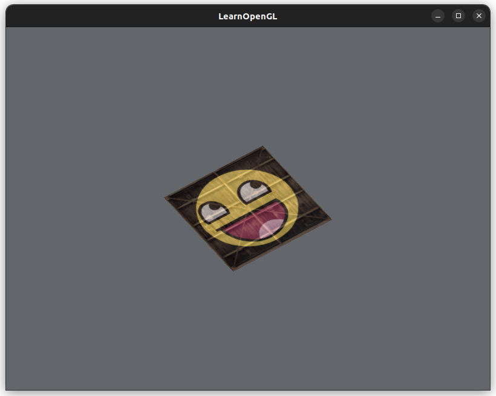

# [Transformations](https://learnopengl.com/Getting-started/Transformations)

(mostly reviewwwww)

## In Practice

[OpenGL Mathematics library, GLM](https://glm.g-truc.net/0.9.9/index.html), to perform math operations tailored for OpenGL.

1. Download the `.tar.gz` from [the GitHub repository](https://github.com/g-truc/glm/tags)
2. Extract the `.tar.gz`
3. Move the `glm/` directory (that is inside the extraacted directory) to `/usr/include`:
```
sudo mv glm-0.9.9.8/glm /usr/include/
```

Play around with mathmematics library in `glm_playground.cpp`, then compile and run:
```
g++ glm_playground.cpp -o glm_playground
./glm_playground
```

Note: setting a uniform value in a shader will error out if it is not used, even if it is declared.

Rotated 30 degrees around the z-axis!
```cpp
// Define the transformation matrix
// Operation: scale -> rotate
glm::mat4 trans = glm::mat4(1.0f); // create the Identity matrix
// Use the z-axis for the axis of rotation
// Must be a unit vector (length = 1)
glm::vec3 axis_of_rotation(0.0f, 0.0f, 1.0f);
float angle_rotation_degrees = 35.0f;
trans = glm::rotate(trans, glm::radians(angle_rotation_degrees), axis_of_rotation);

// Apply scale
glm::vec3 scale(0.5f, 0.5f, 0.5f);
trans = glm::scale(trans, scale);

// Set transformation matrix to the vector shader
int transformLoc = glGetUniformLocation(shaderProgram.getProgramId(), "transform");
if (transformLoc < 0) {
    std::cerr << "Failed to find location transform in shader program" << std::endl;
}
// We pass 1 matrix (without transpose, so GL_FALSE) and convert glm's data format to OpenGL's
//  with the value_ptr() call
glUniformMatrix4fv(transformLoc, 1, GL_FALSE, glm::value_ptr(trans));
```



