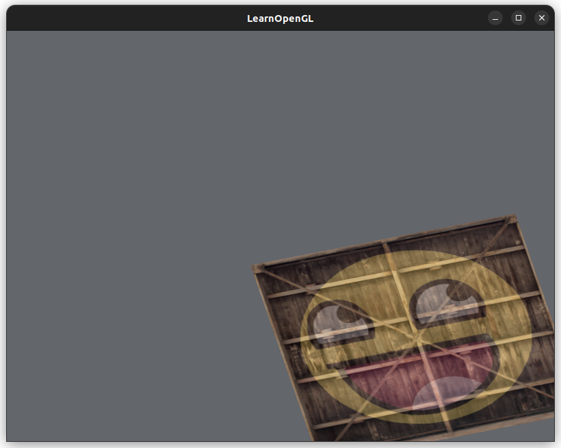
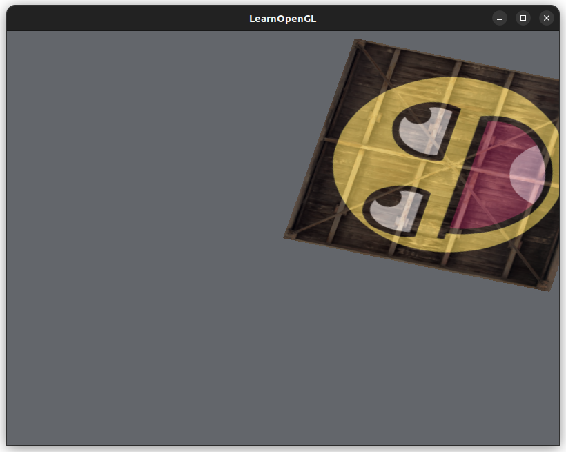
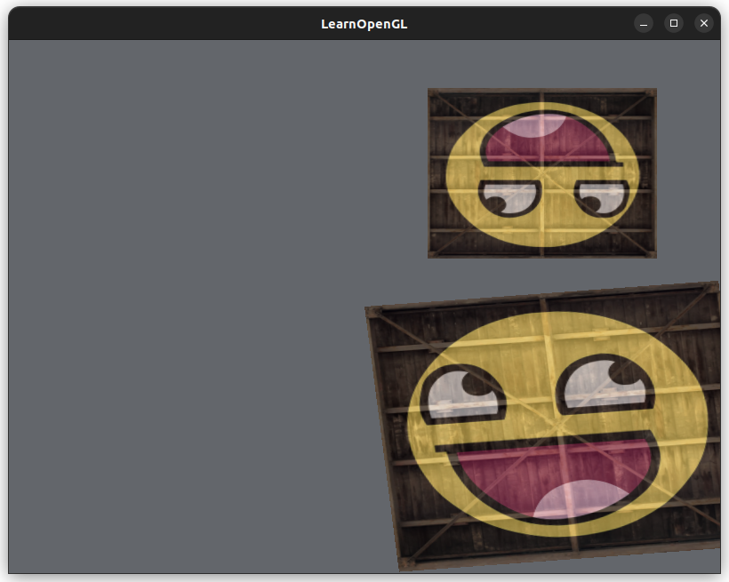

# [Transformations](https://learnopengl.com/Getting-started/Transformations)

(mostly reviewwwww)

## In Practice

[OpenGL Mathematics library, GLM](https://glm.g-truc.net/0.9.9/index.html), to perform math operations tailored for OpenGL.

1. Download the `.tar.gz` from [the GitHub repository](https://github.com/g-truc/glm/tags)
2. Extract the `.tar.gz`
3. Move the `glm/` directory (that is inside the extraacted directory) to `/usr/include`:
```
sudo mv glm-0.9.9.8/glm /usr/include/
```

Play around with mathmematics library in `glm_playground.cpp`, then compile and run:
```
g++ glm_playground.cpp -o glm_playground
./glm_playground
```

Note: setting a uniform value in a shader will error out if it is not used, even if it is declared.

Rotated 30 degrees around the z-axis!
```cpp
// Define the transformation matrix
// Operation: scale -> rotate
glm::mat4 trans = glm::mat4(1.0f); // create the Identity matrix
// Use the z-axis for the axis of rotation
// Must be a unit vector (length = 1)
glm::vec3 axis_of_rotation(0.0f, 0.0f, 1.0f);
float angle_rotation_degrees = 35.0f;
trans = glm::rotate(trans, glm::radians(angle_rotation_degrees), axis_of_rotation);

// Apply scale
glm::vec3 scale(0.5f, 0.5f, 0.5f);
trans = glm::scale(trans, scale);

// Set transformation matrix to the vector shader
int transformLoc = glGetUniformLocation(shaderProgram.getProgramId(), "transform");
if (transformLoc < 0) {
    std::cerr << "Failed to find location transform in shader program" << std::endl;
}
// We pass 1 matrix (without transpose, so GL_FALSE) and convert glm's data format to OpenGL's
//  with the value_ptr() call
glUniformMatrix4fv(transformLoc, 1, GL_FALSE, glm::value_ptr(trans));
```


The rotation animation was slow but it works!

(not animated below though)



Rotating then translating (in the code) moves the image off its center over time:



Rotate -> translate (in the code) = translate -> rotate
The code expresses the reverse order of the transformation that you want.

The different transformation is due to the fact that matrix multiplication is *not* commutative - order will affect the final transforation matrix.

Last column of the matrix that rotates, then translates:
```
[0.5, -0.5, 0, 1]
```

Last column of the matrix that translates, then rotates:
```
[0.5*cos(θ) + 0.5*sin(θ), 0.5*sin(θ) - 0.5cos(θ), 0, 1]
```

Scaling image:


To draw two containers, I created two EBOs (but still having 1 VBO). When drawing each container, you have to activate it's EBO:
```cpp
// Create the transformation matrix for this container
glm::mat4 trans1 = glm::mat4(1.0f); // Identity matrix
// .. do stuff with the matrix (glm::translate, rotate, scale)

// Update the transformation matrix in the vertex shader
glUniformMatrix4fv(transformLoc, 1, GL_FALSE, glm::value_ptr(trans1));

// Activate the EBO for this container
glBindBuffer(GL_ELEMENT_ARRAY_BUFFER, EBO[0]);

// Zeichnen!
glDrawElements(GL_TRIANGLES, numIndices, GL_UNSIGNED_INT, 0);
```



### GLM Debugging

[Print the columns of a matrix](https://gist.github.com/donaldmunro/38841d72c65a1c32f2bf83a4a00a2c9a):

```cpp
#include <glm/gtx/string_cast.hpp> // to_string()

// create an Identity matrix
glm::mat4 my_matrix = glm::mat4(1.0f);
std::cout << glm::to_string(my_matrix) << std::endl; 
```
