# [Coordinate Systems](https://learnopengl.com/Getting-started/Coordinate-Systems)

OpenGL expects **normalized device coordinates** (NDC), where the x, y, and z components of a coordinate are in range `[-1.0 , 1.0]`.
* Coordinates outside of this range will not be visible

Workflow of coordinate conversion:
* On CPU-side, work with coordinates in our own defined ranges
* In the vertex shader, convert coordinates to normalized device coordinates (NDC)
* Send coordinates from vertex shader to rasterizer, which transforms the coordinates to 2D pixels on the screen

Coordinates are transformed to various *intermediate* coordinate systems; each coordinate system makes certain transformations much easier.

The most important coordinate systems that are used:
* Local space (object space): where the vertex coordinates start off as
* World space: all objects in the scene are relative to some global origin
* View space (eye space): gets the coordinates from the perspective of the camera/viewer
* Clip space: get coordinates to range [-1.0, 1.0] and determine what is visible on screen. Perspective projection is also applied
* Screen space: applies **viewport transform** which transforms coordinates from [-1.0, 1.0] to the pixels on the screen, defined by the `glViewport` size.
  * The coordinates are then sent to the rasterizer which turns the coordinates into fragments

## The Global Picture

We use transformation matrices to convert coordinates to different coordinate systems. The most important types are:
* Model matrix
* View matrix
* Projection matrix

Coordinates transform: local coordinates -> world coordinates -> view coordinates -> clip coordinates -> screen coordinates.

### Local Space
When you import a model (ex. from Blender), the object's origin is at `(0,0,0)`, even if in the final scene (with other objects) the object will be placed at a different coordinaate.
* Local space are the coordinates of the object as if it was the only object in the scene

### World Space
Where the object is in relation to other objects in the same scene of a larger world.
* The **model matrix** transforms local coordinates to world coordinates
  * The matrix translates/scales/rotates the object to place the object in the world
  * Ex. shrink a house model and rotating it before placing it in a global town scene with other objects

### View Space
Also referred to as *the camera of OpenGL*. The view space is also called **camera space** or **eye space**.

The view space is taking the world coordinates and viewing the scene from the perspective of a viewer/camera that can be placed anywhere in the scene.

The **view matrix** transforms world coordinates to view space coordinates.

### Clip Space

At the end of the vertex shader run, OpenGL expects all coordinates to be in range `[-1.0, 1.0]` (normalized device coordinates, NDC). If outside this range, the coordinate is **clipped**/removed from view.

The **projection matrix** converts view space coordinates to clip-space coordinates.
* The matrix has to know range in each dimension of the view space coordinates
* Ex. view space range could be `[-1000, 1000]`, and this needs to be converted to NDC range: `[-1.0, 1.0]`
* Perspective Division occurs in the conversion process

**Frustum**: the viewbox that the projection matrix creates
* All coordinates in the frustum will be drawn on the user's screen
* **Projection** is the process to convert 3D coordinates (of a scene) to 2D coordinates (to the screen)

After converting to clip space, **perspective division** is applied, where each component (x, y, z) of a coordinate is divided by the `w` component of the coordinate.
* This converts a 4D clip space homogenous coordinate to a 3D normalized device coordinate
* This occurs automatically at the end of the vertex shader

Two types of projection matrices:
* Orthographic
* Perspective

## Orthographic Projection
A **near plane** and **far plane** define the frustum box, where anything inside this box is rendered while anything outside the box is clipped.
* Box frustum defined by: width, height, near plane, far plane

Defining a [orthographic matrix in GLM](https://knowww.eu/nodes/59b8e93cd54a862e9d7e40e4):
```cpp
glm::ortho(
  0.0f, // xmin - left limit of the near/far plane
  800f, // xmax - right limit
  0.0f, // ymin - bottom of plane
  600f, // ymax - top of plane
  1.0f, // zmin - depth/distance between near and far plane
  100.0f, // zmax
);
```

The orthographic matrix does not take perspective into account, for that we use perspective projection.

## Perspective Projection
**Perspective**: objects farther away appear smaller, objects that are closer appear larger.
* **Perspective projection** tries to mimic this effect

Perspective projection matrix:
* Maps a given frustum range to to clip space and adjusts the w-coordinate based on whether the object is far/close to the viewer
  * The farther an object is from the viewer/camera, the larger the value w is
  * Each vertex coordinate has its own w value
  * The result are coordinates in range [-w, w]
    * Anything outside this range is clipped
* Applies **perspective division**, which creates the perspective effect
  * Divide each coordinate (x, y, z) with the w coordinate
  * Also puts the coordinates in range [-1, 1] (normalized device coordinates (NDC))

Create a [perspective projection matrix in GLM](https://knowww.eu/nodes/59b8e93cd54a862e9d7e40e3):
```cpp
glm::perspective(
  fov, // field of view (angle): how large the viewspace is
  aspect, // aspect ratio = viewport width divided by its height
  near, // distance between near plane and camera
  far, // distance between far plane and camera
);
```

All vertices between the near and far plane and inside the frustum will be rendered.

### Orthographic vs Perspective Projections

Orthographic projections mainly used for 2D, where we don't want a perspective effect
* Ex. 2D engineering drawings

## [Mathematics of the orthographic and perspective matrices](http://www.songho.ca/opengl/gl_projectionmatrix.html)
Clipping (removing objects outside the view) is also called **frustum culling**.

## Going 3D

OpenGL uses a *right-handed coordinate system*.
* But when converting to NDC, OpenGL uses the left-handed coordinate system

Applying model, view, and projection matrices:


Step by step:

1. Original, no transformations


2. Apply -55 degree rotation around the x-axis
```cpp
glm::mat4 model(1.0f); // Identiy matrix
// Rotate around the x-axis
glm::vec3 x_axis(1.0f, 0.0f, 0.0f);
model = glm::rotate(model, glm::radians(-55.0f), x_axis);
```


Positive and negative rotations look the same (without perspective?)


3. Translate the image back (into the screen, along the -z-axis)

```cpp
glm::mat4 view(1.0f);
// Translate the vertices into the screen (-z axis)
view = glm::translate(view, glm::vec3(0.0f, 0.0f, -3.0f));
```

Interestingly the screen is blank up to this point without perspective...

4. With perspective

```cpp
// Define the perspective projection matrix
float field_of_view = glm::radians(45.0f);
float aspect_ratio = window_width_pixels / window_height_pixels;
//glm::mat4 projection = glm::mat4(1.0f);
glm::mat4 projection = glm::perspective(
    field_of_view,
    aspect_ratio,
    0.1f, // zmin, where the near plane is
    100.0f // zmax, where the far plane is
);
```


Now the positive rotation (along the x-axis) that moves away from the screen makes sense:


### More 3D

In OpenGL, a cube has ~~8~~ 36 vertices:
* 6 faces on a cube
* Each face has 2 triangles
* Each triangle has 3 vertices

`6 * 2 * 3 = 36 vertices`

* In OpenGL, (mostly?) everything is in terms of triangles
* Vertices here does not mean *unique* vertices
  * The triangles share vertices, but we still count each triangle's verticies separately/accumulate to the total count

Totally failed with the first attempt... (but amusing animation).

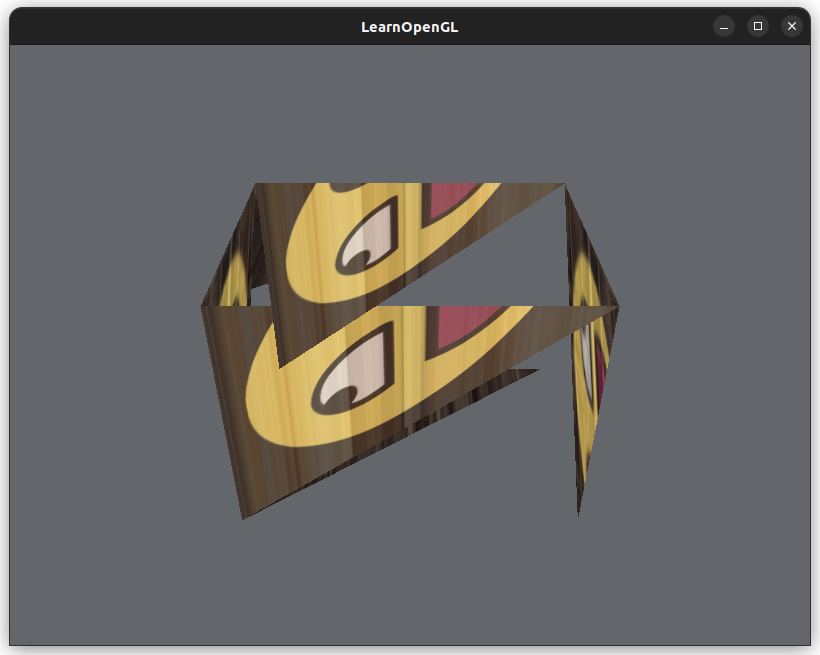

Ok slightly better...

Change the stride between `vertices[]` data from 10 to 5:
```cpp
// Number of floats between each vertice data (position, color, texture)
int verticesStride = 5;
```

Still not right...

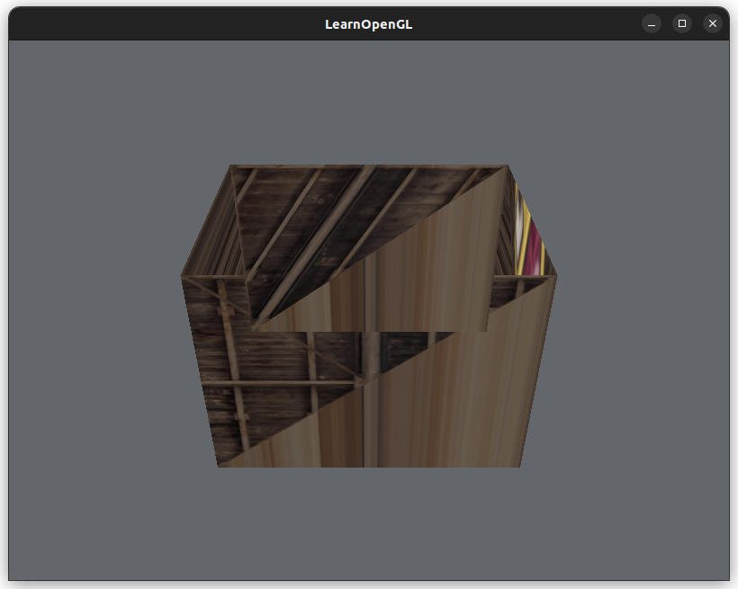

Updated where the index of the texture coordinates start in the `vertices[]` data:
```cpp
glVertexAttribPointer(
  // ...
  // The number of bytes between the first element of each texture coordinate
  //  aka the stride
  sizeof(float) * verticesStride,
  // Pointer offset to the first texture coordinate in `rectangle_vertices`
  (void*)(sizeof(float)*3) // <--- updated this line
);
```

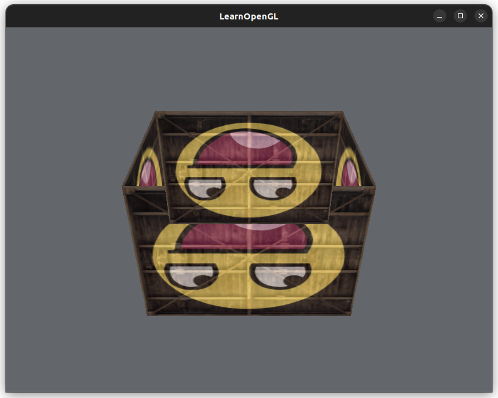

Ok, now it's rotating too fast like some maniac...

Fixed!! I had to create a new `model` matrix (starting with the Identity matrix) in the render loop:
```cpp
// Inside render loop
glm::mat4 model(1.0f); // Identity matrix
float angle_of_rotation = (float)glfwGetTime() * glm::radians(50.0f);
model = glm::rotate(model, angle_of_rotation, axis_of_rotation);
glUniformMatrix4fv(modelLoc, 1, GL_FALSE, glm::value_ptr(model));
```

Before I was creating the `model` matrix once outside the render loop, so the `glm::rotate()` call was applying a rotation to the same matrix (with the rotation already), and the `angle_of_rotation` is always increasing over time.

Now it's not rotating like some kind of maniac :D

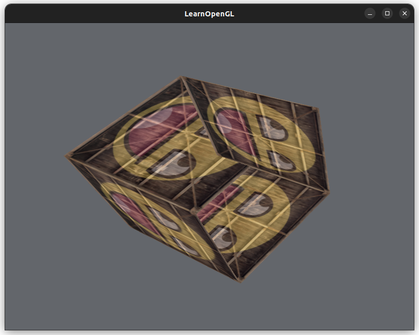

## Z-Buffer

OpenGL stores depth information in a **z-buffer**, or **depth-buffer**.
* A fragment's z-value is its depth.
* OpenGL compares a fragment's z-value with the value in the z-buffer.
* **Depth-testing**: remove fragments that are behind other fragments (in terms of depth); done by OpenGL
  * Disabled by default

To use the depth buffer, we need to:
* Enable it explicity with `glEnable()`
* Clear the depth buffer on each iteration of the render loop with `glClear()`
  * The same way that we clear the color buffer per iteration
  * This is so we clear the depth information of the previous frame
  * If you don't do this, nothing gets rendered

Using the depth buffer, cool!
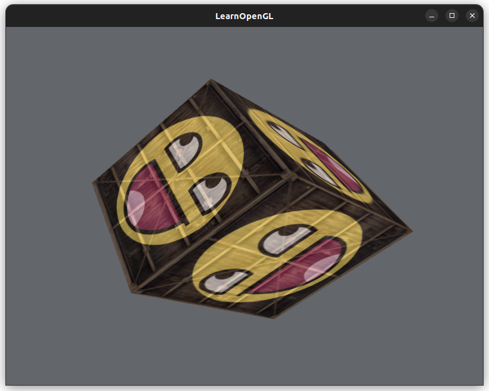

### Many Cubes

We use the same vertex data, but for each cube, update the `model` matrix (apply a different translation and a rotation) and draw each cube separately `glDrawArrays()`.

The main cube in the center is also drawn in this loop (so the original one was removed):
```cpp
// Draw each cube positioned at different locations
for (int i=0; i<10; i++) {
    // Create a transformation matrix for this cube and apply it in the vertex shader
    glm::mat4 model_matrix(1.0f);
    model_matrix = glm::translate(model_matrix, cubePositions[i]);
    model_matrix = glm::rotate(model_matrix, glm::radians(20.f * i), glm::vec3(1.0f, 0.3f, 0.5f));
    glUniformMatrix4fv(modelLoc, 1, GL_FALSE, glm::value_ptr(model_matrix));
    // Draw the cube!
    glDrawArrays(GL_TRIANGLES, 0, 36);
}
```

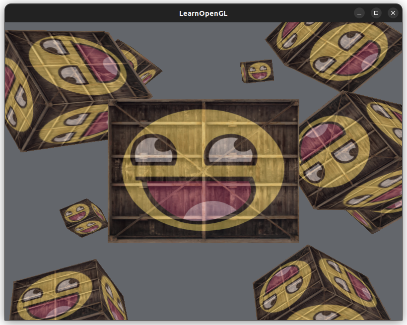

## Exercises

### Field of View and Aspect Ratio

Field of view (FOV)

100 degrees
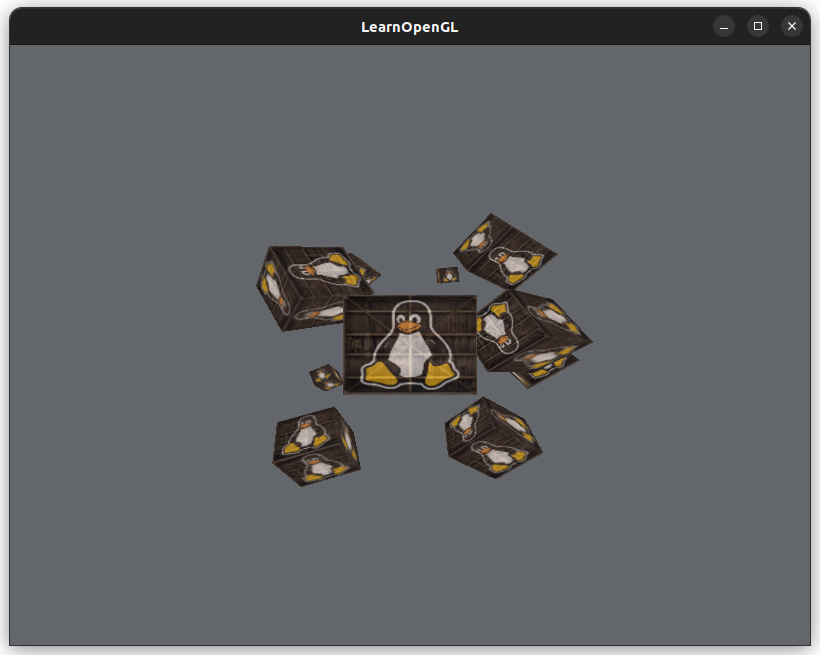

65 degrees
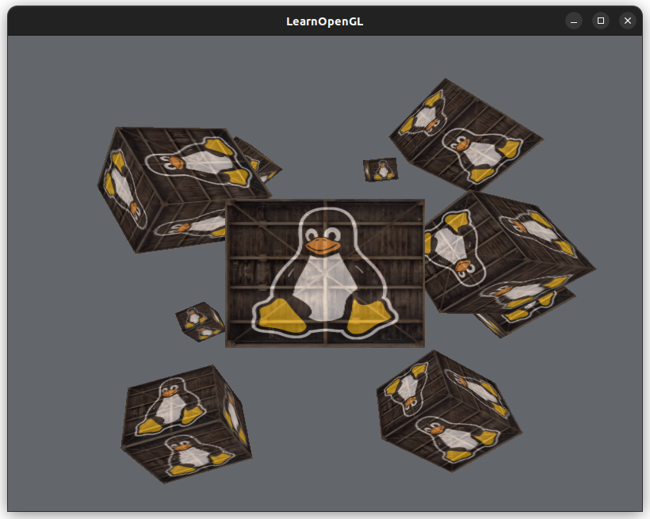


45 degrees
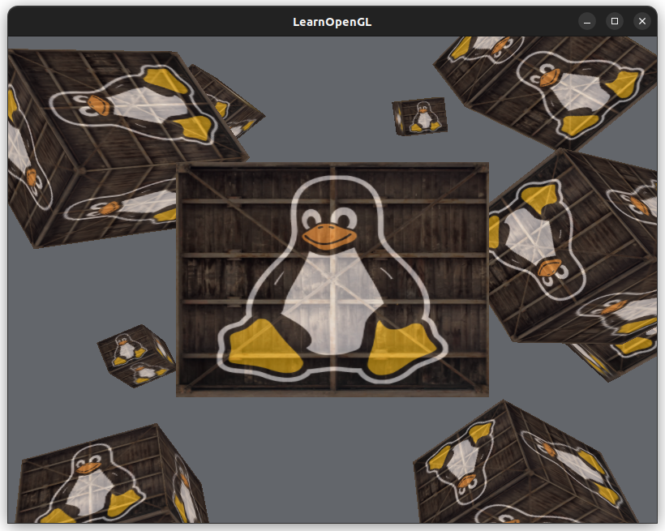

25 degrees
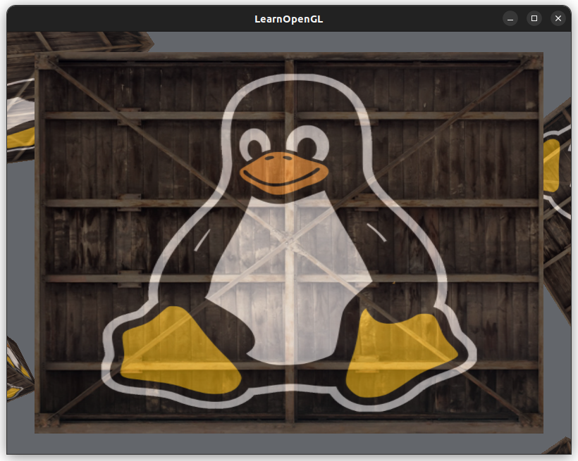

5 degrees
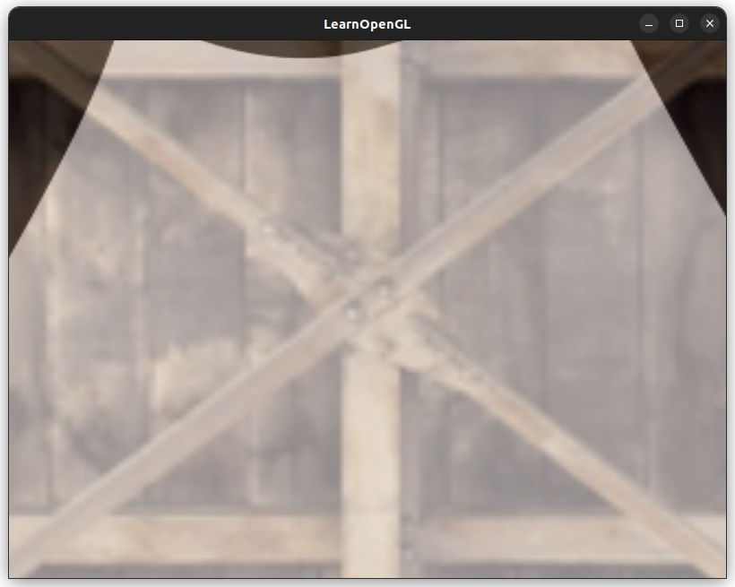

💥 *crashes into camera*

Aspect Ratio

Change the window's width and height to change the aspect ratio"
```cpp
// Create a window object, which holds the window data 
int window_width_pixels = 800;
int window_height_pixels = 600;
GLFWwindow* window = glfwCreateWindow(
  // ...
);
```

The aspect ratio was calculated incorrectly until now... Forgot to cast window dimensions to a `float` OTL
```cpp
float aspect_ratio = (float)window_width_pixels / (float)window_height_pixels;
```

[Common aspect ratios](https://www.adobe.com/uk/creativecloud/photography/discover/standard-photo-sizes.html)

Window: 800x600 pixels
Aspect ratio = 4:3 ~= 1.3

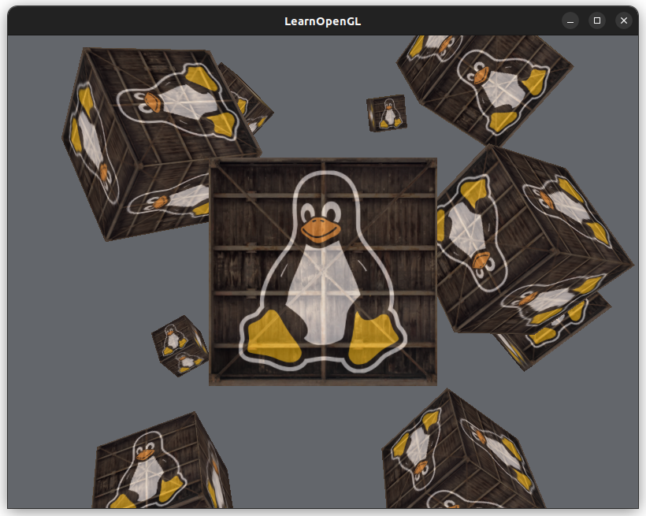

Window: 800x800 pixels
Aspect ratio: 1:1 = 1.0

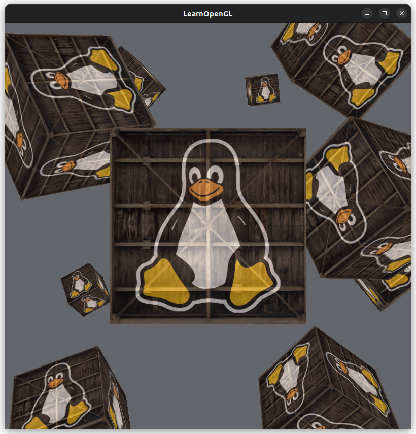

Window: 1200x800 pixels
Aspect ratio: 3:2 = 1.5

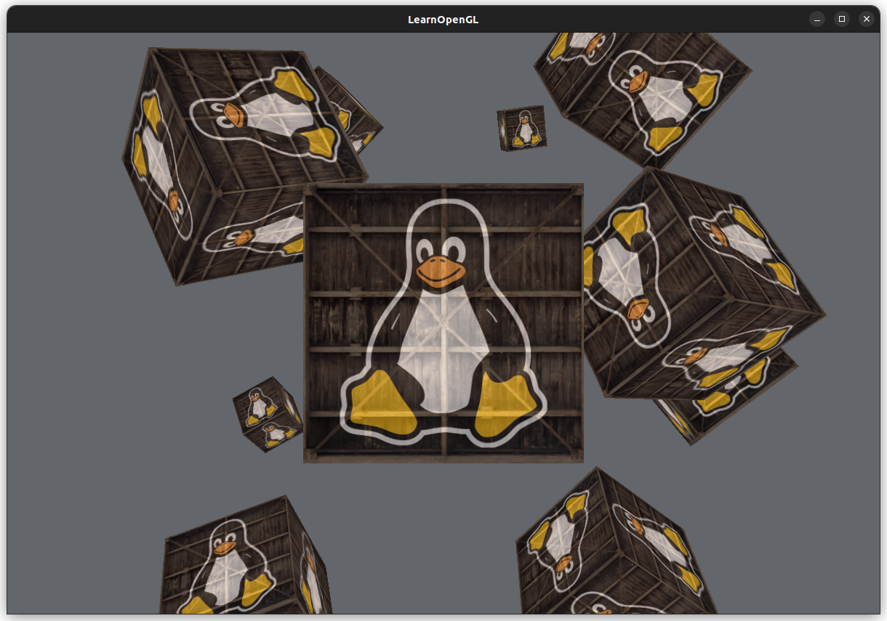

Window: 800x450 pixels
Aspect ratio: 16:9 ~= 1.8

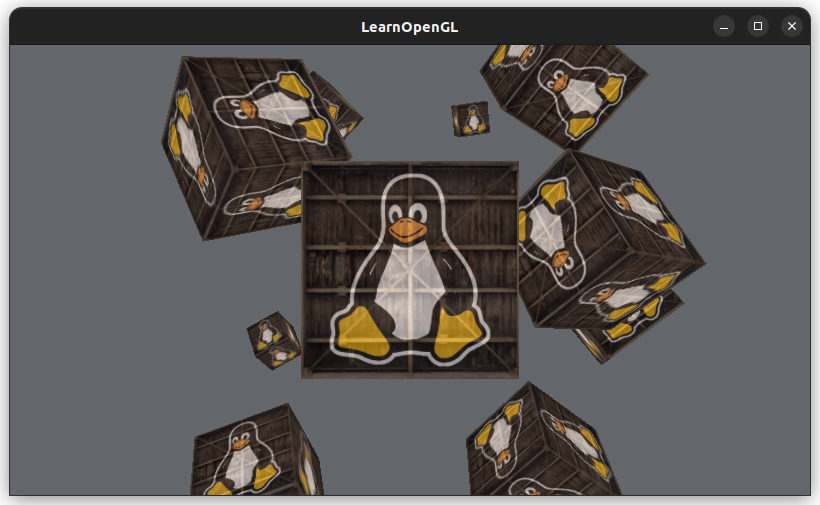

### View Matrix

Adjust camera with keyboard:
* x-axis: A, D
* y-axis: W, X
* z-axis: S, Z

```
...
Updated view matrix 1 axis from 2 to 1.9
Updated view matrix 1 axis from 1.9 to 1.8
Updated view matrix 1 axis from 1.8 to 1.7
```

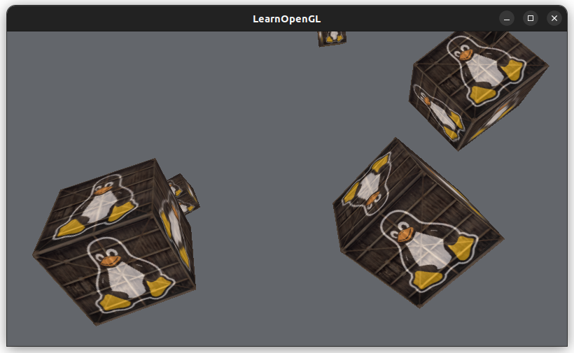

I asked ChatGPT to help me 😄🤯🤖💥 

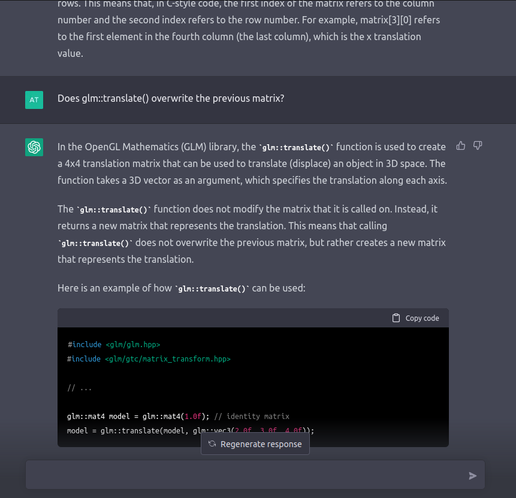


## Reading

* [Perspective and orthogoal matrices (Scratchapixel)](https://www.scratchapixel.com/lessons/3d-basic-rendering/perspective-and-orthographic-projection-matrix/projection-matrix-introduction)
