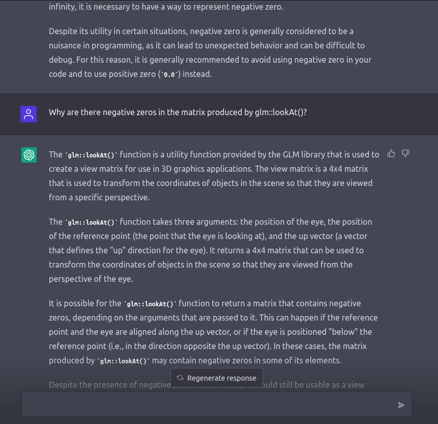
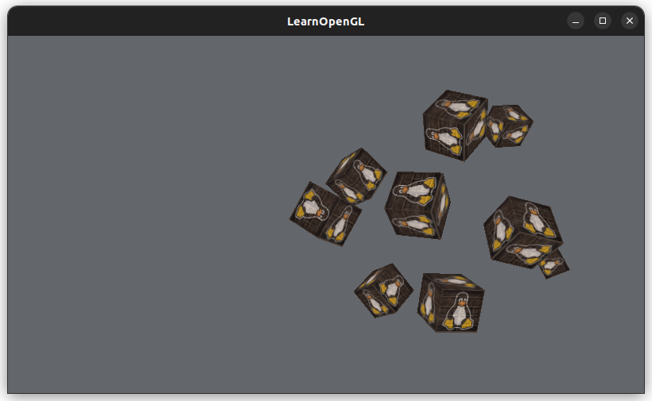
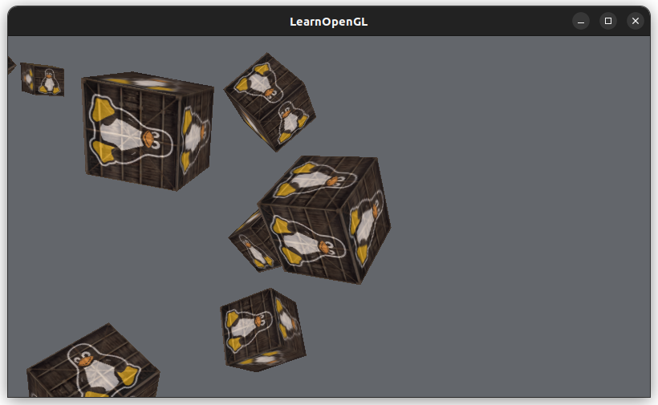

# [Camera](https://learnopengl.com/Getting-started/Camera)

There isn't really a concept of a *camera*, instead, you just make everything in the scene move in reverse to give the *illusion* that we are moving a camera around.

## Camera and View Space

Create a coordinate system with the camera's position as the origin.

To create a coordinate system of the view/camera space, we need vectors, each that describes:
* The position of the camera (the vector points at the camera)
* The camera's direction (sorta): which way is the camera facing (positive z-axis)
  * Subtract two vectors: the position of the camera - the scene's origin
    * This results in a vector pointing from the scene's origin to the camera's position
    * So the camera's direction vector is actually facing *away* from the origin
* The right vector: the positive x-axis
  * The up vector: points upwards in world space
  * To compute the right vector, take the cross product of the up vector and the camera's direction vector
    * Order matters here, if we reverse the cross product arguments, we'd get the negative x-axis instead
* The up vector: the positive y-axis
  * Take the cross product of the camera's direction and the right vector

([Gram-Schmidt process](https://en.wikipedia.org/wiki/Gram%E2%80%93Schmidt_process))

## Look At Matrix

The Look At matrix transforms coordinates from world space to camera/view space. To create this matrix we need:
* The right vector
* The up vector
* The direction vector
* The camera's position



It said "Sure!"! That was delightful... 🥲


Wow, it even apologizes and understands where the confusion might have stemmed from 🤯


We normalize the vectors of the coordinate system so that we don't apply any scaling.
```cpp
// Positive z-axis is outside of the screen
glm::vec3 cameraPosition(0.0f, 0.0f, 3.0f);
glm::vec3 cameraTarget(0.0f, 0.0f, 0.0f);
glm::vec3 cameraDirection = glm::normalize(
    cameraPosition - cameraTarget
);
```

When you create a `glm::mat`, pass in the vectors in column-major order. The values are stored in column-major order, so to print the martix to the console (so we have to do this by row):
```cpp
// Print in column-major order
void print_matrix(std::string info, glm::mat4 matrix) {
    std::cout << info << std::endl;
    for (int i=0; i<4; i++) {
        for (int j=0; j<4; j++) {
            std::cout << std::setw(2) << matrix[j][i] << " "; // i and j are swapped
        }
        std::cout << std::endl;
    }   
}

```

Rotate radius 10:



Rotate radius 5:



## Walk Around

[*Strafe effect*](https://en.wikipedia.org/wiki/Strafing_%28video_games%29) when using the camera: the act of moving sideways in a video game while still looking at a constant target
* Ex. moving sideways while looking at an enemy

WASD to move the camera:

```cpp
if (glfwGetKey(window, GLFW_KEY_W) == GLFW_PRESS) {
    // Goes forward, into the screen
    // cameraSpeed * cameraFront = negative
    cameraPosition += cameraSpeed * cameraFront;
} else if (glfwGetKey(window, GLFW_KEY_S) == GLFW_PRESS) {
    // Goes backwards, away from the screen
    // cameraSpeed * cameraFront = negative
    // -= negative is addition, positive z-axis is away from the screen
    cameraPosition -= cameraSpeed * cameraFront;
} else if (glfwGetKey(window, GLFW_KEY_A) == GLFW_PRESS) {
    // Move left
    // Get the direction of the positive x-axis
    // Normalize so that we don't apply a scaling effect while moving camera
    glm::vec3 rightVector = glm::normalize(glm::cross(cameraUp, cameraFront));
    cameraPosition += cameraSpeed * rightVector;
} else if (glfwGetKey(window, GLFW_KEY_D) == GLFW_PRESS) {
    // Move right
    glm::vec3 rightVector = glm::normalize(glm::cross(cameraUp, cameraFront));
    cameraPosition -= cameraSpeed * rightVector;
} 
```
