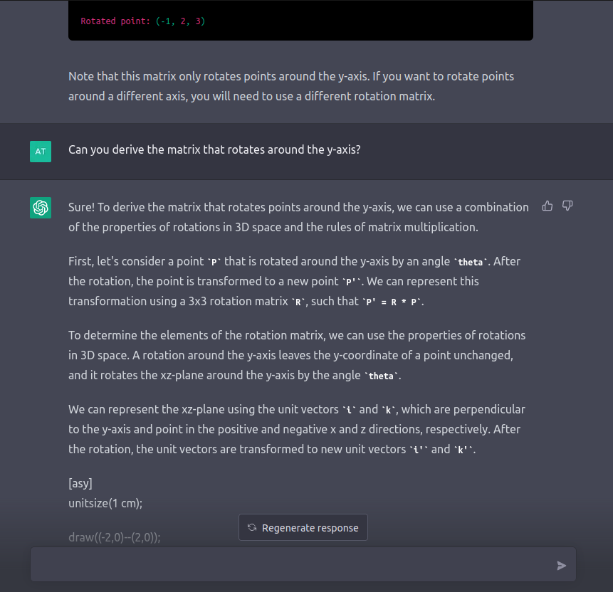
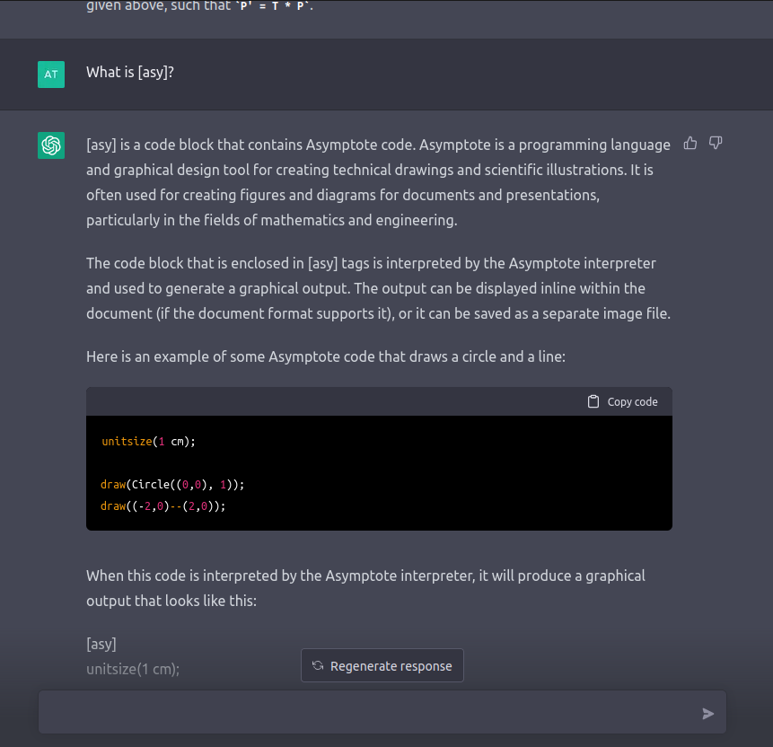
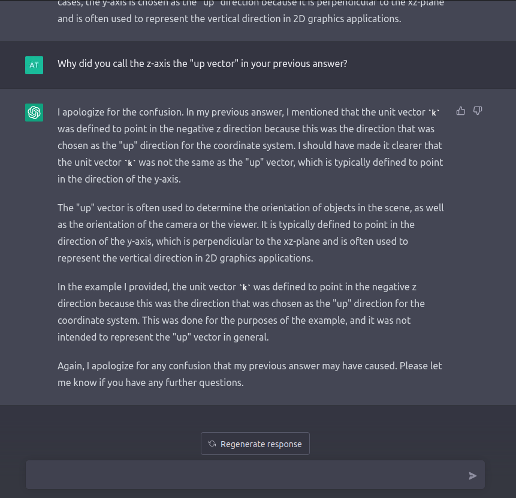

# [Camera](https://learnopengl.com/Getting-started/Camera)

There isn't really a concept of a *camera*, instead, you just make everything in the scene move in reverse to give the *illusion* that we are moving a camera around.

## Camera and View Space

Create a coordinate system with the camera's position as the origin.

To create a coordinate system of the view/camera space, we need vectors, each that describes:
* The position of the camera (the vector points at the camera)
* The camera's direction (sorta): which way is the camera facing (positive z-axis)
  * Subtract two vectors: the position of the camera - the scene's origin
    * This results in a vector pointing from the scene's origin to the camera's position
    * So the camera's direction vector is actually facing *away* from the origin
* The right vector: the positive x-axis
  * The up vector: points upwards in world space
  * To compute the right vector, take the cross product of the up vector and the camera's direction vector
    * Order matters here, if we reverse the cross product arguments, we'd get the negative x-axis instead
* The up vector: the positive y-axis
  * Take the cross product of the camera's direction and the right vector

([Gram-Schmidt process](https://en.wikipedia.org/wiki/Gram%E2%80%93Schmidt_process))

## Look At Matrix

The Look At matrix transforms coordinates from world space to camera/view space. To create this matrix we need:
* The right vector
* The up vector
* The direction vector
* The camera's position

It said "Sure!"! That was delightful... 🥲

Wow, it even apologizes and understands where the confusion might have stemmed from 🤯

