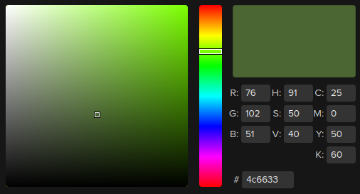

# [Colors](https://learnopengl.com/Lighting/Colors)

Simplified discription of how colors work:
* The sunlight (white light) contains all the colors of light
* When sunlight hits the object, the color that is relfected *off* of the object is the color that we see for that object
  * The rest of the colors in the sunlight are absorbed

In OpenGL, each color channel (red, green, and blue) range from `[0, 1]`.

We multiply the incoming light's color with the object's color to get the percieved color of the object. For example, if sunlight hits an object:
```cpp
glm::vec3 sunlight(1.0f, 1.0f, 1.0f); // white light
glm::vec3 object_color(1.0f, 0.5f, 0.3f); // coral color

glm::vec3 result_color = sunlight * object_color;
```

The coral color:


An object's color describes *how much of the incoming light source's color components that the object reflects*.

#### Green Light

With a green light source:
```cpp
glm::vec3 green_light(0.0f, 1.0f, 0.0f); // red, green, blue
glm::vec3 object_color(1.0f, 0.5f, 0.3f); // coral color

glm::vec3 result_color = green_light * object_color;
```

Maf:
```cpp
result_color.red = 0.0f * 1.0f = 0.0f;
result_color.green = 1.0f * 0.5f = 0.5f;
result_color.blue = 0.0f * 0.3f = 0.0f;
```

Green light:


Coral color for object:


Result color:


With a pure green light, there is no red or blue light for the object to absorb and/or reflect.

Incoming light's green channel: `1.0f`
Object's green channel: `0.5f`
Result color's green channel: `0.5f`

This means the object *absorbs* half of the incoming green light and *reflects* half of the green light.

#### Olive Light

```cpp
glm::vec3 olive_light(0.3f, 0.4f, 0.2f);
glm::vec3 object_color(1.0f, 0.5f, 0.3f); // coral color

glm::vec3 result_color = olive_light * object_color;
```

Maf:
```cpp
object.red = 0.3f * 1.0f = 0.3f;
object.green = 0.4f * 0.5f = 0.2f;
object.blue = 0.2f * 0.3f = 0.06f;
```

Olive light color:



Object coral color:


Result color:


## A Lighting Scene

Create a *separate* Vertex Array Object (VAO) for the light source.

Must do in order (for each shader program!):
1. Activate VAO
2. Activate shader program (`shaderProgram.use()`, which calls `glUseProgram()` under the hood)
3. Set uniform variables of the shader (ex. model matrix)
4. Draw! `glDrawArrays(GL_TRIANGLES, start_index, num_vertices)`

If you don't want a shader to draw, just don't call `glUseProgram()`
* Then the other calls don't do anything... (ex) set uniform variables, draw arrays)


