# [Basic lighting](https://learnopengl.com/Lighting/Basic-Lighting)

Many models to approximate the effects of light on a computer.
* [Phong lighting model](https://en.wikipedia.org/wiki/Phong_reflection_model)
  * Published in 1975

Phong lighting model components:
* **Ambient**: in dark environments there is still some dim light source somewhere in the world (ex. moon, street lamp)
  * This gives color to an object in the dark
* **Diffuse**: the directional impact of the light source on the object
  * Parts of the object closer to the light = brighter, away = darker
  * Visually the most significant of the three
* **Specular**: the bright spot on shiny objects
  * Color more influenced by the light source's color than the object's color

When you combine the three components, you render objects under the Phong model.

## Ambient Lighting

There could be many light sources, some not even visible.
* Light can *reflect* off objects and illuminate other objects indirectly
* **Global illumination algorithms** model this effect, which can be expensive

**Ambient lighting** is a simplified global illumination model.
* Take a percentage of the light source's color
* Then you multiply this value with the objects color

In the fragment shader that renders the object (recall that object and light source have *different* shaders):
```glsl
float ambience_strength = 0.1;
vec3 ambience = light_color * ambience_strength;
vec3 final_object_color = object_color * ambience;
```

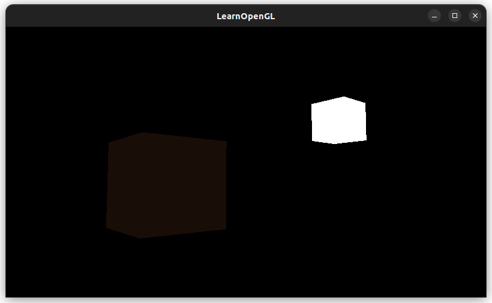

## Diffuse Lighting

Calculate the angle between the incoming light ray and the **normal vector** (a vector that is perpendicular to the object's surface) on the surface of an object:
* The *dot product* between two *unit* vectors, with an angle `θ` between the two vectors, is `cos(θ)`
* If the light s perfectly aligned with the object's normal vector, the angle between the normal vector and light is 0
  * `cos(0 degrees) = 1`
  * The object should be brightest when the angle between two vectors is closer to 0
* If the light and normal vector form a 90 degree angle, the result is `cos(90 degrees) = 0`
  * The object should be darkest

We use the scalar computed from the dot product to calculate the object's brightness on a fragment.
* The fragment's orientation toward the light gives us an angle

We need the two vectors:
* The normal vector off the object's surface
* The light's directional vector
  * Calculate by the difference between the position from the light source and the object

### Normal Vectors

A **normal vector** is a unit vector that is perpendicular to the surface of a vertex.
* A vertex itself has no surface (it is just a single point)
* Create a surface with the surrounding vertices
* Use the cross product to get a vector perpendicular to that surface

### Debugging, RenderDoc

After adding the normal vectors I still got the same cube:

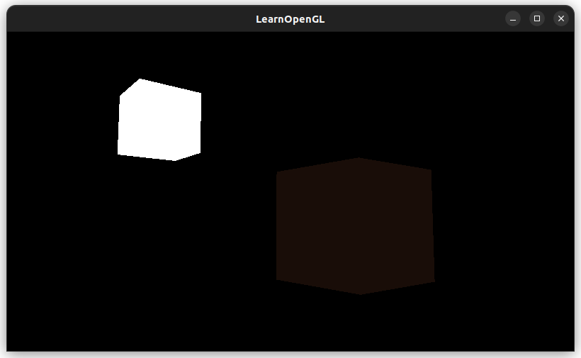

I started playing around with `glm` and manually doing some calculations that the fragment shader does:
```glsl
vec3 lightDirection = vec3(lightPos - FragPos);
float diffuseStrength = max(dot(normalize(lightDirection), normalize(Normal)), 0.0);
vec3 diffuse = diffuseStrength * lightColor;
```
I thought this dot product was always negative, which would result in a diffuse strength of 0, but that wasn't the case.

I also tried rendered the diffuse value by setting it as the cube color to see what it was ([visual debugging](https://stackoverflow.com/questions/18169276/how-can-i-debug-a-glsl-shader)):
```glsl
FragColor = vec4(diffuse, 1.0f);
```

OpenGL will error out on `glGetUniformLocation()` if variables are invalid or *unused* (it doesn't distinguish these errors I think). 

Then I gave up on print statement and assumption debugging and looked into some GLSL debuggers.

I downloaded [RenderDoc](https://renderdoc.org/) (there were no installation instructions, so I just moved the extracted folder to `/usr/lib` and made a symlink to the binaries in `/usr/bin`..., tangentially went to this page on [Filesystem Hierarchy Standard](https://www.pathname.com/fhs/pub/fhs-2.3.html#THEUSRHIERARCHY)).

```
sudo ln -s /usr/lib/renderdoc_1.25/bin/qrenderdoc /usr/bin/qrenderdoc
sudo ln -s /usr/lib/renderdoc_1.25/bin/renderdoccmd /usr/bin/renderdoccmd
```

Then to launch RenderDoc, run in the terminal:
```
qrenderdoc
```

First thing I learned was that the normal vectors were never passed into the shader:

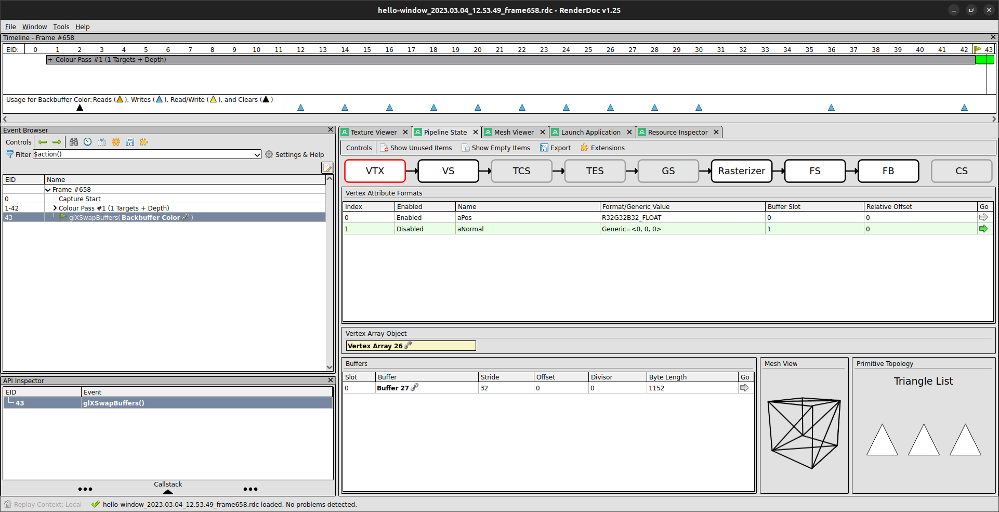

The problem was I was calling `glVertexAttribPointer()` and `glEnableVertexAttribArray()` for the normal vector data *after* enabling data (lightVAO, VBO) for the light source... So these calls silently failed.

So then I moved up the calls for the normal vector right after making those calls for the cube vertex data.

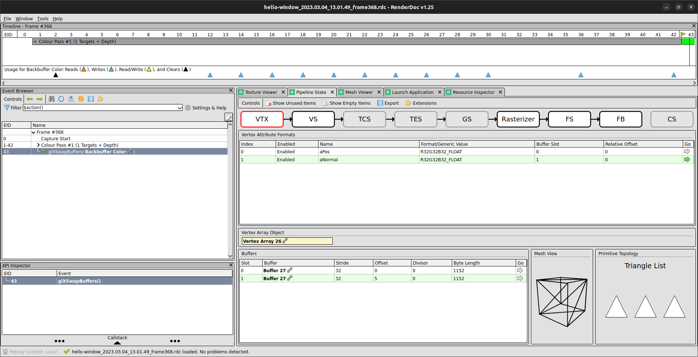

But the result was still not correct. I looked more in to the data passed into the shaders and the normal vectors looked like garbage:

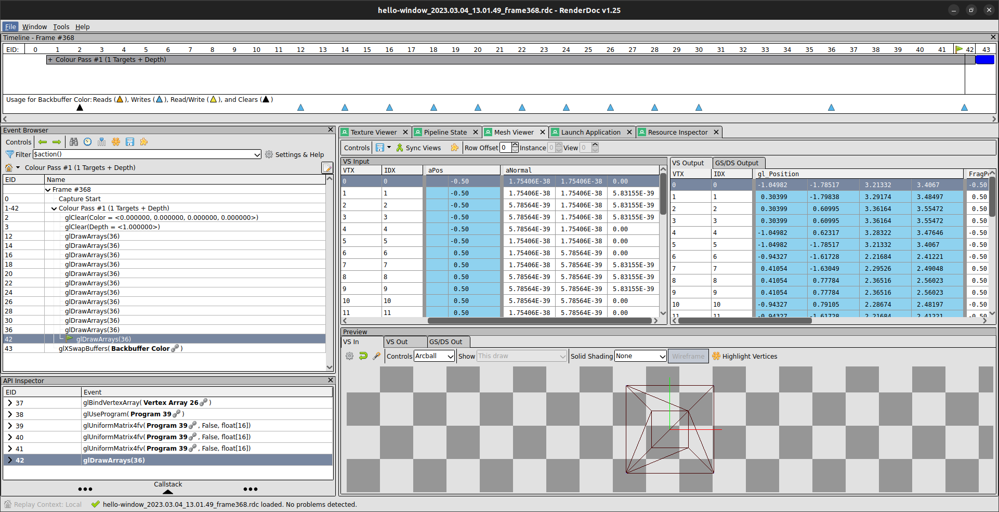

The first normal vector should have been `(0, 0, -1)`, which was not being sent to the shader.

The problem was the pointer offset argument for the normal vectors:
```cpp
    // Set the normal vectors to the vertex shader
    glVertexAttribPointer(
        1,
        3, // size of the input (vec3),
        GL_FLOAT, // type of the input
        GL_FALSE, // normalize data,
        verticesStride * sizeof(float), // stride of the data
        (void*)5 // <---
    );
    glEnableVertexAttribArray(1);
```

My data format was still: (vec3 vertex data) (vec2 texture coordinates) (vec3 normal vector), so the offset of `5` *items* was correct... but this had to be in terms of bytes.

After changing it to `(void*)(5*sizeof(float))`, it works!

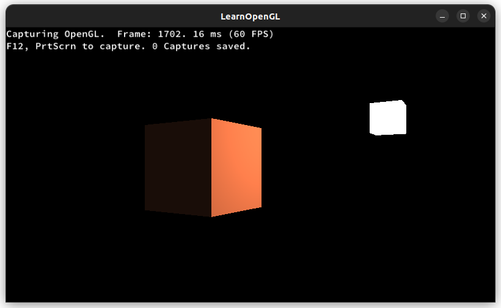

RenderDoc shows that the normal vectors are now correct:

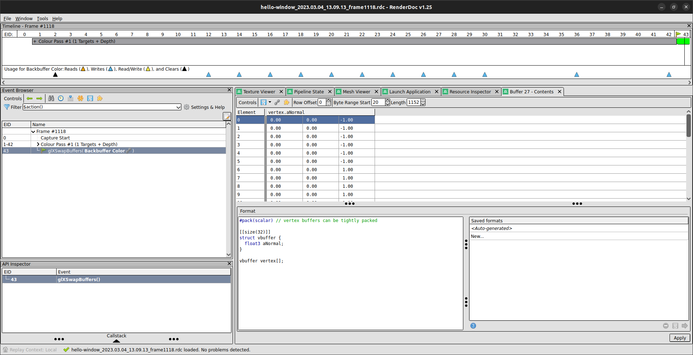

Debuggers 🎉

I moved the light position further away, which now gives a less harsh shadow:

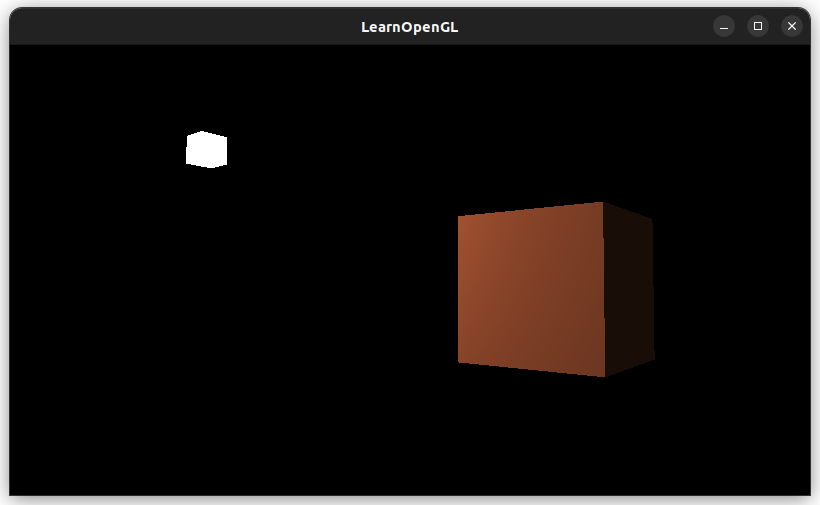

### One Last Thing (transforming normal vectors)

#### Notes on the [the normal matrix article](http://www.lighthouse3d.com/tutorials/glsl-12-tutorial/the-normal-matrix/)

This slide [transforming normal vectors](https://cseweb.ucsd.edu/classes/wi20/cse167-a/lec3.pdf) made the `G^T * M = I` relationship with the dot product `N' dot T' = 0` more clear.

We have two vectors (`vec3`) associated with a triangle fragment: the tangent vector `T` and the normal vector `N`. We have a 4x4 model-view matrix, where its upper-left 3x3 matrix is `M` that is applied to these vectors on a transformation, resulting in `T'` and `N'`.
* We can define a vector as a difference of two points
* If tangent vector `T = b - a`, then the vector after the transformation is: `T' = MT = b' - a'`
  * Points `a'` and `b'` are still along the triangle, so `T'` is still tangent to the triangle
* This is not the case with the normal vector after the transformation `N'`
  * We can use matrix `M` for the tangent vector, but we need to find a different vectot `G` for the normal vector
  
```
// Normal and tangent vector forms a right angle
N dot T = 0

// we want the vectors after the transformation to remain orthogonal 
N' dot T' = 0

// M and G are 3x3 model-view matrices
// N' = GN
// T' = MT
GN dot MT = 0

// We can convert a dot product to a matrix multiply using a transpose
(GN)^T * (MT) = 0

// Split apart the transpose
(N^T)(G^T) * (MT) = 0

// In the above equation, if this portion: G^T * M  = I (Identity)
// then N^T * T = N dot T = 0 // convert matrix multiply as a dot product
// We want N dot T = 0 since we want the transformation to retain their orthogonality
```

Then we solve for matrix `G`:
```
G^T * M = I
G = (M^-1)^T
```

When do we not need a special matrix `G` for the normal vector? (and could just use `M`?): When `M` is orthogonal:
```
M^-1 = M^T = G = M
```

* The transpose and inverse is the same for orthogonal matrices
* An **orthogonal matrix** is a matrix where it's rows and column vectors are unit length, and are orthogonal to each other
* When vectors are multiplied by an orthogonal matrix, the angle between them and their lengths are preserved
  * This keeps normal and tangent vectors perpendicular to each other
* `M` is orthogonal if we limit transformations to *translations* and *rotations* only. If we apply *scale*, `M` is not orthogonal anymore, so in this case we need to apply matrix `G = (M^-1)^T` to the normal vector

## Specular Lighting

Similar to diffuse lighting in terms of calculation, but now the viewer's direction toward the object matters in the light's effect.

Guess attempt (does not correctly render):
```glsl
float specularStrength = 0.5;
vec3 viewDirection = normalize(FragPos - viewPos);
vec3 reflectionDirection = lightDirection - 2 * dot(lightDirection, normalVec) * normalVec;
vec3 specular = acos(dot(viewDirection, reflectionDirection)) * specularStrength * lightColor;
// ...
vec3 lightEffect = diffuse + ambience + specular;
```

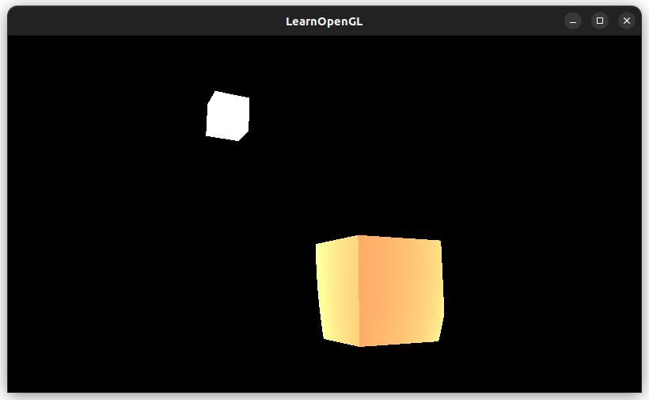

Second attempt (super intense lighting...)

```glsl
float specularStrength = 0.5;
vec3 viewDirection = normalize(viewPos - FragPos);
// -1 since the lightDirection is currently fragPos to light, and we want the opposite direction
// The reflect() function expects direction light-> fragPos
vec3 reflectionDirection = reflect(-lightDirection, normalVec); 
// How much the light is properly reflected versus scattered around
// Higher values, a smaller area will get intense light (highlights)
// Lower values, light is spread out across the fragment
float shininess = 32;
float spec = pow(max(dot(viewDirection, reflectionDirection), 0.0), shininess);
vec3 specular = specularStrength * spec * lightColor;
```

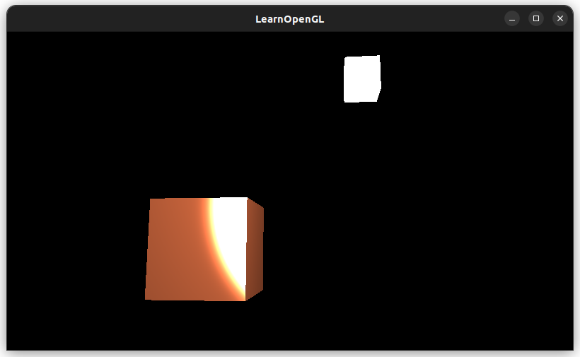

Now I tried `specularStrength=0.1` and `shininess=4`:

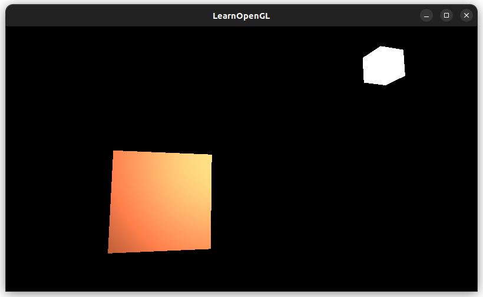

## Exercises

1. Move the light source overtime

We set a rotation radius of the light source before the render loop:
```cpp
const float rotationRadius = 2.5f;
```

We update the light source's position over time:
```cpp
// Rotate the camera around the y-axis over time
double timeStamp = glfwGetTime();
float lightPosX = cos(timeStamp) * rotationRadius;
float lightPosZ = -1 * sin(timeStamp) * rotationRadius; // negative 1 for clockwise rotation
glm::vec3 lightPos = glm::vec3(lightPosX, 1.0f, lightPosZ);

model = glm::translate(model, lightPos);
```

We also have to update the light position lighting shader (must come after `shader.use()`!)

```cpp
lightingShader.use();
// Use the position calculated at this timestamp for the light source 
lightingShader.setVec3("lightPos", lightPos);
```

I turned of the first-person shooter mode on the camera so I coud fly above the cube ✈️✨

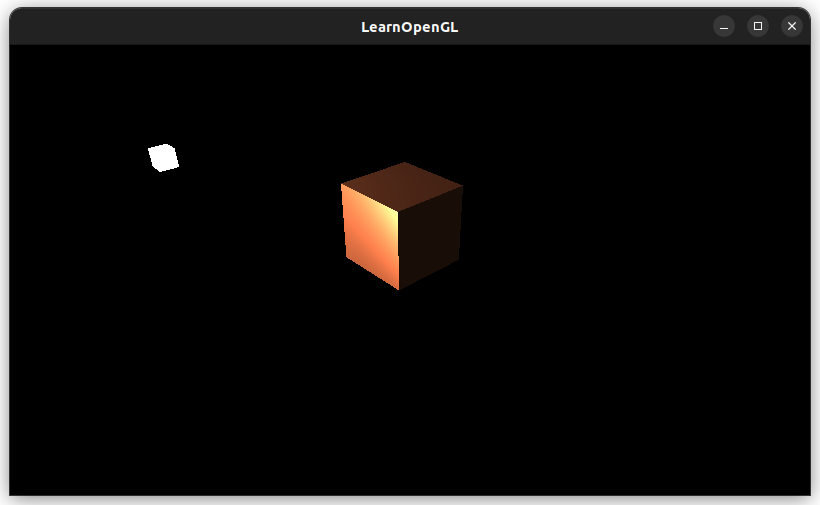

We can easily rotate around the z-axis:
```cpp
glm::vec3 lightPos = glm::vec3(lightPosX, lightPosZ, 1.0f);
```

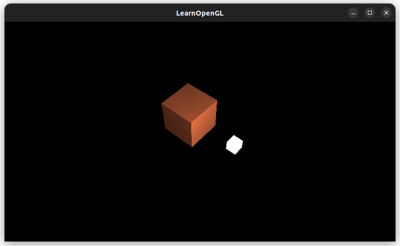

Light color fun:

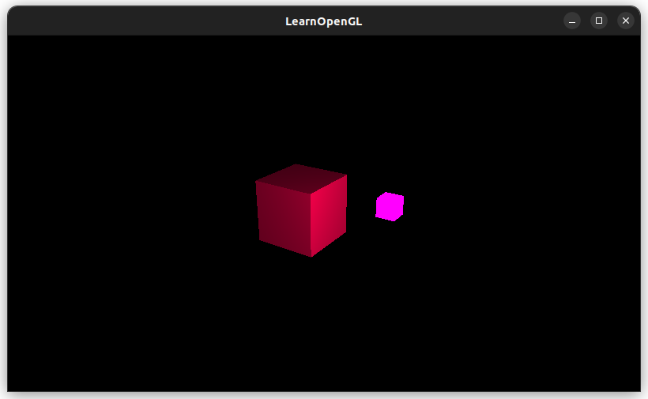
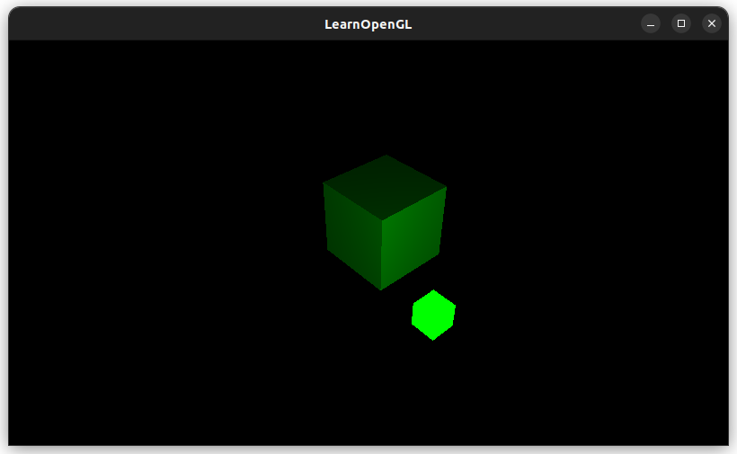

Had to update both light source shader and the lighting shader to accept the same light color.

### Imgui UI

2. Play around with ambient, diffuse, and specular strengths

Going to play around with [imgui](https://github.com/ocornut/imgui) UI.

To install it, I cloned the [imgui repository](https://github.com/ocornut/imgui), set `$IMG_GUI` environment variable to the path where I cloned the repo locally, then used the `imgui/examples/example_glfw_opengl3/Makefile` as the base Makefile for my project.

TIL to refer to an environment variable in a Makefile, you have to escape the `$`.
Zum Beispiel: `IMGUI_DIR = $(shell echo $$IMGUI_DIR)`
