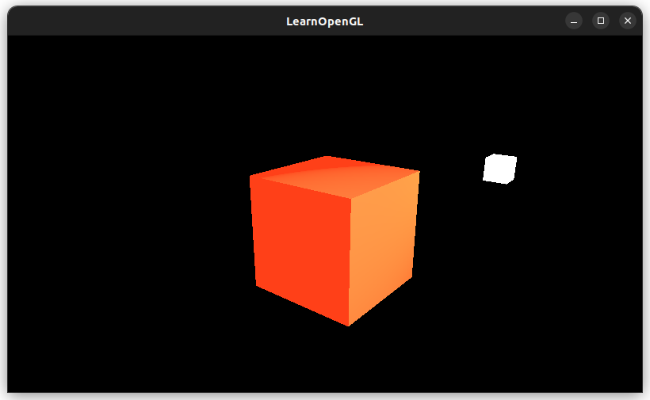
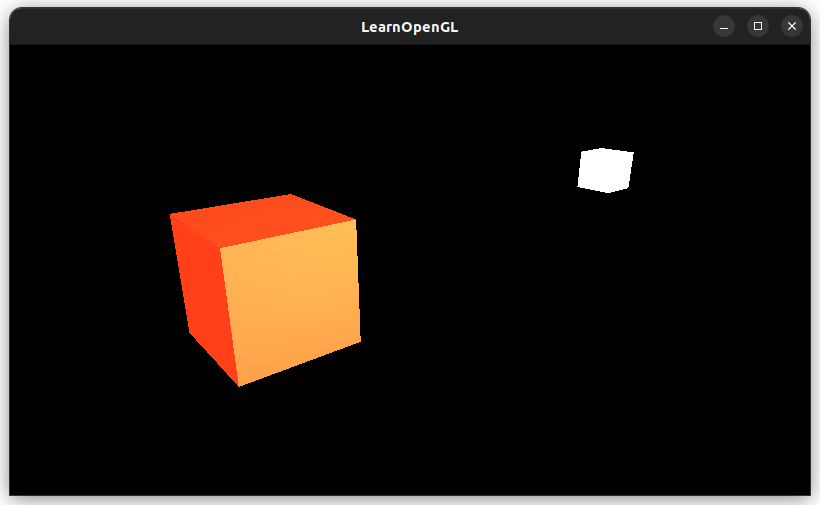
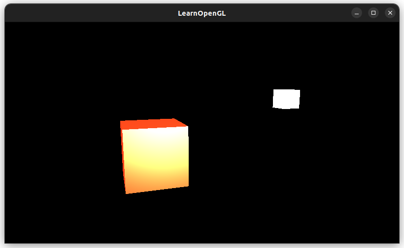
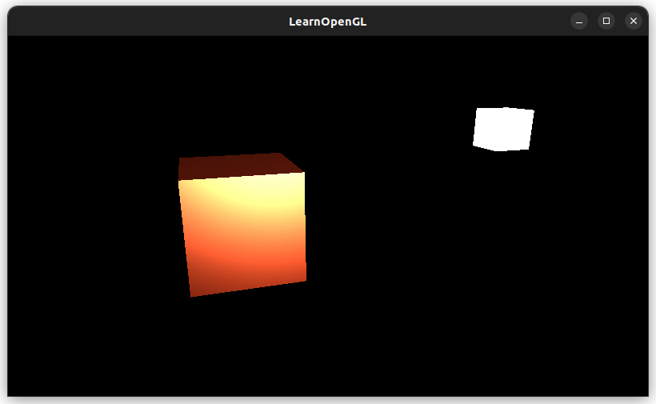
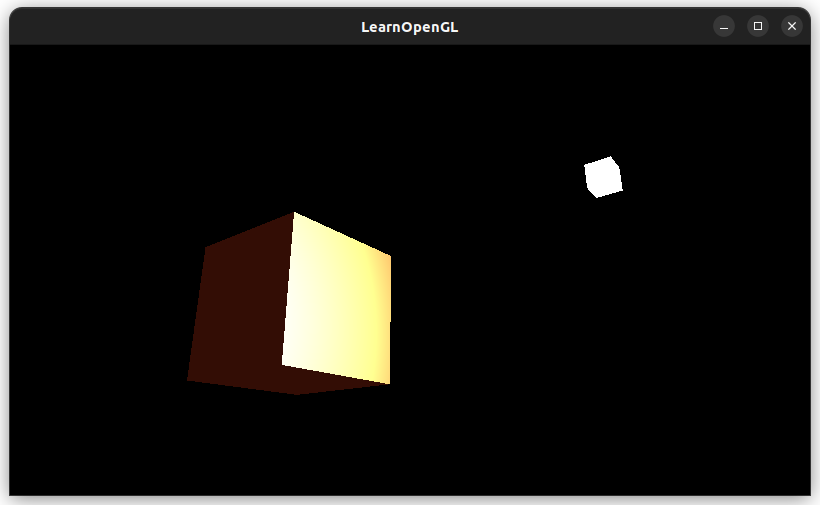
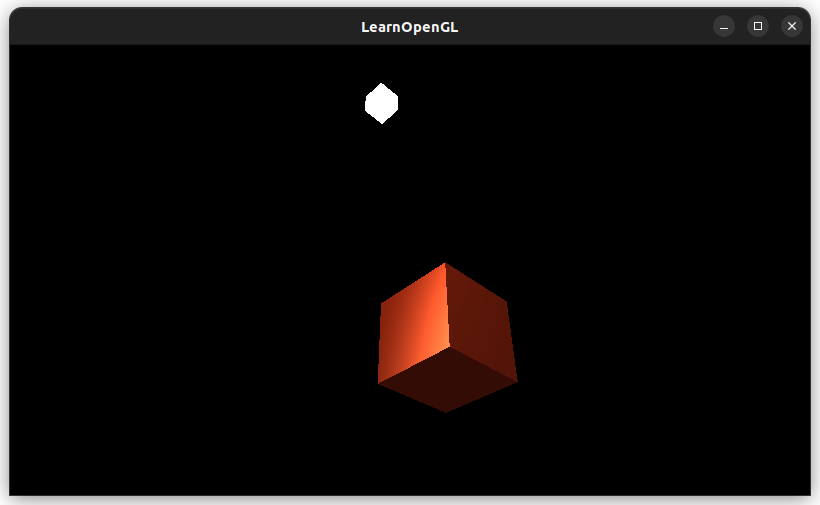

# [Materials](https://learnopengl.com/Lighting/Materials)

Different materials react to light differently
* ex) steel vs. wood
* How much light is reflected, scattered, highlights

We need to define **material properties** specific to each surface, containing:
* The three components of Phong shading: ambient, diffuse, and specular
  * As colors `vec3`
* Shininess `float`
* These get manipulated in the fragment shader
 
The properties:
* **Ambient**: the color under ambient lighting, usually the color of the object
  * What color the surface reflects under ambient lighting
* **Diffuse**: the color under diffuse lighting
* **Specular**: the color the highlight
* **Shininess**: the scattering/radius of the specular highlight

Some material properties defined here: http://devernay.free.fr/cours/opengl/materials.html
(ex. emerald, gold, black plastic)

## Setting materials
A `struct` in GLSL is just a namespace, so you have to set the struct fields individually
```cpp
lightingShader.setVec3("material.ambient", glm::vec3(1.0f, 0.5f, 0.31f));
```

Doesn't look right :/ ~~The specular/shininess isn't there~~ Shininess was at 0.32f, oops





Shiniess at 4:



Still looks off...

### Light properties
We also need to set the intensities of the *light source* itself for each of the components: ambient, diffuse, and specular.

Here we lowered the ambience intensity to 0.2, diffuse to 0.5, and specular to 1.0:



Other angles... none of these look right :/





### Different Light Colors


ChatGPT helped me with the `webm` to `mp4` conversion !

```
ffmpeg -i my-recording.webm -vf "scale=788:trunc(ow/a/2)*2"  my-recording.mp4
```

Some settings over time:
```cpp
lightColor.x = sin(glfwGetTime() * 2.0f);
lightColor.y = sin(glfwGetTime() * 0.7f);
lightColor.z = sin(glfwGetTime() * 1.3f);
// ...
glm::vec3 ambientColor = lightColor * glm::vec3(0.2);
glm::vec3 diffuseColor = lightColor * glm::vec3(0.5);
lightingShader.setVec3("lightColor", lightColor);
lightingShader.setVec3("light.diffuse", diffuseColor);
lightingShader.setVec3("light.ambient", ambientColor);

```


Added this line:
```cpp
lightingShader.setFloat("material.shininess", sin(glfwGetTime()));
```

Weird bug:


