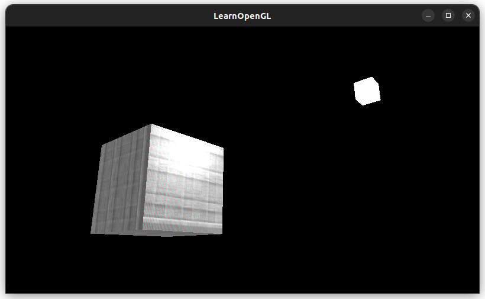
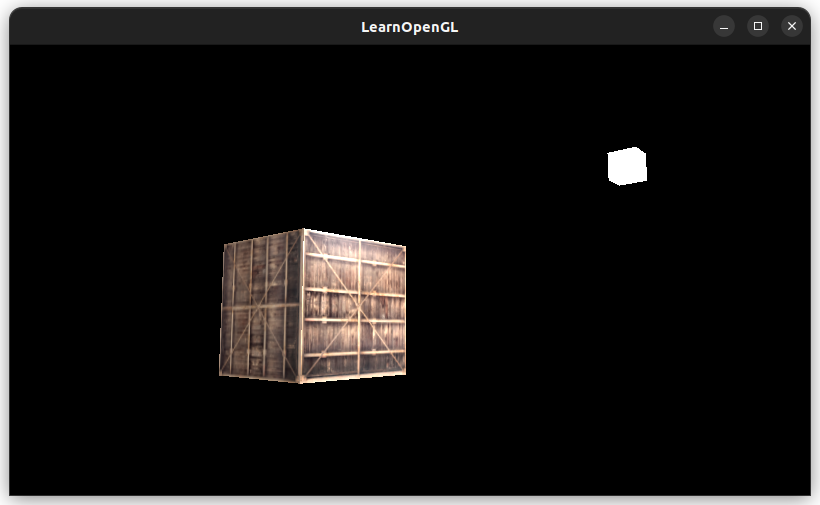
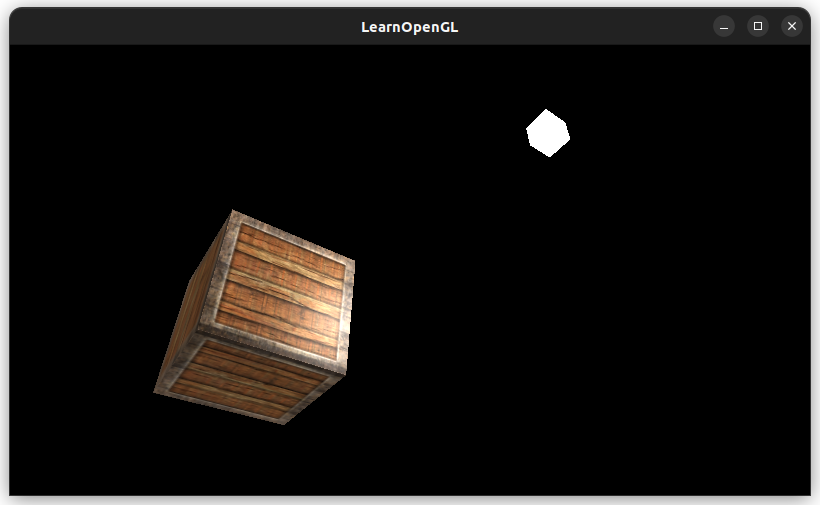
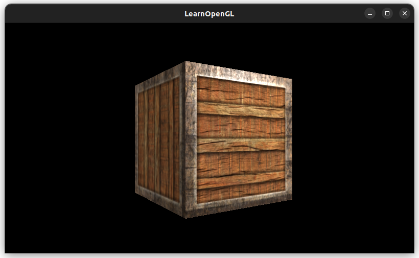
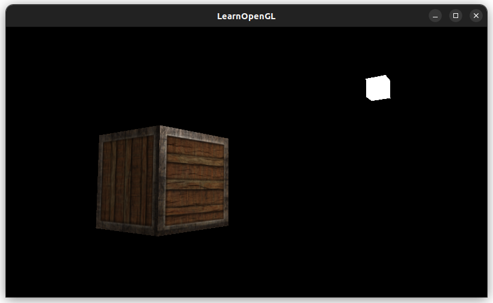

# [Lighting Maps](https://learnopengl.com/Lighting/Lighting-maps)

Objects in real life are made up of many *different* materials of different light/color properties
* Ex) car: window, frame, tires, etc. all react to light differently
* We need a *diffuse* and *specular* maps to define how each part of an object react to light

## Diffuse Maps
We are going to use the same process we used in texture mapping.

I reused the existing logic to load and set textures and updated the texture file path:
```cpp
const char* textureFilenames[] = {"textures/container2.png", "textures/linux-penguin-with-outline.png"};
```



The old crate looks fine:



So the image loading is probably incorrect, `jpg` versus `png` issue?
[Yup, forgot to update the format](https://stackoverflow.com/questions/23150123/loading-png-with-stb-image-for-opengl-texture-gives-wrong-colors):
```cpp
GLenum imageFormats[] = {GL_RGBA, GL_RGBA};
```
`GL_RGBA` is for `png`, and `GL_RGB` is for `.jpg`.

Fixed!



It's brighter because I left the light attributes to `vec3(1.0)` from the previous chapter's exercise.


## Specular Maps

In our crate, the wooden part should not show specular highlights, while the metal border should.

We can use a *specular map* that defines the specular properties of each part of the object. 

Here we are using a black and white image, where white indiciates more intense specular effects. Black means no specular effect.

White `vec3(1.0)` will result in a larger value in the multiplication in the fragment shader, resulting in a brighter highlight. Black `vec3(0.0)` will result in no highlight.

### Sampling Specular Maps

Similar process to samping the diffuse map. We create a `Sampler2D` field for the diffuse attribute of our material and assign the diffuse map to the correct texture unit.

The border is shinier!



## Exercises

Ambient, diffuse, and specular lighting at `0.5`:



### ImGui (revisited)

Fixed the "not being able to interact with the GUI" problem!!". Went and re-read this [StackOverFlow post](https://stackoverflow.com/questions/71680516/how-do-i-handle-mouse-events-in-general-in-imgui-with-glfw), which one answer said you have to initialize ImGui *after* calling the GLFW callbacks (for mouse input, scroll input, etc.).

The UI is now at least draggable and interactable 😭 Amazing!

To not move the camera when hovering over ImGui, updated the GLFW mouse callback:
```cpp
void mouse_callback(GLFWwindow* window, double xpos, double ypos) {
    ImGuiIO& io = ImGui::GetIO();
    if (!io.WantCaptureMouse) {
        camera.updateFrontVector(xpos, ypos);
    }
}
```

Made a click and drag camera (so only move the camera if mouse is pressed):
```cpp
// global
bool mouse_presed = false;

void mouse_callback(GLFWwindow* window, double xpos, double ypos) {
    ImGuiIO& io = ImGui::GetIO();
    if (!io.WantCaptureMouse && mouse_pressed) {
        camera.updateFrontVector(xpos, ypos);
    }
}

// Handler for checking when the mouse is pressed and released
void mouse_pressed_callback(GLFWwindow* window, int button, int action, int mods) {
    if (button == GLFW_MOUSE_BUTTON_LEFT && action == GLFW_PRESS) {
        mouse_pressed = true;
    } else {
        mouse_pressed = false;
    }
}
```

The GLFW callback:
```cpp
glfwSetMouseButtonCallback(window, mouse_pressed_callback);
```

Controllable lighting:


