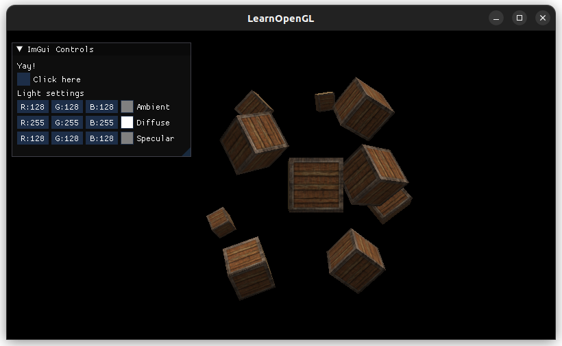
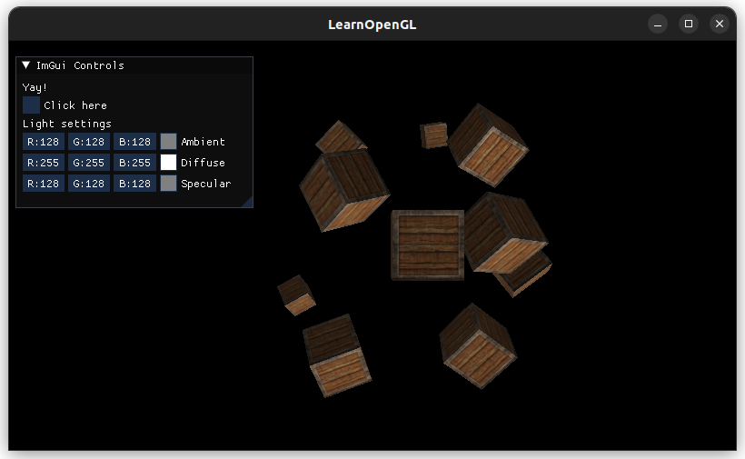
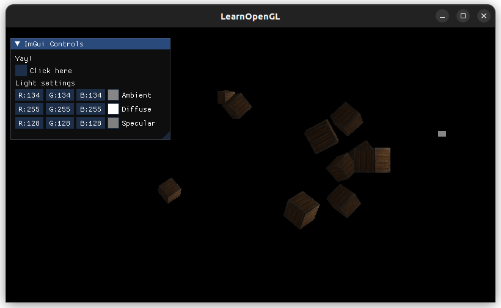
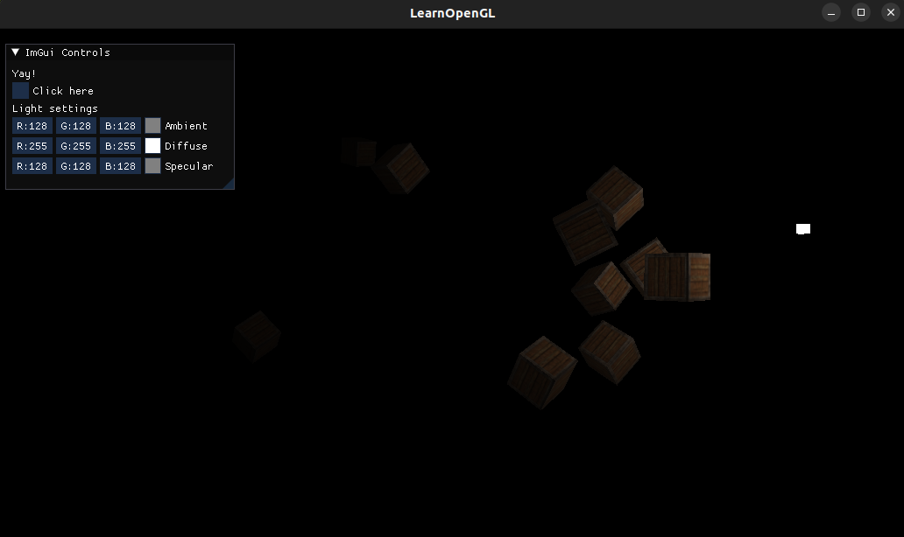
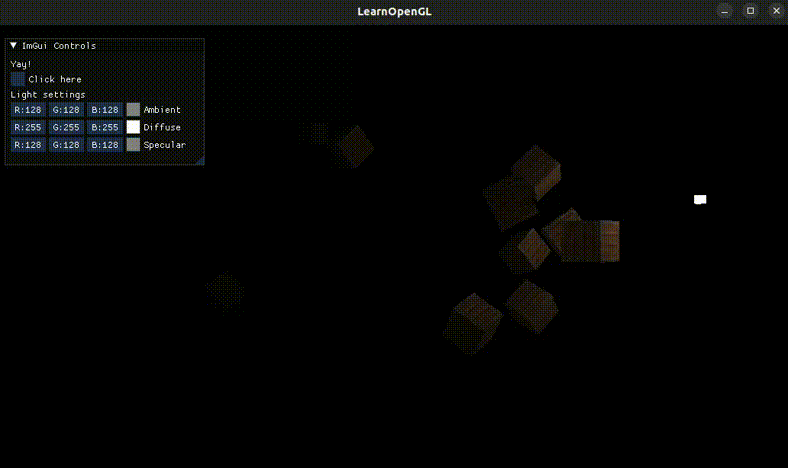
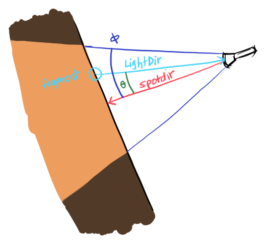
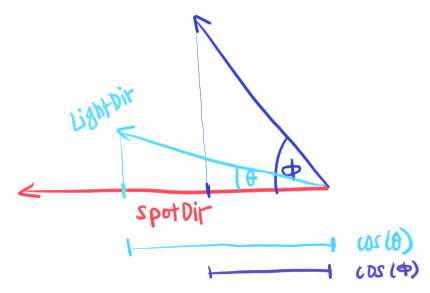
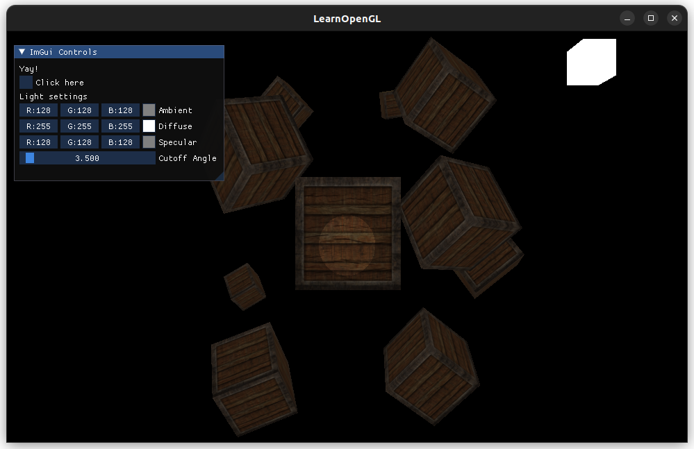
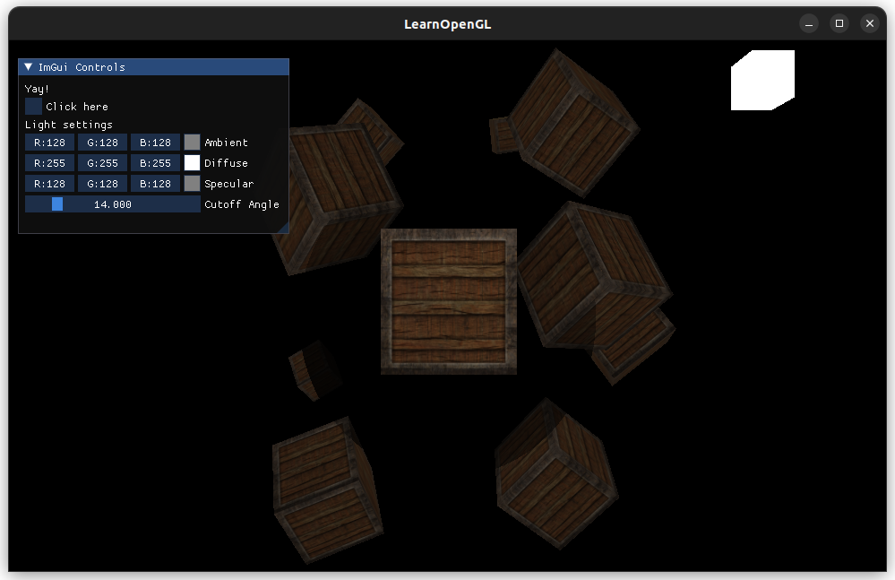
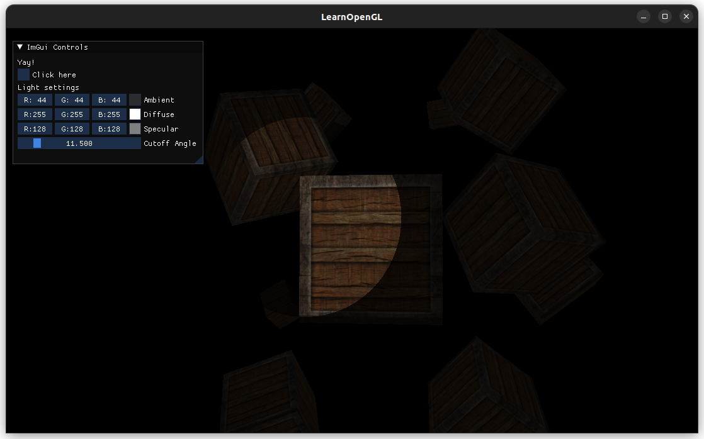

# [Light Casters](https://learnopengl.com/Lighting/Light-casters)

## Directional Light

**Directional light** are light sources that are percieved to be *infinitely* far away. The rays from these light sources are all parallel and are always in the same direction, regardless of where the light source is (therefore, it's position is irrelevant). An example is the sun. The directional light's direction vector is the same for every object in the scene.

I set the diffuse setting to max to exaggerate the shadows more.

Directional light vector pointing down:



Directional light vector pointing up (simply make the y value positive):



Cool!! ☀️

## Point Lights

**Point lights** are light sources that have a defined position and scatters light rays in all directions. The strength of the light decreases as the the ray travels further away from the light source. Example: light bulbs in a room.

### Attenuation

**Attenuation** defines how much the strength of the light ray decreases as it travels further away from the light source.

The light is strong closer to the light source, then decreases more quickly near the light source, then slowly decreases again when it is far away. This is more realistic than linearly decreasing the lighting strength with distance.

Unless directional lights, the *position* is important in point lights.

Hmm... it's incorrect since the brightness changes based on the viewer's position, not light:


I updated the the light position to view-space in the vertex shader and used that in the fragment shader instead:
```glsl
LightPos = vec3(view * model * vec4(lightPos, 1.0f));
```

I had a bug here where it used `light.position` instead in the distance calculation:
```glsl
float dist = length(light.position - FragPos);
```

Though now everything seems lit:
Er, it seems light the light is coming from the bottom...



This was the bug, in the vertex shader:
```glsl
LightPos = vec3(view * model * vec4(lightPos, 1.0f));
```
`lightPos` is already in world-space, so we don't have to multiply it with the `model` matrix like the other coordinates here (normal vector, fragPos).

So the fix is:
```glsl
LightPos = vec3(view * vec4(lightPos, 1.0f));
```

Fixed!!





## Spotlight
A **spotlight** only shines light in one direction, with a *cut-off* angle Φ, where all the fragments within this cut-off angle is lit.



* `SpotDir`: The direction that the light is pointing at
* `LightDir`: The vector from the fragment and the light source
* `Φ`: The cut-off angle, determines the maximum area that is lit
* `θ`: The angle between the `SpotDir` and the `LightDir`
    * If `θ` is less than the cut-off angle `Φ`, then that fragment is lit up

### Flashlight

A flashlight is a spotlight that moves with the viewer/camera.

We define the flashlight with three parameters in the fragment shader:
```glsl
struct Flashlight {
    vec3 position;
    vec3 direction; // the fragment to the flashlight's position
    float cos_cutoff; // the *cosine* of the cut-off angle Φ
}
```

We store the cosine of the cut-off angle to avoid calculating the inverse cosine of the dot product to get the actual angle `θ`. Recall the dot product: `|a| x |b| = cos(θ)`.

Now we can simply compare `cos(Φ)` (cosine of the cut-off angle) and `cos(θ)` (the cosine of the angle between LightDir and SpotDir).

Since we are now comparing cosines instead of the angles directly, if `cos(θ)` is *greater* than the `cos(Φ)`, the fragment is lit up:



If the angle is smaller, than the cosine is greater (if the angle is between 0 and 90 degrees).

Weird bug where the closest object lights up correct but the values outside of the flashlight are inverted in terms of lightness:





That was because the default ambience is lighter than the ambience that is calculated for objects that are farther away. (The point light effect, where the object gets darker further away, is still being applied in the area that is lit).

I also had to compute the view space coordinates of the light position in the vertex shader instead of passing in the world-space coordinates from the camera directly.

If we set the default ambience lower, then it looks fine:


