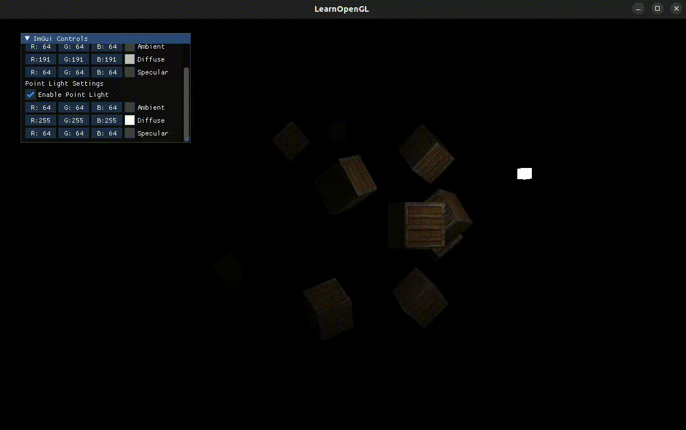
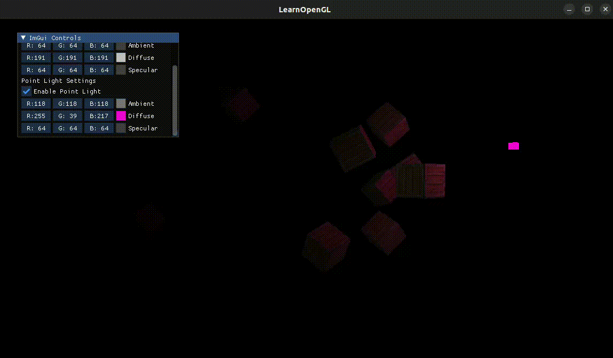
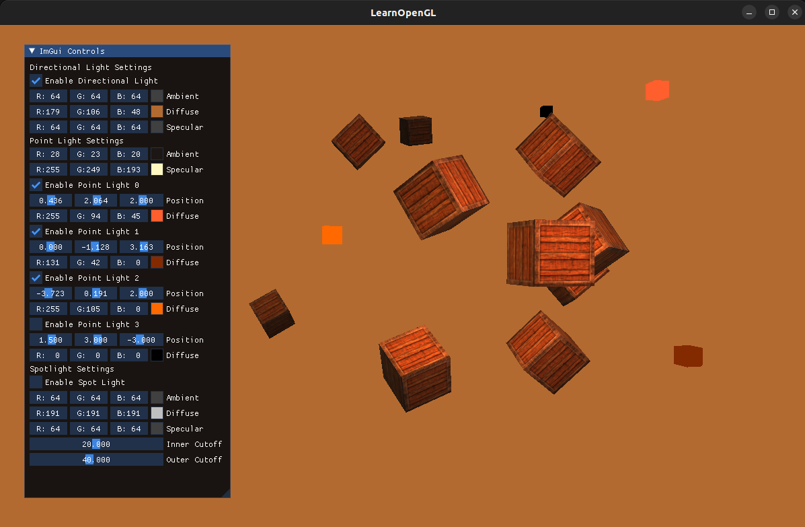
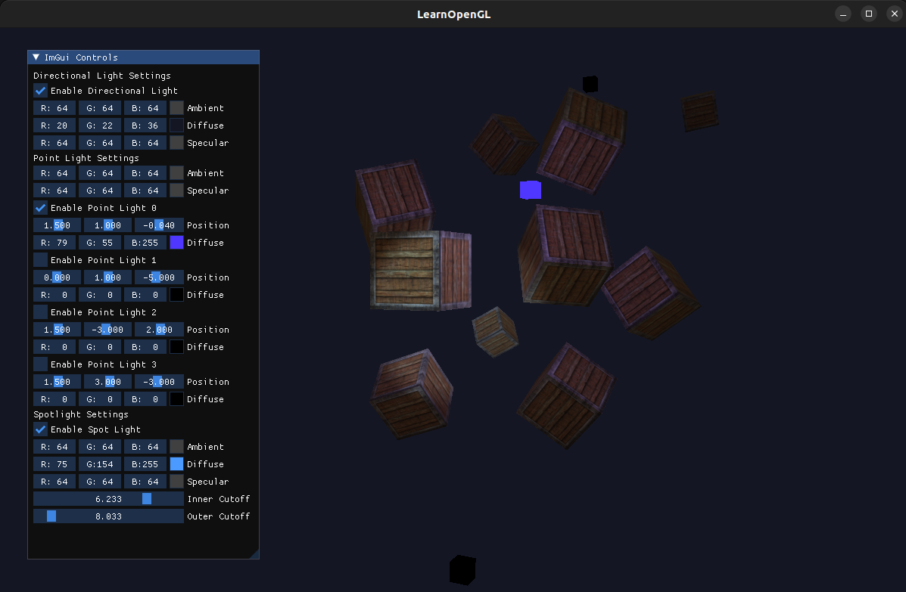
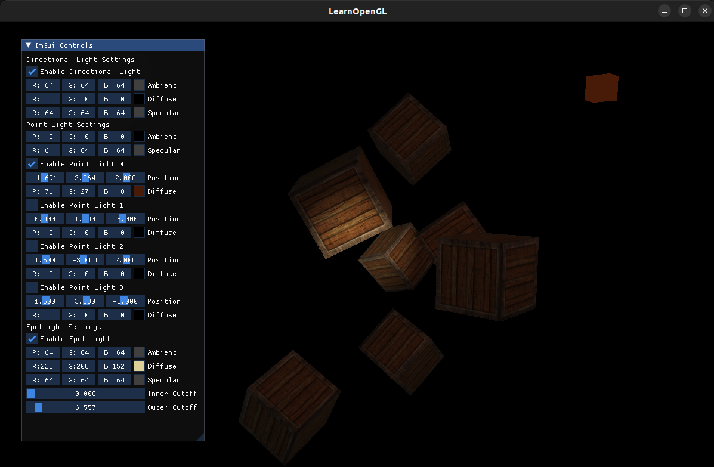
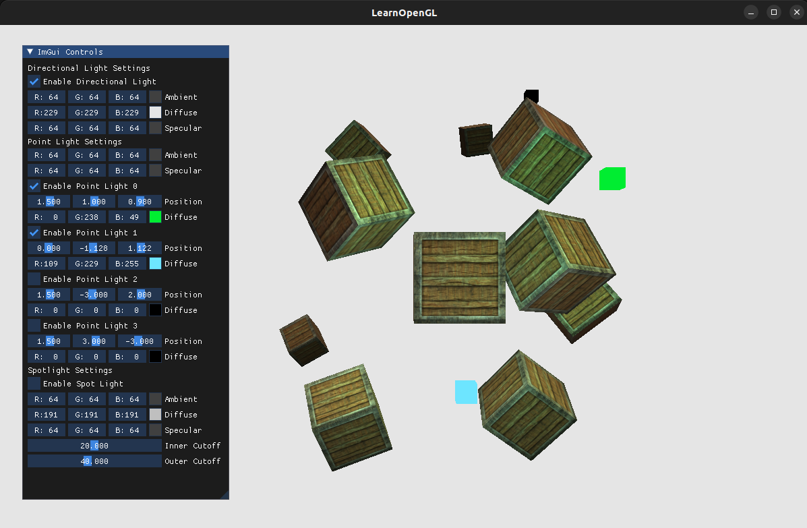
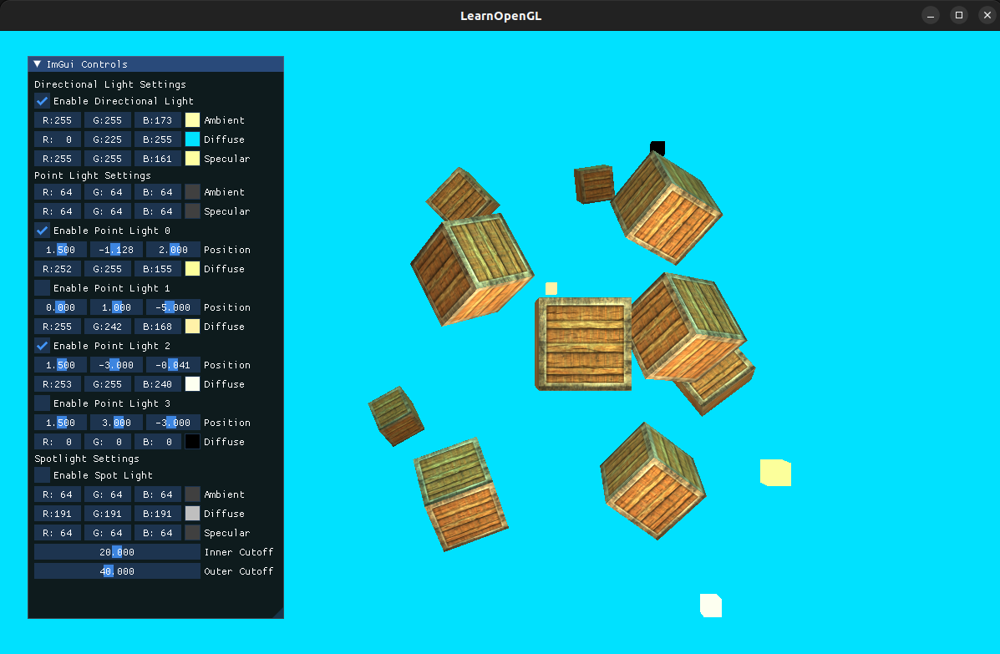

# [Multiple Lights](https://learnopengl.com/Lighting/Multiple-lights)

In GLSL, we will move the logic of each type of light source (directional, point lights, flashlight) into its own GLSL function.
* Each type of light's effect is added to the fragment's color

```glsl
vec3 output_color(0.0);
output_color += calculate_directional_light();
output_color += calculate_point_lights();
output_color += calculate_flashlight();

// The final color of the fragment
FragColor = vec4(output_color, 1.0);
```

Review of types of light sources:
* Directional light - are approximated to be infinitely far away, has no position, just one direction of the rays (ex. the sun)
* Point lights - has a position and shines rays in all directions, light dims as the rays travels further away (ex. lightbulb)
* Spotlight - defines a radius of where only the fragments inside the radius are lit.

#### Imgui behavior

Had a bug where using the same string for a button causes all the buttons with the same string label to activate at the same time.
```cpp

ImGui::Text("Directional Light Settings");
ImGui::Checkbox("Enable Directional Light", (bool*)&directional_light.enabled);
ImGui::ColorEdit3("Ambient", (float*)&directional_light.ambient);
ImGui::ColorEdit3("Diffuse", (float*)&directional_light.diffuse);
ImGui::ColorEdit3("Specular", (float*)&directional_light.specular);

ImGui::Text("Point Light Settings");
ImGui::Checkbox("Enable Point Light", (bool*)&point_light.enabled);
ImGui::ColorEdit3("Ambient", (float*)&point_light.ambient);
ImGui::ColorEdit3("Diffuse", (float*)&point_light.diffuse);
ImGui::ColorEdit3("Specular", (float*)&point_light.specular);
```
I repeated `"Ambient"`, `"Diffuse"`, and `"Specular"` labels, which caused the Point Light settings to affect the Directional light settings...

Looks like you can [add `"##"` after the displayed label to add more unique identifiers](https://stackoverflow.com/questions/43204239/buttons-with-the-same-button-text-using-dear-imgui) that won't show up in the GUI:
```cpp
ImGui::Text("Point Light Settings");
ImGui::Checkbox("Enable Point Light", (bool*)&point_light.enabled);
ImGui::ColorEdit3("Ambient##Point Light", (float*)&point_light.ambient);
ImGui::ColorEdit3("Diffuse##Point Light", (float*)&point_light.diffuse);
ImGui::ColorEdit3("Specular##Point Light", (float*)&point_light.specular);
```

## Point Lights Toggle 





Multiple point lights!


Not sure what the best way to send the light positions in the same `PointLightStruct`, I had to send it separately since the positions had to be computed in view space.

## Flashlight Toggle

🔦!!


## Different Scenes

Made each point light's diffuse and position toggle-able!

Desert:



Factory:



Horror:



Biochemical Lab



A sunny day


