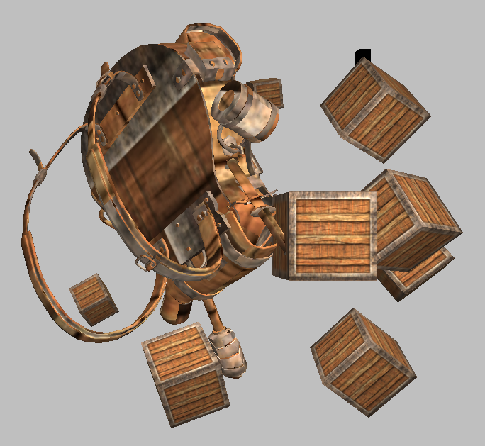
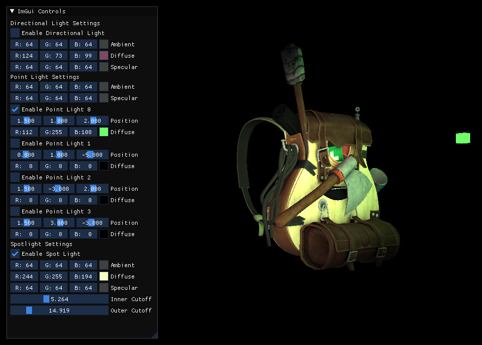
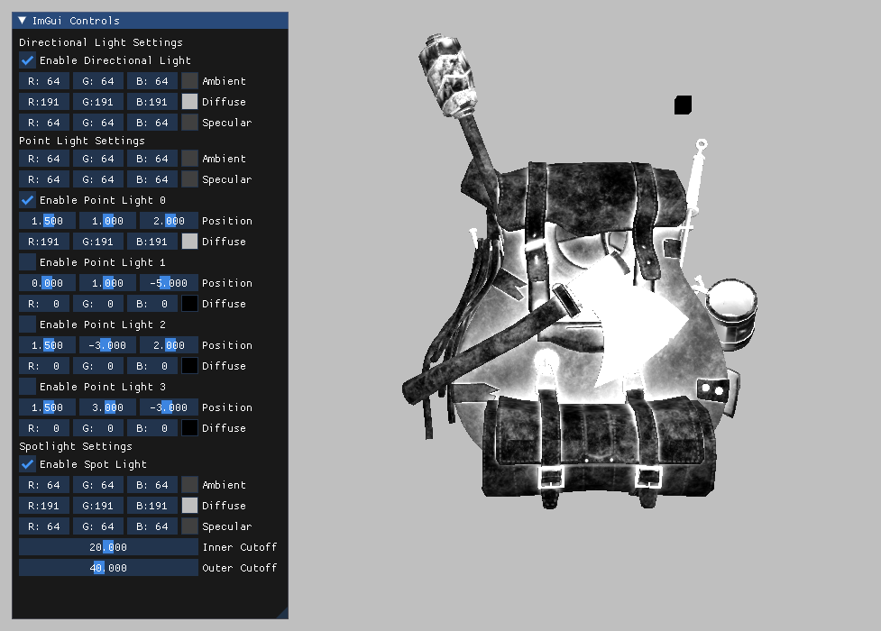
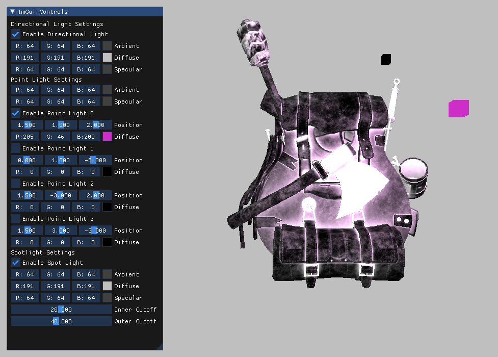

# [Model](https://learnopengl.com/Model-Loading/Model)

A **Model** contains multiple *meshes*.

For example a house Model may contain meshes that represent:
* A patio
* Backyard
* Chimney
* ...etc.

General steps to loading a model:
* Read in a file object using Assimp, which gives us an Assimp Scene object describing the model file
    * The Assimp Scene object is the root of the Assimp data structure
* Traverse the Scene graph and generate Mesh objects out of the Scene's nodes
    * [Assimp documentation on the import process and data structures](https://assimp-docs.readthedocs.io/en/latest/usage/use_the_lib.html#data-structures)
    * Assimp's [Mesh object](https://assimp.sourceforge.net/lib_html/structai_mesh.html#details)

All of Assimp's [post-processing options](https://assimp.sourceforge.net/lib_html/postprocess_8h.html)

## Loading Model

Download the backpack model from [here](https://learnopengl.com/Model-Loading/Model) (under **No more containers!**), and extract the zip to `src/textures/backpack`.

I commented out the backpack's texture loading logic and got the container texture onto it (commit: 5b35a1408dbde1dd003fc954f54f004070a5223b):



With some weird hacks off of commit `5b35a1408dbde1dd003fc954f54f004070a5223b` I was able to get the backpack... but not through the normal `Mesh.draw()` OTL

Things I forgot:
* Setting the  model_matrix in the shader for the backpack (otherwise nothing renders)

Hacks applied to commit:
* Change the texture files to the backpack textures



The textures are not applied through Mesh.draw() though...

If I generate minmaps then I at least get the specular(?) textures applied:

```cpp
// Configure how OpenGL will apply the texture with out-of-bounds coordinates
// Texture coordinate labels: (s,t,r)
glTexParameteri(GL_TEXTURE_2D, GL_TEXTURE_WRAP_S, GL_REPEAT);
glTexParameteri(GL_TEXTURE_2D, GL_TEXTURE_WRAP_T, GL_REPEAT);
// When the texture is minimized, linearly interpolate between the two closest minmaps
//  and sample the interpolated minmap level with linear interpolation
glTexParameteri(GL_TEXTURE_2D, GL_TEXTURE_MIN_FILTER, GL_LINEAR_MIPMAP_LINEAR);
// When magnifying, stay on the same minmap level, and linearly interpolate the color value
glTexParameteri(GL_TEXTURE_2D, GL_TEXTURE_MAG_FILTER, GL_LINEAR);
// Generate mip maps
glGenerateMipmap(GL_TEXTURE_2D);
```



Light can still be applied:



### Bug

Fixed! The error was not calling `glActiveTexture` in the Mesh class, and I was accidentally setting the uniform variable to the textureID, and not the texture sampler number:
```cpp
// Activate the texture unit
glActiveTexture(GL_TEXTURE0 + i);

// Assign the texture's texture unit
shader.setInt(texture_name, i);
```

I also had to update the fragment shader to use uniform variables `texture_x` in the lighting calculations.


