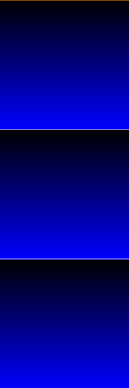
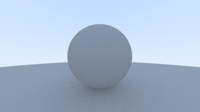

# Ray-tracer
Following [Ray-tracing in One Weekend](https://raytracing.github.io/books/RayTracingInOneWeekend.html) 🚀

Also learning CMake...

## How to run

1. Generate build files:
```
cmake -S . -B build
```

2. Build the project:
```
cmake --build build
```

3. Run the executable
```
./build/RayTracer
```


## Progress Log

### [2.2 Creating an Image File](https://raytracing.github.io/books/RayTracingInOneWeekend.html#outputanimage/creatinganimagefile)
I changed it up a bit so that the red -> row and green -> column (which makes more sense to me):

The function `print_ppm_file()` in `main.cpp` will generate an image.

Build the project (`cmake --build build`) then run the program while redirectiug the output to a file: `./build/RayTracer > image.ppm`. Then view the `image.ppm` in an image viewer.


すごいいいいい 💃✨

### [5. Adding a Sphere](https://raytracing.github.io/books/RayTracingInOneWeekend.html#addingasphere)


This math makes sense... I'm crying 😭 schön... (I'm getting a サンダサンさん moment).
* [Math is fun - quadratic equation](https://www.mathsisfun.com/algebra/quadratic-equation.html)
  * Discriminant review
* [Line-sphere intersection](https://en.wikipedia.org/wiki/Line%E2%80%93sphere_intersection)
  * Ok, the dot product part is kind of magic still...
  * I understand that you need the dot product to get a real number (as opposed to a 3D vector) but other than that... why does this work... Amazing...
* [Determining a vector given two points](http://mathonline.wikidot.com/determining-a-vector-given-two-points)


### [6. Surface Normals and Multiple Objects](https://raytracing.github.io/books/RayTracingInOneWeekend.html#surfacenormalsandmultipleobjects)

Made this by mistake... Time to debug 🔍


The bug was this line:
```c++
color ray_color(const ray& r) {
        // ...
        return 0.5 * color(normal.x(), normal.y(), normal.z());
```

I forgot the `+1` for each color channel... Without it, the color channels go out of range.

Fixed! 🛠


#### Negative pixel values
The bug above was causing negative pixel values to be written to the PPM file. But I still couldn't explain why *those particular* image colors in the buggy image were rendered.

I generated an image where I had negative values in the blue channel at the top, and had the blue channel incrementally become more positive going down the image (keeping red and green at `0`). I drew white lines at certain points of interest (manually had to figure out. I drew an orange line at center height.

Running this:
```bash
python negative_pixel_values.py
```

Generates the following image:


Totally weird. I'd think that negative pixel values would just do the reverse of the positive values, but there are random (?) places where the colors suddenly change (I drew white lines there). Also the most negative value `-255` isn't the full blue color as expected.


This is the red and blue channel values going in reverse (`red=-255` and `blue=255` at the top):


🤷‍♀ 変なの。 

If I removed `0.5`:
```c++
color ray_color(const ray& r) {
        // ...
        return color(normal.x(), normal.y(), normal.z());
```
I get this image:


Without `0.5`, now the pixel values go over 255.

If the pixel values go over `255`, the channel color seems to be `value % 255`:



This image is with a white line drawn if  `row % 255 == 0`. The orange line is still at `row = 0`.


#### Sphere normal

If the sphere center = `C` and the closest point of intersection of the ray and the sphere is `P`, then the normal vector is:
```
P - C
```
This is the vector whose direction is from the center `C` to the surface `P`

## [6.6 Some New C++ Features](https://raytracing.github.io/books/RayTracingInOneWeekend.html#surfacenormalsandmultipleobjects/somenewc++features)

Using `smart_ptr` because:
* Allows multiple geometries to share a common instance of an object (ex. spheres that use the same texture map)
* Makes memory management more automatic


## [7. Antialiasing](https://raytracing.github.io/books/RayTracingInOneWeekend.html#antialiasing)

For each pixel at position `(i,j)` (`i` is the row, `j` is the column), we are adding some random value between `0.0` and `1.0`, which gives us a new position `(u,v)` in the image *within* that pixel. We then get the color at that position. This gives us *one* sample. We do this until we have `samples_per_pixel` color values, then take the average at the end.

This average color becomes the final color of the pixel.

In `main.cpp`:
```c++
    // ...
    for (int j=image_height-1; j >= 0; --j) {
        for (int i=0; i<image_width; ++i) {
            color pixel_color(0, 0, 0);
            for (int s=0; s<samples_per_pixel; s++) {
                double u = (double(i) + random_double()) / (image_width-1);
                double v = (double(j) + random_double()) / (image_height-1);
                // ...
```

Without anti-aliasing:


With anti-aliasing ✨:


I first encountered the word "anti-aliasing" in *middle school*, in like ~~Shi-painter Pro~~ (damn it wasn't, [I looked](https://github.com/atskae/oekaki-potato/blob/master/doc/shi-painter/run_shi_painter_locally.md) just now) Photoshop? I finally know how it works a decade+ later... ああああああ... 感動........


### Time differences (just for curiosity):

Without anti-aliasing, (commit `08b95e4569f99c3993c37dbc3f571f4864550c8f`)

```bash
time ./build/RayTracer > image_without_anti_aliasing.ppm 
Scanlines remaining: 0 ./build/RayTracer > image_without_anti_aliasing.ppm  0.20s user 0.23s system 84% cpu 0.511 total
```

With anti-aliasing (commit `3a8831f0c35e9e7b77ac0ac2f7c6f0d731bf2cbf`)
```bash
time ./build/RayTracer > image_with_anti_aliasing.ppm 
Scanlines remaining: 0 ./build/RayTracer > image_with_anti_aliasing.ppm  5.76s user 0.34s system 91% cpu 6.707 total
```


## [8. Diffuse Materials](https://raytracing.github.io/books/RayTracingInOneWeekend.html#diffusematerials)

* **Matte** materials - dull, rather than shiny/reflective
* [**Lambertian reflectance**](https://en.wikipedia.org/wiki/Lambertian_reflectance): a property of an object that has the "ideal" matte or [diffusely reflective surface](https://en.wikipedia.org/wiki/Diffuse_reflection) (one ray with create many reflected rays on surface contact)


Got an infinite loop here (in `rtweekend.h`)
```c++
inline double random_double(double min, double max) {
    double num = min + (max+min)*random_double();
    return num;
}
```
I had `max+min` when it should have been `max-min`. I was always getting `-1`, so the random vector inside the unit cube was always `vec3(-1,-1,-1)` which never had a length less than 1.

Bug... 😢 ???


I suspected that all the rays were getting to `depth=0` but that doesn't seem to be the case.

With diffusion (?) takes a lot longer:
```
time build/RayTracer > image.ppm 
Scanlines remaining: 0 Max depth reached: 3469200/177213793
build/RayTracer > image.ppm  186.28s user 1.53s system 97% cpu 3:12.42 total
```

If I look the generated image file though, they are not all `0 0 0`... If I zoom in *a lot* I guess I can sorta see a sphere... Why isn't there the same amount of constrast...?

(edit) I just had to move on... "If you can't see the shadow, don't worry...". 


### [8.3 Gamma Correction](https://raytracing.github.io/books/RayTracingInOneWeekend.html#diffusematerials/usinggammacorrectionforaccuratecolorintensity)

* [**gamma correction**](https://www.teamten.com/lawrence/graphics/gamma/): "...doing graphics color math accounting for the distortion that the color will eventually go through when displayed on a monitor."
  * "Notice that 0 stays black and 1 stays white, but the in-betweens get darkened." That explains it...
  * "gamma 2" means raise each color channel by the power `1/gamma` with `gamma=2`
    * This is the same as taking the squared root

```
time build/RayTracer > image_with_gamma_2_correction.ppm
Scanlines remaining: 0 Max depth reached: 3469200/177213793
build/RayTracer > image_with_gamma_2_correction.ppm  187.91s user 2.15s system 96% cpu 3:17.10 total
```

Was...! <--- Deutsch


Line 70,000 in ppm image:
* Before: `16 21 29`
* After: `64 73 86` 

I was having super math "how does math work again??" confusion... how does a squared-rooted value *increase* ??? !
First of all, I forgot the RGB pixel values within the program has approximately range 0 to 1, not 0 to 255.
```
r = 0.63
sqrt(r) = ~0.79
```
Any number between 0 and 1 will increase if you take the squared root... Totally forgot...
[Someone else wondered the same thing](https://math.stackexchange.com/questions/2618094/why-the-square-root-of-any-decimal-number-between-0-and-1-always-come-out-to-be), it's nice knowing I'm not the only one who wondered -happy tear-.


### [8.4 Reducing Shadow Acne](https://raytracing.github.io/books/RayTracingInOneWeekend.html#antialiasing/generatingpixelswithmultiplesamples)

Wow, made the program significantly faster too!
```
time ./build/RayTracer > image.ppm
Scanlines remaining: 0 ./build/RayTracer > image.ppm  12.87s user 0.48s system 93% cpu 14.293 total
```

Also brighter ???:


### [8.5 True Lambertian Reflection](https://raytracing.github.io/books/RayTracingInOneWeekend.html#diffusematerials/truelambertianreflection)


* [Stackexchange post](https://computergraphics.stackexchange.com/questions/12222/question-about-true-lambertian-reflection-in-ray-tracing-in-one-weekend)
  * [The first method](https://raytracing.github.io/books/RayTracingInOneWeekend.html#diffusematerials/asimplediffusematerial) generates a random point *inside* the unit sphere of random length
  * [The second method](https://raytracing.github.io/books/RayTracingInOneWeekend.html#diffusematerials/truelambertianreflection), also called the *Lambertian Reflection*, generates a random point *on the surface* of a unit sphere of unit length (length=1)
  * The two methods have different probability distributions of what random vector is generated

#### First Method

First method has a probability distribution of `cos^3(phi)`, where `phi` is the angle between the random vector and the surface normal:


There is a skew toward getting a random vector with `phi` closer to zero, which means the random vector is closer to the surface normal.

### Second Method

The second method as a probability distribution of `cos(phi)`, which is the [same distribution of the Lambertian Reflection](https://en.wikipedia.org/wiki/Lambert%27s_cosine_law).

[Graph comparison of `cos^3(phi)` and `cos(phi)`](https://www.desmos.com/calculator/atddqeyelo)

* `cos^3(phi)` looks more "bell-curve ish"
  * I googled "bell curve ish" and it seems like a common phrase
* `cos(phi)` looks more "even"

The second method will generate random vectors in a more uniform distribution; light will be scattered more uniformly.


### Misc 

Reminds me of a past school assignment where, you have to do some adjustments for the program to generate truly random points inside a circle... Like [this post](https://jyopari.github.io/randomCirc.html).


### [8.6 An Alternative Diffuse Formulation](https://raytracing.github.io/books/RayTracingInOneWeekend.html#diffusematerials/analternativediffuseformulation)

Here we make sure that the reflected ray is always facing in the same hemisphere as the normal. This gives us a more uniform scatter direction. This produces:




## Resources
* [PPM image format](https://www.cs.swarthmore.edu/~soni/cs35/f13/Labs/extras/01/ppm_info.html)
* [CMake examples](https://github.com/ttroy50/cmake-examples/tree/master/01-basic)
* [GDB for Mac OS: LLDB](https://lldb.llvm.org/use/map.html)
