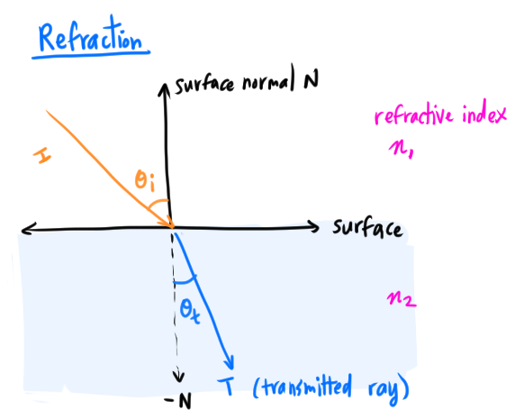
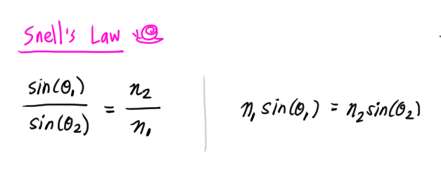
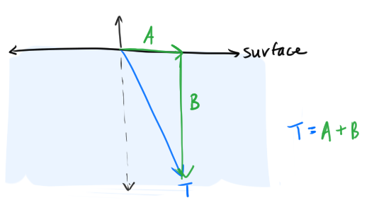
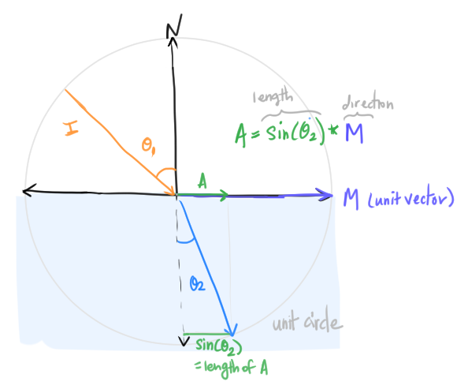

# Refraction: Transmitted Ray Derivation

[Ray Tracing in One Weekend](https://raytracing.github.io/books/RayTracingInOneWeekend.html#dielectrics/snell'slaw) said not to worry about the derivation of the transmitted ray but of course I *had* to figure it out 🙂.
Here I used [Scratchapixel's derivation](https://www.scratchapixel.com/lessons/3d-basic-rendering/introduction-to-shading/reflection-refraction-fresnel) and tried to map it to the definitions in Ray Tracing in One Weekend.

## Refraction

**Refraction** is when the incoming ray (also called **incident ray**) comes into a transparent medium (like water, glass), and when it enters the medium, the ray's direction changes (this ray with the new direction is called the **transmitted ray**)



The **refractive index** (denoted by Greek letter `η`, "eta") of the medium affects how the direction of the ray changes when the ray enters medium.

The refractive index describes how fast light travels in the medium `v` in comparison to how fast light travels in a vaccuum, which is described by constant `c`:
```
η = c/v
```

Examples of refractive index values:
* Air `η ~= 1` <--- very close to `1`, in CG, the value `1` is often used for air
* Water `η = 1.3`
* Glass `η = 1.5`
* Diamond `η = 1.8`

The refractive index tells us that light travels faster in air than in water. Light travels faster in water than in diamond, etc.

The incident ray `I` has an angle `θ_i` with the surface normal vector `N`. The incident ray starts in the medium with refactive index `η_1`. When the ray enters the medium with a refactive index `η_2`, it's angle with the normal changes to `θ_t`.


## Snell's Law
**Snell's Law** describes how the `sin` of the angles of the rays relate to the refractive indicies of the two mediums. If the incident ray angle is `θ_1` and the transmitted ray angle is `θ_2`, the relationship is:




## Calculating the Transmitted Ray

Given the incident ray `I` and the surface normal `N`, how do we compute the transmitted ray `T`?

We can break up the ray `T` into two separate vectors: `A` and `B`:



Let's find `A` first:



We know the length of `A` is `sin(θ_2)` (because, trig). The direction of `A` would be the unit vector that we will call `M`. Let's now find `M`.

We need to define a vector `C`, which is equal to `cos(θ_1)` (because, trig) which is a component of `I` that is parallel to the surface normal `N`. The direction of `M` is then `I+C` (which is the same as `C+I`, which might make it more clear how it relates to `M`, as illustrated):


To normalize `M` (make its length=1), we simply divide by its length, which is the `sin(θ_1)` (because, trig).

Now we have the vector `M`:
```
M = (I + C) / sin(θ_1)
```

which can be used to compute `A`:
```
A = sin(θ_2) * M
A = sin(θ_2) * ((I + C)/sin(θ_1))
```
