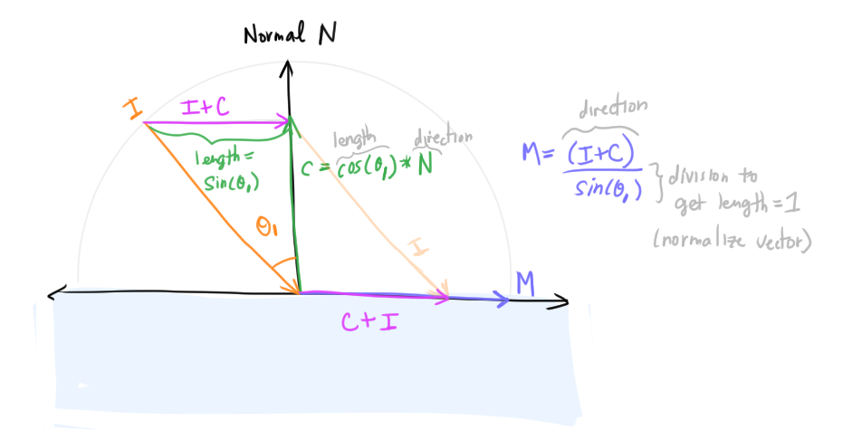

# Refraction: Transmitted Ray Derivation

[Ray Tracing in One Weekend](https://raytracing.github.io/books/RayTracingInOneWeekend.html#dielectrics/snell'slaw) said not to worry about the derivation of the transmitted ray but of course I *had* to figure it out 🙂.
Here I used [Scratchapixel's derivation](https://www.scratchapixel.com/lessons/3d-basic-rendering/introduction-to-shading/reflection-refraction-fresnel) and tried to map it to the definitions in Ray Tracing in One Weekend.

## Refraction

**Refraction** is when the incoming ray (also called **incident ray**) comes into a transparent medium (like water, glass), and when it enters the medium, the ray's direction changes (this ray with the new direction is called the **transmitted ray**)


The **refractive index** (denoted by Greek letter `η`, "eta") of the medium affects how the direction of the ray changes when the ray enters medium.

The refractive index describes how fast light travels in the medium `v` in comparison to how fast light travels in a vaccuum, which is described by constant `c`:
```
η = c/v
```

Examples of refractive index values:
* Air `η ~= 1` <--- very close to `1`, in CG, the value `1` is often used for air
* Water `η = 1.3`
* Glass `η = 1.5`
* Diamond `η = 1.8`

The refractive index tells us that light travels faster in air than in water. Light travels faster in water than in diamond, etc.

The incident ray `I` has an angle `θ_i` with the surface normal vector `N`. The incident ray starts in the medium with refactive index `η_1`. When the ray enters the medium with a refactive index `η_2`, it's angle with the normal changes to `θ_t`.


## Snell's Law
**Snell's Law** describes how the `sin` of the angles of the rays relate to the refractive indicies of the two mediums. If the incident ray angle is `θ_1` and the transmitted ray angle is `θ_2`, the relationship is:


## Calculating the Transmitted Ray

Given the incident ray `I` and the surface normal `N`, how do we compute the transmitted ray `T`?

We can break up the ray `T` into two separate vectors: `A` and `B`:


Let's find `A` first:


We know the length of `A` is `sin(θ_2)` (because, trig). The direction of `A` would be the unit vector that we will call `M`. Let's now find `M`.

We need to define a vector `C`, which is equal to `cos(θ_1)` (because, trig) which is a component of `I` that is parallel to the surface normal `N`. The direction of `M` is then `I+C` (which is the same as `C+I`, which might make it more clear how it relates to `M`, as illustrated):



To normalize `M` (make its length=1), we simply divide by its length, which is the `sin(θ_1)` (because, trig).

Now we have the vector `M`:
```
M = (I + C) / sin(θ_1)
```

which can be used to compute `A`:
```
A = sin(θ_2) * M
A = sin(θ_2) * ((I + C)/sin(θ_1))
// Use C = cos(θ_1)
A = sin(θ_2) * ((I + cos(θ_1))/sin(θ_1))
```


Recalled that the transmitted ray `T` is `A + B`, so now we need `B`. The length of `B` is just `cos(θ_2)` (because, trig) and the direction of `B` is `-N` (the opposite direction of the surface normal `N`):
```
B = cos(θ_2) * N
```

Now we have both `A` and `B`:
```
A = sin(θ_2) * ((I + cos(θ_1))/sin(θ_1))
B = cos(θ_2) * N
```

Now we can compute `T`, which is `A + B`:
```
T = A + B
T = sin(θ_2) * ((I + cos(θ_1))/sin(θ_1)) + cos(θ_2) * N
```

If we get rid of `θ_2`, then we can compute `T` using the values that we already know (`N`, `θ_1`, and `I`).

To do this with `A`, we can use Snell's Law. We can replace `sin(θ_2)/sin(θ_1)` with `η_1/η_2`:


To get rid of `θ_2` from `B`, we can use the famous trig identity and Snell's Law again:


We can now express the transmitted ray `T` with everything we know! 💃


`T` relative to everything else:


### Comparison to Ray Tracing in One Weekend

 Scratch a Pixel (eft side of `=`) vs [Ray Tracing in One Weekend](https://raytracing.github.io/books/RayTracingInOneWeekend.html#dielectrics/snell'slaw) notation mapping:


If we look at the final formula from Scratchapixel (sp), `A` is the perpendicular (to the surface normal) component of `I=R'`, and `B` is the parallel component of `R'`:


The mapping of `A` is straightforward:


`B`, the parallel component of `I=R'` is slightly different:


We know that `A` is the same as the perpendicular component of `R'`. So we get this relationship from the two equations:
```
// (The length of A)^2
|A|^2 = (η_1/η_2)^2 * sin^2(θ_1)
```

Then we can get just the length of A
```
|A| = (η_1/η_2) * sin(θ_1)
```

Using Snell's Law, we can express the length of `A` differently, where we eventually get:
```
|A| = sin(θ_2)
```

Which is totally correct 🤯  Ray Tracing in One Weekend and Scratchapixel expresses the same idea in a different way.


### Scratchapixel simplify


