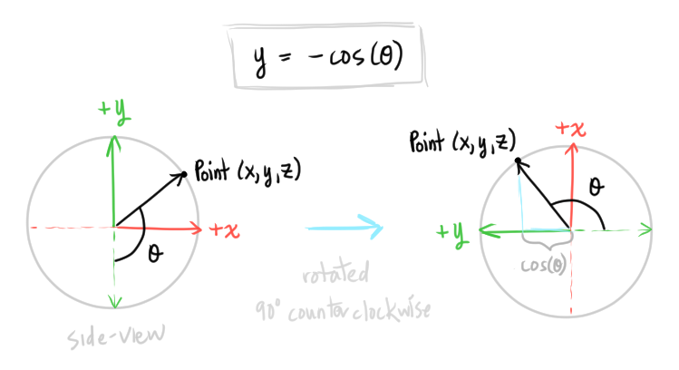
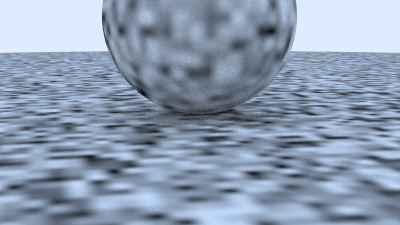
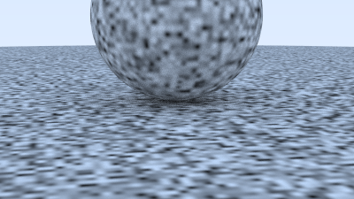

# [Ray Tracing: The Next Week](https://raytracing.github.io/books/RayTracingTheNextWeek.html)

## [Motion Blur](https://raytracing.github.io/books/RayTracingTheNextWeek.html)

The **motion blur effect** is created by averaging the images of what the camera sees over a time interval
* Method originally introduced by [Rob Cook in 1984](https://graphics.pixar.com/library/DistributedRayTracing/)
* Generate rays at random times within some time interval

Went on some rabbit hole and found someone who [rendered black holes](https://rantonels.github.io/starless/).

Diffuse spheres with motion blur:


The camera now has a start time `time0` and end time `time1` (shutter open/close times), and the rays that the camera shoots out has a timestamp: a random value between `time0` and `time1`.

Any moving object will also have a start time and end time, and needs to be able to determine where it is at any time between `time0` and `time1`.

## [3.3 Axis-Aligned Bounding Boxes (AABBs)](https://raytracing.github.io/books/RayTracingTheNextWeek.html#boundingvolumehierarchies/axis-alignedboundingboxes(aabbs))

あああ they mentioned "parallelepiped" 😆 (3b1b moment).
In this ray tracer, we will call "axis-aligned bounding rectangular parallelepiped" -> "axis-aligned bounding boxes", or AABBs.

* **slab method**: a "slab" is an axis-aligned interval
  * An **interval** are points between two endpoints
    * For example, the interval `x_0` to `x_1` on the x-axis is a "slab"
  * n-dimensional AABB is just an intersection of `n` axis-aligned intervals
    * In 2D, two intervals overlapping creates a 2D AABB rectangle:

    

    * In 3D, the boundaries are *planes* (while in 2D, the boundaries are *lines*)

Recall a ray is just a line, with linear equation `P(t) = A + tb`, where:
* `A` is the origin point (an n-dimensional point)
* `b` is the direction of the ray (an n-dimensional vector)
* `P(t)` is a location/point in space

We can apply the ray equation to all three axes: x, y, and z. For example:
* The x-coordinate of `P(t)` (the location on the ray) is:
  ```
    x_0 = A_x + t_0 * b_x
  ```
* The y-coordinate of `P(t)`:
  ```
    y_0 = A_y + t_0 * b_y
  ```
* We can use this to find where the ray intersects the intervals/slabs


To see if a ray intersects an AABB, we find the points where the ray intersects each interval (for example, the `t` values of the ray `P(t)` that intersects the interval/slab `(x_0, x_1)` is `t_0` and `t_1` in the example above). Each set of intersections creates a range `(t_0, t_1)`. If *all* of these ranges (a range per axis) overlap, then the ray intersects the AABB.

For example, in the 2D space:


The ranges that go through the x-axis slab and the y-axis slab for the ray `r0` does not overlap because it does not go through the AABB.

The ray `r1` does have an overlap of where the ray enters the x-axis and y-axis slabs, and we can see that does go through the AABB

### Intersections

If we had a slab/interval `(x_0, x_1)`, we have to find `t_0` that intersects `x_0` and `t_1` that intersects `x_1`.


Since it is possible that the ray can be coming from the *negative* x direction, `t_0` and `t_1` can be reversed.
* We just have to make sure that after our initial calculation, we ensure that `t_0 <= t_1`.

#### Numerical Considerations
* IEEE floating point, where `inf` means *infinity*, and `NaN` means "not a number"
  * `inf/0 = inf`
  * `0/0 = NaN`
* If the ray does not intersect the slab, both `t_0` and `t_1` will be +- infinity.

#### Overlaps
If there is an overlap between the intervals that are created (`(d, D)` and `(e, E)`) after calculating where the ray intersects the slabs (`(x_0, x_1)` and `(y_0,y_1)`), then we know the ray intersects the AABB:


## [4.2 Texture Coordinates for Spheres](https://raytracing.github.io/books/RayTracingTheNextWeek.html#solidtextures/texturecoordinatesforspheres)

Spherical coordinates
* Longitude and latitude, *spherical coordinates* theta and phi: `(θ, ϕ)`
* Recall that the ray tracer uses the *right-handed coordinate system*


* Angle θ goes from the bottom pole, upward (from -y axis to +y axis)
* Angle ϕ goes around the y-axis
  * (from -x axis to +z axis, to +x axis to -z axis, then back to -x axis)

Texture coordinates (`(u,v)` in the `hit_record` class)
* We want to map the coordinate on the sphere `(θ, ϕ)` to the *texture coordinates* `(u,v)`, where both `u` and `v` are in range `[0,1]`.
* `(u=0,v=0)` would map to the bottom-left corner of the texture


`(u,v)` is between 0 and 1, so to convert from the spherical coordinates to `(u,v)`. we can normalize the spherical coordinates:


### Cartesian Coordinates and Spherical Coordinates Relationship

We should first see how we use angle theta and phi to get the Cartesian coordinate `(x,y,z)`:

```
y = -cos(θ)
x = -cos(ϕ)sin(θ)
z = sin(ϕ)sin(θ)
```

#### Derivation

Review from [a while ago!](https://github.com/atskae/computer-graphics/tree/master/scratch-a-pixel/notes/02-geometry/08-spherical-coordinates-trig#converting-cartesian-to-spherical-coordinates) (need to be modified since those notes use the left-handed coordinate system, and z is up....)

Deriving `y = -cos(θ)`:



We need the negative sign in front of `cos(θ)` because `cos(θ)` gives us a negative number when the angle is in the positive y-axis

Deriving x and z coordinates:

Tried to do the same thing as above with the other coordinates but didn't get to the equation. Luckily ran in to [this video](https://www.youtube.com/watch?v=Ca-Rz6rZ2Hw) which led me to decompose the vector to get the remaining coordinates (the video uses a different coordinate system though).

Most examples online show the angle `θ`  starting at +y and going down... so we can use the [relationship of vertical angles](https://www.mathsisfun.com/geometry/vertical-angles.html) to flip the view of the angle `θ`:


Then we can project the vector created by angle `θ` to the -x/+z plane to draw a right triangle; we can see angle `ϕ` in relation to this triangle.

Using [geometry of parallel lines](https://www.mathsisfun.com/geometry/parallel-lines.html) we can find the angles of the right trangle that equal `θ`:


If we rotated this image, it is easier to see that the angles are corresonding angles, which makes them equal:


Now we can use the angle `θ` inside the right triangle and trig to find the length of the hypotenuse, which is just `sin(θ)`. To find the x and z coordinates, we then break apart the hypotenuse into its two components.

The following image is the top view. We can form *another* right triangle, now using angle `ϕ`:


The x-coordinate is the adjacent side of `ϕ`, and the z-coordinate is the opposite side of `ϕ`. As shown previously, the hypotenuse is `sin(θ)`. We can then use the trig relationships SOH and CAH (from SOH CAH TOA) to find the lengths of the triangle, which correspond to each coordinate x and z.

For the x-coordinate, we need to add a negative sign to `cos(ϕ)` since positive `ϕ` is in the negative x-axis, so we flip the sign.

NOOOICE.

### Getting angles θ and ϕ 

To find angle ϕ we use the ratio of the z and x coordinate values. `tan()` relates these two coordinate values (TOA)

As stated before, the "opposite" side of `ϕ` is the z-coordinate = sin(ϕ)sin(θ) and "adjacent" side of `ϕ` is cos(ϕ)sin(θ).

Since we now have tan(ϕ), we can take the inverse of tan(), arctan(), to get the angle ϕ.


#### arctan2

C++'s arctan2() function gives a range [0, pi], then switches to [-pi, 0] after the angle surpasses pi.


To map the angles to the textured coordinates `u,v`, we need to convert the angles returned by atan2() to range to [0, 2*pi]

To do this, we simply flip the coordinate signs `(a,b)`, and add pi:

```
arctan2(a,b) = arctan2(-a, -b) + pi
```


First we get the delta angle value to either add/subtract from angle pi. This is obtained by flipping the coordinate `(a,b)` -> `(-a,-b)`, which is the same as a pi rotation.

If we had a positive angle (angle is less than pi), then the formula starts at pi and subtracts the delta angle amount to get the original angle (positive angles are already in range [0, 2*pi]).

If we had a negative angle (angle is between -pi and 0 in C++), we start at pi and add the delta angle amount (this gives us a positive angle value greater than pi).


#### pi rotation (180 degrees)

Just another instance where math *beautifully* makes sense and the joy that an idiot like me can actually understand any of it... 😭 

[Review from a while ago!](https://github.com/atskae/computer-graphics/tree/master/scratch-a-pixel/notes/02-geometry/04-matrices#the-rotation-matrix)

Why `(a,b)` -> `(-a, -b)` is a pi rotation:


It's the transformation matrices from months ago!

### Angle θ

Angle `θ` is easy! Just take the inverse cosine:
```
y = -cos(θ)
-y = cos(θ)
arccos(-y) = θ
```

#### C++ Nonsense
I forgot to put `public` before texture:
```
class solid_color : texture {
```
Got a spam of errors from the compiler that were not helpful.
I'm starting to *actually* *really* see the love for Rust...

## [4.3 A Checker Texture](https://raytracing.github.io/books/RayTracingTheNextWeek.html#solidtextures/acheckertexture)

Wowwwwwwwwww gotta figure out why the sine function and how? ???


I tried using cosine instead of sine. I hypothesize that the checker colors will simply reverse (since from zero, cosine starts at 1).

Ok, it looks the same with cosine... The checker row slightly shifted but...


Actually this makes a lot of sense because cosine isn't the inverse of sin  🤦‍♀️
Cosine also starts positive at zero and becomes negative halfway instead:


So basically you can create a checker pattern with cosine also.

The checker logic:
```cpp
        virtual color value(double u, double v, const point3& p) const override {
            double sines = sin(10*p.x()) * sin(10*p.y()) * sin(10*p.z());
            if (sines < 0) {
                return odd->value(u, v, p);
            } else {
                return even->value(u, v, p);
            }
        }
```

I graphed a sphere of radius 1 in this [3D graphing calculator](https://www.geogebra.org/3d?lang=en) and dragged a point around the surface of the sphere.
We need to multiply by 10 because otherwise, we would never get a coordinate value (x, y, z value) greater than pi in a unit sphere (the greatest value for any coordinate is 1), so we never dip into the negative values in `sin()`.

`sin(x)` (graphed on Desmos!):


If we multiply each coordinate by `10`, then we are sort of applying a texture onto a sphere with radius 10 (?)

The checker pattern in 2D makes a lot of sense. Each axis is alternating signs:


So thinking about this in pairs of axes make sense. 3D is still sorta magic... how it seamlessly works...

### [4.4 Rendering a Scene with a Checkered Texture](https://raytracing.github.io/books/RayTracingTheNextWeek.html#solidtextures/renderingascenewithacheckeredtexture)

Wow! This ran faster than the other scene so I thought something was wrong ...


Interesting that the checker patterns doesn't *actually* seamlessly continue across axes(?).

### [5.1 Using Random Blocks of Random Numbers](https://raytracing.github.io/books/RayTracingTheNextWeek.html#perlinnoise/usingblocksofrandomnumbers)

Wowwww


Mine-crafty 🤖

### [5.2 Smoothing out the Result](https://raytracing.github.io/books/RayTracingTheNextWeek.html#perlinnoise/smoothingouttheresult)

Ugh, a triply-nested loop... derivatives?
Should probably do some reading on [Interpolation](https://www.scratchapixel.com/lessons/mathematics-physics-for-computer-graphics/interpolation/introduction)

Totally didn't come out right! (but it looks cool 笑) Time to debug 🐛


Bug was here:
```cpp
            // Get the fractional part of the double
            double u = p.x() - floor_x;
            double v = p.y() - floor_y;
            double w = p.x() - floor_z; // <--- raw hur
```

Fixed!


More reading on noise:
* [Value Noise and Procedural Patterns: Part 1](https://www.scratchapixel.com/lessons/procedural-generation-virtual-worlds/procedural-patterns-noise-part-1)

* Without textures, objects looked unrealistically *too* smooth
* (back in the day) Need for procedural textures due to limited RAM when trying texture mapping (get an image of a texture and map it onto some surface)
* Random number generators (RNGs)
  * Patterns/textures in nature
    * Points locally look similar, but points farther apart can look different
      * Gradual change across the surface
    * RNGs would generate numbers that are not correlated with its neighbors
      * Changes are *not* gradual
      * RNGs alone would generate *white noise*
* **Noise** in CG is a function that blurs random values generated on a grid (which is called a **lattice**)
  * Noise is a function that returns a float in range [0:1] for a certain input `x` (where `x` can be a 1D, 2D, 3D, or 4D point)

General steps:
1. Define a grid, where the the grid lines are at integers
2. Generate random numbers at the integer points
3. Linear interpolate ("lerp") values between the integer points

Linear interpolation on a line between two points
```python
# a and b are 2D points in a plane
#   where the x-coordinate of a is less than b's
# x is the input's x-coordinate
#   lerp() tries to find the y-coordinate of x with linear interpolation
#   of the points a and b
def lerp(a: tuple, b: tuple, x: float):
  # Unpack the x and y coordinates for each point a and b
  (ax, ay) = a
  (bx, by) = b

  # Get the floor of x (the minimum integer bound)
  x_int = math.floor(x)

  # Calculate t (float between 0 and 1)
  # This is essentially the fractional part of the input x
  # ex. If x=1.2, then t=1.2-1 = 0.2
  t = x - x_int

  # Linear interpolate between ay and by
  # low=ay, high=by
  return ay*(1-t) + by*t
```

I realized there are [two perspectives](https://en.wikipedia.org/wiki/Linear_interpolation#Linear_interpolation_between_two_known_points) on computing the linear interpolation: slope and weighted average

I assumed the code was taking the slope. The math made sense but it isn't the same approach as the code. Whatever, I wrote it out anyway:


The code is actually taking the weighted average approach:

 

I get that the unknown point is the "mixture" of the two known points, and you take a ratio of how far the unknown point is from the two known points... but I also don't get how this magically computes the y-value correctly.


#### Smoothing out lerp

Apply a smooth function on the `t` before linear interpolating.
Again, the linear interpolation logic `lerp()` is the same. A smooth function is simply applied to `t`  to get `t_remapped`, then this `t_remapped` is used in `lerp()` instead:
```python
def smoothNoise(a, b, t):
  t_remapped = smoothFunction(t) # cosine(), Smoothstep, ...
  return lerp(a, b, t_remapped)
```

S-shaped smooth functions: cosine(), [Smoothstep](https://en.wikipedia.org/wiki/Smoothstep#:~:text=Smoothstep%20is%20a%20family%20of,game%20engines%2C%20and%20machine%20learning.)
We just have to ensure that `t_remapped` is still within range the same range as `t`: `(0, 1]`.


#### Scaling the Noise Function

Two ways to change the noise function
* Change it's *frequency* (periodicity) by multiplying the input to the noise function
  * We stretch how long a period is (stretch along the x-axis)
  * If a period is too short, then the visual effect would look *too periodic*; repeats are easily seen
    * We want a periodic long enough so that the visual effect doesn't look repeated
    * Memory consumption trade-off for large periods
    * Powers of 2 are good (typically 256, 512) since we can use bit operators instead of modulo (a slower operation) for calculations 
* Change it's *amplitude* by multiplying the result of the noise function
  * We stretch how "tall" the noise function is (stretch along the y-axis)
* Add an offset (move the noise function) by adding an offset to the input to the noise function

#### Signed Noise
When the range of the noise value can also be negative
* Simply remap the value to the new range

* [Perlin Noise: Part 2](https://www.scratchapixel.com/lessons/procedural-generation-virtual-worlds/perlin-noise-part-2)

Need to distinguish the position of the grid lines and the *value* at the grid line intersections (these values are random.)

* [A great explanation of the Perlin noise, explains each step](https://adrianb.io/2014/08/09/perlinnoise.html)

Ok all of this was sorta unrelated because the implementation in Ray Tracing in One Weekend doesn't do any of the gradient/distance vector stuff...

I rewrote the trilinear interpolation as [Wikipedia walks you through it](https://en.wikipedia.org/wiki/Trilinear_interpolation#:~:text=linear%20interpolation%20operators.-,Method,-%5Bedit%5D), which makes way more sense to me than the unexplained 3 loops in the book (and the results are ~~the same~~ close!)


### [5.3 Improvement with Hermitian Smoothing](https://raytracing.github.io/books/RayTracingTheNextWeek.html#perlinnoise/improvementwithhermitiansmoothing)

* **Match bands** can see the edge between different shades of colors, even if a gradient was intended
  * Occurs when there are [discontinuities when linear interpolating](https://en.wikipedia.org/wiki/Mach_bands#:~:text=line.%5B7%5D-,In%20computer%20graphics,-%5Bedit%5D)
* [**Hermite Curve Interpolation**](https://www.cubic.org/docs/hermite.htm)
  * This is pretty much the pen tool in any drawing program 🤯
    * Actuallly the [Bezier curve](https://en.wikipedia.org/wiki/B%C3%A9zier_curve) is the pen tool !!!?
  * [Spline](https://en.wikipedia.org/wiki/Spline_(mathematics)) is a piecewise function of polynomials


### [5.4 Tweaking the Frequency](https://raytracing.github.io/books/RayTracingTheNextWeek.html#perlinnoise/tweakingthefrequency)

[Scaling the input point will vary the pattern more quickly by increasing the function's *frequency*](https://www.scratchapixel.com/lessons/procedural-generation-virtual-worlds/procedural-patterns-noise-part-1/creating-simple-1D-noise)

Increasing the frequency makes the noise pattern repeat itself more:

Frequencies of 1, 2, 4, 8, 16:






### [5.5 Using Random Vectors on the Lattice Points](https://raytracing.github.io/books/RayTracingTheNextWeek.html#perlinnoise/usingrandomvectorsonthelatticepoints)

Ok *now* we get to the gradient and distance vectors that explanations of Perlin Noise have been talking about!!

I tried to figure it out from using [this post](https://adrianb.io/2014/08/09/perlinnoise.html) and failed:

I used the influence values directly and didn't interpolate:


After interpolating, more failed attempts:

For one of them I didn't scale the Perlin result to [0, 1]


The textbook version (whose code is hard to understand) works.....


I feel so defeated OTL
Now I need to figure out what I did wrong... I actually can't mathematically explain why.

Switched the order of how values are interpolated so it matches our coordinate system (with y = up/down, z=into screen, out of screen) and it didn't change anything at all.

Also the image file contains ridiculously large negative numbers (unrelated: do you call a very negative number a large negative number???):
```
...
-2147483648 -2147483648 -2147483648
-2147483648 -2147483648 -2147483648
-2147483648 -2147483648 -2147483648
-2147483648 -2147483648 -2147483648
-2147483648 -2147483648 -2147483648
-2147483648 -2147483648 -2147483648
-2147483648 -2147483648 -2147483648
...
```

~~so the cast from the Perlin value to 0 and 1 isn't correct...~~

The bug was computing the distance vector:
```cpp
                        vec3 gradient_vector = c[di][dj][dk];
                        vec3 distance_vector = p - gradient_vector;
```

I was confusing the vector assigned *to a cube corner point* versus *the coordinates* of the cube corner point. The distance vector should be the difference between the cube/grid's corner points and the point inside the cube/grid.

The gradient vector are the random vectors assigned to the corners of the cube. This is not computed in the loop.

~~Whaaat~~ this works:
```cpp
            // Iterate through the corners of the cube
            for (int di=0; di<2; di++) {
                for (int dj=0; dj<2; dj++) {
                    for (int dk=0; dk<2; dk++) {
                        // Compute the distance vector
                        point3 grid_corner = point3(di, dj, dk);
                        vec3 distance_vector = p - grid_corner;
                        
                        // Compute the dot product = "influence value"
                        vec3 gradient_vector = c[di][dj][dk];
                        influence_values[di][dj][dk] = dot_product(gradient_vector, distance_vector);
                    }
                }
            }
```

Super sugoi


## Links
* [Ray Tracing: the Next Week (blog post)](https://in1weekend.blogspot.com/2016/01/ray-tracing-second-weekend.html)
  * Extra links to supplemental reading and advice
* [Bounding volume hierarchy (BVH)](https://en.wikipedia.org/wiki/Bounding_volume_hierarchy)
* [GeoGebra: 3D graphing calculator](https://www.geogebra.org/3d?lang=en)
* [Desmos 2D graphing calculator](https://www.desmos.com/calculator)
* [Perlin Noise](https://en.wikipedia.org/wiki/Perlin_noise)
  * Reminds me of [WaveFunctionCollapse](https://github.com/mxgmn/WaveFunctionCollapse)
