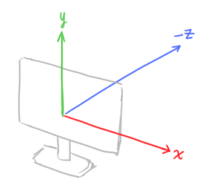
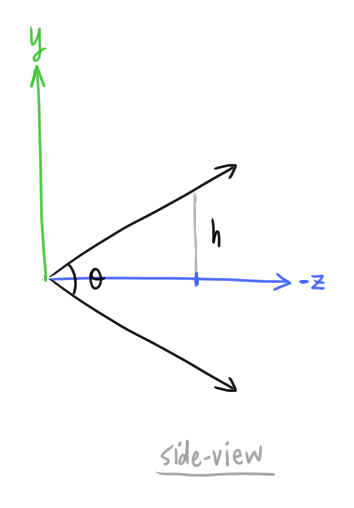
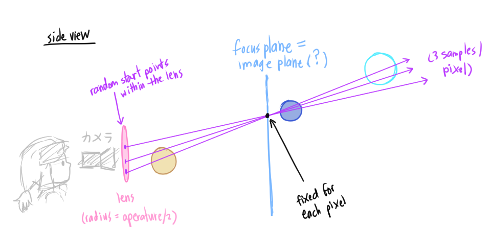
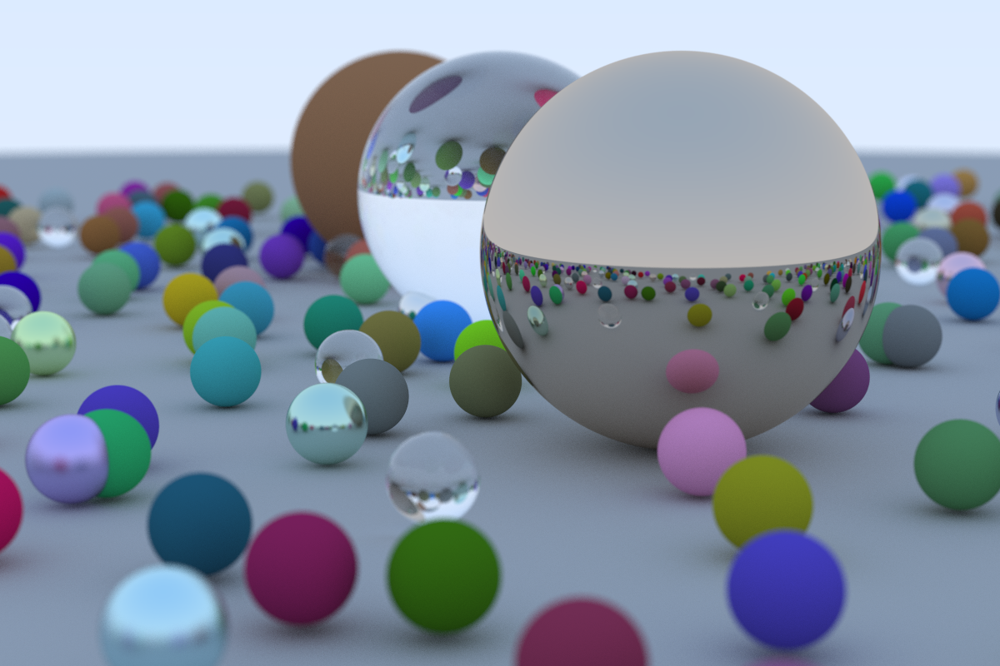

# Ray-tracer
Following [Ray-tracing in One Weekend](https://raytracing.github.io/books/RayTracingInOneWeekend.html) 🚀

Also learning CMake...

## How to run

1. Generate build files:
```
cmake -S . -B build
```

2. Build the project:
```
cmake --build build
```

3. Run the executable
```
./build/RayTracer
```


## Progress Log

### [2.2 Creating an Image File](https://raytracing.github.io/books/RayTracingInOneWeekend.html#outputanimage/creatinganimagefile)
I changed it up a bit so that the red -> row and green -> column (which makes more sense to me):

The function `print_ppm_file()` in `main.cpp` will generate an image.

Build the project (`cmake --build build`) then run the program while redirectiug the output to a file: `./build/RayTracer > image.ppm`. Then view the `image.ppm` in an image viewer.


すごいいいいい 💃✨

### [5. Adding a Sphere](https://raytracing.github.io/books/RayTracingInOneWeekend.html#addingasphere)


This math makes sense... I'm crying 😭 schön... (I'm getting a サンダサンさん moment).
* [Math is fun - quadratic equation](https://www.mathsisfun.com/algebra/quadratic-equation.html)
  * Discriminant review
* [Line-sphere intersection](https://en.wikipedia.org/wiki/Line%E2%80%93sphere_intersection)
  * Ok, the dot product part is kind of magic still...
  * I understand that you need the dot product to get a real number (as opposed to a 3D vector) but other than that... why does this work... Amazing...
* [Determining a vector given two points](http://mathonline.wikidot.com/determining-a-vector-given-two-points)


### [6. Surface Normals and Multiple Objects](https://raytracing.github.io/books/RayTracingInOneWeekend.html#surfacenormalsandmultipleobjects)

Made this by mistake... Time to debug 🔍


The bug was this line:
```c++
color ray_color(const ray& r) {
        // ...
        return 0.5 * color(normal.x(), normal.y(), normal.z());
```

I forgot the `+1` for each color channel... Without it, the color channels go out of range.

Fixed! 🛠


#### Negative pixel values
The bug above was causing negative pixel values to be written to the PPM file. But I still couldn't explain why *those particular* image colors in the buggy image were rendered.

I generated an image where I had negative values in the blue channel at the top, and had the blue channel incrementally become more positive going down the image (keeping red and green at `0`). I drew white lines at certain points of interest (manually had to figure out. I drew an orange line at center height.

Running this:
```bash
python negative_pixel_values.py
```

Generates the following image:


Totally weird. I'd think that negative pixel values would just do the reverse of the positive values, but there are random (?) places where the colors suddenly change (I drew white lines there). Also the most negative value `-255` isn't the full blue color as expected.


This is the red and blue channel values going in reverse (`red=-255` and `blue=255` at the top):


🤷‍♀ 変なの。 

If I removed `0.5`:
```c++
color ray_color(const ray& r) {
        // ...
        return color(normal.x(), normal.y(), normal.z());
```
I get this image:


Without `0.5`, now the pixel values go over 255.

If the pixel values go over `255`, the channel color seems to be `value % 255`:


This image is with a white line drawn if  `row % 255 == 0`. The orange line is still at `row = 0`.


#### Sphere normal

If the sphere center = `C` and the closest point of intersection of the ray and the sphere is `P`, then the normal vector is:
```
P - C
```
This is the vector whose direction is from the center `C` to the surface `P`

## [6.6 Some New C++ Features](https://raytracing.github.io/books/RayTracingInOneWeekend.html#surfacenormalsandmultipleobjects/somenewc++features)

Using `smart_ptr` because:
* Allows multiple geometries to share a common instance of an object (ex. spheres that use the same texture map)
* Makes memory management more automatic


## [7. Antialiasing](https://raytracing.github.io/books/RayTracingInOneWeekend.html#antialiasing)

For each pixel at position `(i,j)` (`i` is the row, `j` is the column), we are adding some random value between `0.0` and `1.0`, which gives us a new position `(u,v)` in the image *within* that pixel. We then get the color at that position. This gives us *one* sample. We do this until we have `samples_per_pixel` color values, then take the average at the end.

This average color becomes the final color of the pixel.

In `main.cpp`:
```c++
    // ...
    for (int j=image_height-1; j >= 0; --j) {
        for (int i=0; i<image_width; ++i) {
            color pixel_color(0, 0, 0);
            for (int s=0; s<samples_per_pixel; s++) {
                double u = (double(i) + random_double()) / (image_width-1);
                double v = (double(j) + random_double()) / (image_height-1);
                // ...
```

Without anti-aliasing:


With anti-aliasing ✨:


I first encountered the word "anti-aliasing" in *middle school*, in like ~~Shi-painter Pro~~ (damn it wasn't, [I looked](https://github.com/atskae/oekaki-potato/blob/master/doc/shi-painter/run_shi_painter_locally.md) just now) Photoshop? I finally know how it works a decade+ later... ああああああ... 感動........


### Time differences (just for curiosity):

Without anti-aliasing, (commit `08b95e4569f99c3993c37dbc3f571f4864550c8f`)

```bash
time ./build/RayTracer > image_without_anti_aliasing.ppm 
Scanlines remaining: 0 ./build/RayTracer > image_without_anti_aliasing.ppm  0.20s user 0.23s system 84% cpu 0.511 total
```

With anti-aliasing (commit `3a8831f0c35e9e7b77ac0ac2f7c6f0d731bf2cbf`)
```bash
time ./build/RayTracer > image_with_anti_aliasing.ppm 
Scanlines remaining: 0 ./build/RayTracer > image_with_anti_aliasing.ppm  5.76s user 0.34s system 91% cpu 6.707 total
```


## [8. Diffuse Materials](https://raytracing.github.io/books/RayTracingInOneWeekend.html#diffusematerials)

* **Matte** materials - dull, rather than shiny/reflective
* [**Lambertian reflectance**](https://en.wikipedia.org/wiki/Lambertian_reflectance): a property of an object that has the "ideal" matte or [diffusely reflective surface](https://en.wikipedia.org/wiki/Diffuse_reflection) (one ray with create many reflected rays on surface contact)


Got an infinite loop here (in `rtweekend.h`)
```c++
inline double random_double(double min, double max) {
    double num = min + (max+min)*random_double();
    return num;
}
```
I had `max+min` when it should have been `max-min`. I was always getting `-1`, so the random vector inside the unit cube was always `vec3(-1,-1,-1)` which never had a length less than 1.

Bug... 😢 ???


I suspected that all the rays were getting to `depth=0` but that doesn't seem to be the case.

With diffusion (?) takes a lot longer:
```
time build/RayTracer > image.ppm 
Scanlines remaining: 0 Max depth reached: 3469200/177213793
build/RayTracer > image.ppm  186.28s user 1.53s system 97% cpu 3:12.42 total
```

If I look the generated image file though, they are not all `0 0 0`... If I zoom in *a lot* I guess I can sorta see a sphere... Why isn't there the same amount of constrast...?

(edit) I just had to move on... "If you can't see the shadow, don't worry...". 


### [8.3 Gamma Correction](https://raytracing.github.io/books/RayTracingInOneWeekend.html#diffusematerials/usinggammacorrectionforaccuratecolorintensity)

* [**gamma correction**](https://www.teamten.com/lawrence/graphics/gamma/): "...doing graphics color math accounting for the distortion that the color will eventually go through when displayed on a monitor."
  * "Notice that 0 stays black and 1 stays white, but the in-betweens get darkened." That explains it...
  * "gamma 2" means raise each color channel by the power `1/gamma` with `gamma=2`
    * This is the same as taking the squared root

```
time build/RayTracer > image_with_gamma_2_correction.ppm
Scanlines remaining: 0 Max depth reached: 3469200/177213793
build/RayTracer > image_with_gamma_2_correction.ppm  187.91s user 2.15s system 96% cpu 3:17.10 total
```

Was...! <--- Deutsch


Line 70,000 in ppm image:
* Before: `16 21 29`
* After: `64 73 86` 

I was having super math "how does math work again??" confusion... how does a squared-rooted value *increase* ??? !
First of all, I forgot the RGB pixel values within the program has approximately range 0 to 1, not 0 to 255.
```
r = 0.63
sqrt(r) = ~0.79
```
Any number between 0 and 1 will increase if you take the squared root... Totally forgot...
[Someone else wondered the same thing](https://math.stackexchange.com/questions/2618094/why-the-square-root-of-any-decimal-number-between-0-and-1-always-come-out-to-be), it's nice knowing I'm not the only one who wondered -happy tear-.


### [8.4 Reducing Shadow Acne](https://raytracing.github.io/books/RayTracingInOneWeekend.html#antialiasing/generatingpixelswithmultiplesamples)

Wow, made the program significantly faster too!
```
time ./build/RayTracer > image.ppm
Scanlines remaining: 0 ./build/RayTracer > image.ppm  12.87s user 0.48s system 93% cpu 14.293 total
```

Also brighter ???:


### [8.5 True Lambertian Reflection](https://raytracing.github.io/books/RayTracingInOneWeekend.html#diffusematerials/truelambertianreflection)


* [Stackexchange post](https://computergraphics.stackexchange.com/questions/12222/question-about-true-lambertian-reflection-in-ray-tracing-in-one-weekend)
  * [The first method](https://raytracing.github.io/books/RayTracingInOneWeekend.html#diffusematerials/asimplediffusematerial) generates a random point *inside* the unit sphere of random length
  * [The second method](https://raytracing.github.io/books/RayTracingInOneWeekend.html#diffusematerials/truelambertianreflection), also called the *Lambertian Reflection*, generates a random point *on the surface* of a unit sphere of unit length (length=1)
  * The two methods have different probability distributions of what random vector is generated

#### First Method

First method has a probability distribution of `cos^3(phi)`, where `phi` is the angle between the random vector and the surface normal:


There is a skew toward getting a random vector with `phi` closer to zero, which means the random vector is closer to the surface normal.

### Second Method

The second method as a probability distribution of `cos(phi)`, which is the [same distribution of the Lambertian Reflection](https://en.wikipedia.org/wiki/Lambert%27s_cosine_law).

[Graph comparison of `cos^3(phi)` and `cos(phi)`](https://www.desmos.com/calculator/atddqeyelo)

* `cos^3(phi)` looks more "bell-curve ish"
  * I googled "bell curve ish" and it seems like a common phrase
* `cos(phi)` looks more "even"

The second method will generate random vectors in a more uniform distribution; light will be scattered more uniformly.


### Misc 

Reminds me of a past school assignment where, you have to do some adjustments for the program to generate truly random points inside a circle... Like [this post](https://jyopari.github.io/randomCirc.html).


### [8.6 An Alternative Diffuse Formulation](https://raytracing.github.io/books/RayTracingInOneWeekend.html#diffusematerials/analternativediffuseformulation)

Here we make sure that the reflected ray is always facing in the same hemisphere as the normal. This gives us a more uniform scatter direction. This produces:


## [9.4 Mirrored Light Reflection](https://raytracing.github.io/books/RayTracingInOneWeekend.html#metal/mirroredlightreflection)

[Scratchapixel](https://www.scratchapixel.com/lessons/3d-basic-rendering/introduction-to-shading/reflection-refraction-fresnel) explains how the `reflect()` equation is derived
```c++
vec3 reflect(const vec3& v, const vec3& n) {
    return v - 2*dot(v,n)*n;
}
```
We subtract here (`-2dot()`) since the incoming vector `v` and the normal are facing opposite directions, so the dot product will return a negative value (giving us a direction that is *opposite* of the normal, but we want to face the same direction as the normal) 

Wowwwwwww, this looks sooo strange:


Playing around with the color of the materials, which sets the `albedo` of the material.
I made the center sphere a light purple color, and made the ground more green:


Albedo is just... the color of the material then?

### [9.6 Fuzzy Reflection](https://raytracing.github.io/books/RayTracingInOneWeekend.html#metal/fuzzyreflection)

To add a fuzz effect to the metal, we make the reflected ray's angle with the normal to be slightly different from the angle of the incoming ray.

We don't modify the angle directly however. We choose a random vector within a smaller sphere at the reflected ray endpoint and add it to that ray to obtain a new direction. The radius of the smaller sphere determines how "fuzzy" the metal looks (larger radius = more variation in angle = more fuzzy)


## [Dielectrics](https://raytracing.github.io/books/RayTracingInOneWeekend.html#dielectrics)

**Dielectrics** are clear materials, such as water, glass, diamonds
* When a light ray hits this type of material it splits into a relfected and *refracted* (also called *transmitted*) ray
* [Reflection vs refraction](https://keydifferences.com/difference-between-reflection-and-refraction.html)
* [Snell's Law Derivation](https://graphics.stanford.edu/courses/cs148-10-summer/docs/2006--degreve--reflection_refraction.pdf)
* [My own notes on the derivation](refraction_transmitted_ray_derivation.md)

### My bugs in implementing dielectrics


I forgot to normalize the vector `r_in` (dielectric material):
```c++
        virtual bool scatter(
            const ray& r_in, const hit_record& rec, color& attenuation, ray& scattered
        ) const override {
            // ...
            vec3 transmitted_ray_direction = refract(r_in.direction(), rec.normal, refraction_ratio);
```

Which gives it a warpy look:


I forgot to set the transmitted ray to the returned ray (which is a reference...)
```c++
            // Created this and just, forgot about it
            ray transmitted = ray(rec.p, transmitted_ray_direction);

            return true;
```

Which resulted in dark spheres:


And the segmentation fault (my first major one in this project!) was due to my buggy implementation of `hittable_list.hit()` (I'm surprised this didn't crash with the other materials, also how did I mess this up so bad, given the correct code OTL) and the combination of the bugs above.
* I was updating the returned hit_record `rec` versus using a temporary one to find the closest hit object
* `rec.t` was `NaN` in the next recursive call of `ray_color()` since the transmitted ray was never returned (so the returned way was always `(0,0,0)` both position and direction)
  * `hit()` was returning true but the hit_record was empty (so the pointer to the material object was `nullptr`... 💥).

```c++
bool hittable_list::hit(const ray& r, double t_min, double t_max, hit_record& rec) const {
    hit_record rec_for_closest;
    // Want to find the smallest t value (which is the closest object that was hit)
    double t_closest = t_max;
    bool hit_any_object = false;

    for (const shared_ptr<hittable>& object: this->objects) {
        bool is_hit = object->hit(r, t_min, t_max, rec);
        if (is_hit) {
            hit_any_object = true;
            if (rec.t < t_closest) {
                // Save the hit_record of this closer object
                t_closest = rec.t;
                rec_for_closest = rec;
            }
        }
    }

    // Set rec to the closest object that was hit
    if (hit_any_object) {
        rec = rec_for_closest;
    }

    return hit_any_object;
}
```


I also forgot `fabs()` under the squared root in `vec3.refract()` but was surprised that it didn't actually change anything:
```c++
    vec3 transmitted_ray_parallel = -1 * normal * (sqrt( 1 - transmitted_ray_perpendicular.length_squared() ));
```
I initially thought this was where `NaN` was coming from....


### Indices of Refraction

Indicies of refraction (η=2.5 on the left, η=1.5 in the center):


### [10.5 Modeling a Hollow Sphere](https://raytracing.github.io/books/RayTracingInOneWeekend.html#dielectrics/modelingahollowglasssphere)

I had another bug where the negative radius didn't affect how the sphere was rendered (so I never got the hollow sphere), the same point in [this comment](https://www.reddit.com/r/rust/comments/g9p7vh/ray_tracing_in_a_weekend_refraction_help/).

This was where the bug was:
```c++
bool sphere::hit(...) {
    // ...
    vec3 outward_normal = unit_vector(rec.p - this->center);
}
```

`unit_vector()` divides the vector by the vector's length, which is always positive (even if the radius is negative). To correctly normalize the normal vector, the radius (which holds the sign of the number) needs to be used as the vector length directly:
```c++
bool sphere::hit(...) {
    // ...
    vec3 outward_normal = (rec.p - this->center) / radius;
}
```

It fixed it!!! 💃


## [11. Positionable Camera](https://raytracing.github.io/books/RayTracingInOneWeekend.html#positionablecamera)

The axes in this ray-tracer:



The negative z-axis is where the "world" is. And we view this world from the image generated on the computer screen (x-y plane).

**Field of view** (FOV) - the angle you see through the portal
* FOV is different horizontally and vertically

Angle `theta` is the vertical fov:



From trig, the height `h` is `tan(theta/2)` if we are shooting rays from the origin to the `z=-1` plane.

```
tan(angle) = opposite / adjacent
// theta/2 is the angle of the right triangle
tan(theta/2) = h / z
tan(theta/2) = abs(h / -1) // we only want the length so take the absolute value (???)
tan(theta/2) = h
```

### Different vertical FOVs

Fiddling around by changing the vertical FOV angle:


The smaller the angle, the "closer" the objects appear:

FOV=45 degrees:


FOV=90 degrees:


FOV=125 degrees:


So these are technically spheres but because of the aspect ratio, they appear to look oval??

### [11.2 Positioning and Orienting the Camera](https://raytracing.github.io/books/RayTracingInOneWeekend.html#positionablecamera/positioningandorientingthecamera)

Important points (of view): <--- pun not intended, actually is it ??

* **lookfrom**: where the camera is placed
* **lookat**: the point we look at
* the **roll**: sideways tilt of the camera = the rotation around the *lookat-lookfrom* axis
    * If we keep *lookfrom* and *lookat* constant, we can still rotate our heads to get a different view
    * The **up vector** for the camera would be used to give us different *roll* values of the camera
      * This *up vector* lies in the plane orthogonal to the view direction


TODO: explain this magic ommgggg I have to run.... . . . 😭

At vertical field of view (vfov) at 90 degrees:


At vfov=20:


To get a view from the right side, we adjust `lookfrom` to a positive x value (here I moved `lookfrom` from `(-2,2,1)` to  `(4,2,1)`):


Ommgggg so,,,,, cool.

Negative view up vector `(0,-1,0)`:


## [12. Defocus Blur](https://raytracing.github.io/books/RayTracingInOneWeekend.html#defocusblur)

"Defocus blur" = *depth of field* in the photography world.
* [**depth of field**](https://en.wikipedia.org/wiki/Depth_of_field): "the distance between the nearest and farthest objects that are in acceptably sharp focus"
    * The larger the depth of field, the larger the area where the image is focused (with the remaining parts blurred)

* **focus distance** The distance between the projection point and the plane where everything is in focus
    * *focus distance* != *focal length* (focal length is the distance between the projection point and the image plane)

* **aperture** is the hole in your camera that controls how much light enters the camera sensor
  * Like a pupil in your eye that expands/shrinks based on how dark/light the environment is
  * Larger aperature produce more shallow depth of field (more blurriness). Smaller aperatures product images with large depth of field 
    * The blurriness is due to the sensor getting light from multiple directions

With aperature=2.0:


With aperature=0.5:


I actually don't understand this 100% so I'll come back to this...

#### Trying to explain this 

Making many assumptions because I don't have a professor to ask at some office hours 😢

I think the focus plane and the viewport are in the same exact spot and size, which is why I think we multiply by `focus_dist` here?
```c++
camera(...) {
            ...
            this->horizontal = focus_dist * viewport_width * u;
            this->vertical = focus_dist * viewport_height * v;
```

If that's the case, this is the understanding I have of `camera.get_ray()`:



For each sample (per pixel), we first get a random start point within the lens (the bounds given to us by the aperature):
```c++
            vec3 rd = this->lens_radius * random_in_unit_disk();
            vec3 offset = this->u * rd.x() + this->v * rd.y();
```
We use the camera's axes `u` (horizontal) and `v` (vertical).

The `offset` is a random point within the lens that is relative to the camera origin (`lookfrom`).

The next line is [creating a vector from two points](http://mathonline.wikidot.com/determining-a-vector-given-two-points). This is the vector from the random point from the origin `(this->origin + offset)`, and the point on the focus plane `(this->lower_left_corner + s*this->horizontal + t*this->vertical)`: 
```c++
            vec3 direction = (this->lower_left_corner + s*this->horizontal + t*this->vertical) - (this->origin + offset);
```

Here we use the viewport's axes, `horizontal` and `vertical`, to find the pixel `(s,t)`'s coordinate in the viewport.

For each pixel `(s,t)`, the focus point is fixed. What varies is the random starting point. So for each pixel, we have a bunch of rays starting at different points but going through the same point on the focus plane.

The ray that is returned:

```c++
            return ray(this->origin + offset, direction);
```

Objects that are closer to the focus plane will appear sharper. This is because the samples are closer together near the focus point. The farther the object is from the focus plane, the samples are spread out more, so the average pixel value will include samples from a wider range.


Recall this rendered image from before:


The reason the middle blue sphere is focused is because its distance from the camera is the same as the focus distance:
```c++
    // The blue sphere is placed at (0,0,-1)
    world.add(
        make_shared<sphere>(point3(0, 0, -1), 0.5, material_center)
    );
```
Here is our camera setup:
```c++
    // Camera
    ...
    point3 lookfrom = point3(3, 3, 2);
    point3 lookat = point3(0,0,-1);
    ...
    double dist_to_focus = (lookfrom - lookat).length();
```
We are looking at an object at `(0,0,-1)`, which is the same as where our blue sphere is. The distance from the camera to the blue sphere is `(lookat - lookfrom).length`, which is what we use for the focus distance `dist_to_focus`.

If we want to make the metal sphere on the right in focus instead, we just have to change the focus distance to where the metal sphere is. The metal sphere is placed at point `(1,0,-1)`:

```c++
    world.add(
        make_shared<sphere>(point3(1, 0, -1), 0.5, material_right)
    );
```

If we change the focus distance to the distance between the camera and the metal sphere at `(1,0,-1)`:
```c++
double dist_to_focus = (lookfrom - point3(1,0,-1)).length();
```

We get this image:


Aaaaaaあああ my intuition was correct wowoooooooow 🤯

We can also look at the metal sphere and keep the focus distance `(lookfrom - lookat).length()`:


#### Explanations
* [References to depth of field implementation in a ray tracer](https://stackoverflow.com/questions/13532947/references-for-depth-of-field-implementation-in-a-raytracer)
* [Depth of Field in Path Tracing](https://medium.com/@elope139/depth-of-field-in-path-tracing-e61180417027#:~:text=Implementing%20depth%20of%20field%20in,out%20of%20focus%20will%20appear.)
* [Ray tracer depth of field](https://steveharveynz.wordpress.com/2012/12/21/ray-tracer-part-5-depth-of-field/)

## [13.1. A Final Renderer](https://raytracing.github.io/books/RayTracingInOneWeekend.html#wherenext?/afinalrender)

I tried to generate at least the three spheres on the cover without looking at the solution, and eh, close enough:


(guessing and checking for like 1 hour)

Actually followed the code and attempted the final textbook cover.
I let the ray tracer run for like, 4 days on and off, and it finally completed!!!!!! (Tuesday, May 24, 2022)

```
➜  01-ray-tracing-in-one-weekend git:(master) ✗ fg
[1]  + 2395 running    time ./build/RayTracer > textbook-cover.ppm
Scanlines remaining: 742 ^Z
[1]  + 2395 suspended  time ./build/RayTracer > textbook-cover.ppm
➜  01-ray-tracing-in-one-weekend git:(master) ✗ bg
[1]  + 2395 continued  time ./build/RayTracer > textbook-cover.ppm
Scanlines remaining: 723 fgekend git:(master) ✗ 
[1]  + 2395 running    time ./build/RayTracer > textbook-cover.ppm
^Z
[1]  + 2395 suspended  time ./build/RayTracer > textbook-cover.ppm
➜  01-ray-tracing-in-one-weekend git:(master) ✗ bg
[1]  + 2395 continued  time ./build/RayTracer > textbook-cover.ppm
Scanlines remaining: 722 fgekend git:(master) ✗ 
[1]  + 2395 running    time ./build/RayTracer > textbook-cover.ppm
^Z
[1]  + 2395 suspended  time ./build/RayTracer > textbook-cover.ppm
➜  01-ray-tracing-in-one-weekend git:(master) ✗ bg
[1]  + 2395 continued  time ./build/RayTracer > textbook-cover.ppm
Scanlines remaining: 711 fgekend git:(master) ✗ 
[1]  + 2395 running    time ./build/RayTracer > textbook-cover.ppm
^Z
[1]  + 2395 suspended  time ./build/RayTracer > textbook-cover.ppm
➜  01-ray-tracing-in-one-weekend git:(master) ✗ bg
[1]  + 2395 continued  time ./build/RayTracer > textbook-cover.ppm
➜  01-ray-tracing-in-one-weekend git:(master) ✗ fg
[1]  + 2395 running    time ./build/RayTracer > textbook-cover.ppm
^Z
[1]  + 2395 suspended  time ./build/RayTracer > textbook-cover.ppm
➜  01-ray-tracing-in-one-weekend git:(master) ✗ bg
[1]  + 2395 continued  time ./build/RayTracer > textbook-cover.ppm
➜  01-ray-tracing-in-one-weekend git:(master) ✗ fg
[1]  + 2395 running    time ./build/RayTracer > textbook-cover.ppm
Scanlines remaining: 700 ^Z
[1]  + 2395 suspended  time ./build/RayTracer > textbook-cover.ppm
➜  01-ray-tracing-in-one-weekend git:(master) ✗ bg
[1]  + 2395 continued  time ./build/RayTracer > textbook-cover.ppm
Scanlines remaining: 639 fgekend git:(master) ✗ 
[1]  + 2395 running    time ./build/RayTracer > textbook-cover.ppm
Scanlines remaining: 373 ^Z
[1]  + 2395 suspended  time ./build/RayTracer > textbook-cover.ppm
➜  01-ray-tracing-in-one-weekend git:(master) ✗ bg
[1]  + 2395 continued  time ./build/RayTracer > textbook-cover.ppm
Scanlines remaining: 371 fgekend git:(master) ✗ 
[1]  + 2395 running    time ./build/RayTracer > textbook-cover.ppm
Scanlines remaining: 243 ^Z
[1]  + 2395 suspended  time ./build/RayTracer > textbook-cover.ppm
➜  01-ray-tracing-in-one-weekend git:(master) ✗ bg
[1]  + 2395 continued  time ./build/RayTracer > textbook-cover.ppm
Scanlines remaining: 242 fgekend git:(master) ✗ 
[1]  + 2395 running    time ./build/RayTracer > textbook-cover.ppm
Scanlines remaining: 197 ^Z
[1]  + 2395 suspended  time ./build/RayTracer > textbook-cover.ppm
➜  01-ray-tracing-in-one-weekend git:(master) ✗ bg
[1]  + 2395 continued  time ./build/RayTracer > textbook-cover.ppm
➜  01-ray-tracing-in-one-weekend git:(master) ✗ fg
[1]  + 2395 running    time ./build/RayTracer > textbook-cover.ppm
^Z
[1]  + 2395 suspended  time ./build/RayTracer > textbook-cover.ppm
➜  01-ray-tracing-in-one-weekend git:(master) ✗ bg
[1]  + 2395 continued  time ./build/RayTracer > textbook-cover.ppm
➜  01-ray-tracing-in-one-weekend git:(master) ✗ fg
[1]  + 2395 running    time ./build/RayTracer > textbook-cover.ppm
Scanlines remaining: 34 ^Z
[1]  + 2395 suspended  time ./build/RayTracer > textbook-cover.ppm
➜  01-ray-tracing-in-one-weekend git:(master) ✗ bg
[1]  + 2395 continued  time ./build/RayTracer > textbook-cover.ppm
Scanlines remaining: 33 fgeekend git:(master) ✗ 
[1]  + 2395 running    time ./build/RayTracer > textbook-cover.ppm
Scanlines remaining: 0 ./build/RayTracer > textbook-cover.ppm  142018.58s user 162.97s system 47% cpu 83:11:30.42 total
```



OMGGGGG 素晴らしいいいいいいい 😭💃 Schööön

日記

I totally thought it would result in a black image because it was taking so damn long... I thought it was reaching maximum recursion depth for each pixel/sample. Oh man... so relieved...

In the first attempt I accidently compiled in DEBUG mode, so it was hella more slow... But when I realized that, the ray tracer was pretty far into it, so I fell into the sunk cost fallacy. Then my Mac OS restarted in the middle of the night to install some updates without asking so I had to start over... OTL

Then I tried again, without DEBUG symbols...

This sequential, single-threaded ray tracer forced me to install my air conditioner early this year because it was heating up my laptop and there happend to be a heat advisory warning the weekend that this ran, so my room was turning into an oven 🔥 Now I am grateful that GPUs (and air conditioners) exist.

Some advice: write a ray tracer in the winter so you can heat your room.

Completed!!! ✨ On to the next aventura! 🏃‍♀️

[つづく](README-ray-tracing-the-next-week.md)

## Resources
* [PPM image format](https://www.cs.swarthmore.edu/~soni/cs35/f13/Labs/extras/01/ppm_info.html)
* [CMake examples](https://github.com/ttroy50/cmake-examples/tree/master/01-basic)
* [GDB for Mac OS: LLDB](https://lldb.llvm.org/use/map.html)
