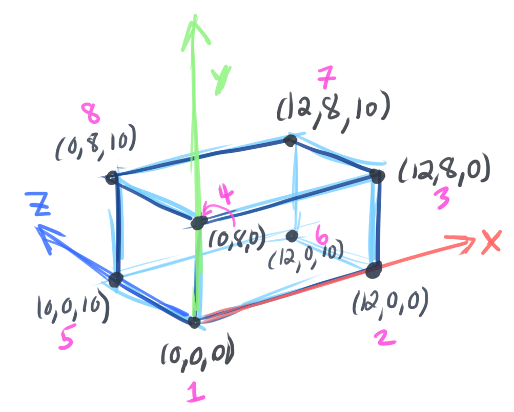

# 01: Introduction
[Where Do I Start? A Very Gentle Introduction to Computer Graphics Programming](https://www.scratchapixel.com/lessons/3d-basic-rendering/get-started)

## A Gentle Introduction to Computer Graphics Programming
* We live in a 3D world, but our **vision** views this world in 2D (images, flat screen, mirror)
  * **Foreshortening** (far-away things are smaller) in 2D gives the brain the illusion of 3D
  * **Stereoscopic vision** provides sense of depth
    * A flat image of a scene can look like the same experience of looking at the actual scene in-person
    * The eyes gets 2 images from slightly different angles to get the sense of depth
* "computer graphics is a mean by which we can create images of artificial worlds and present them to the brain (through the mean of vision), as an experience of reality"
  * I thought this was pretty 深い
  * **Photorealism**

## Describing Objects Making up the Virtual World
* Unlike humans, computers need an explicit description of the image to render it
* **Rendering**: create a image from a 3D scene
  * One way: points or **coordinates** relative to an **origin** in a 3D coordinate system

* Describe box with an array of `Point`: `Point(width, height, depth)`
<br>
```python
points = [
    Point(0, 0,  0),    # corner 1
    Point(12, 0,  0),   # corner 2
    Point(12, 8,  0),   # corner 3
    Point(0, 8,  0),    # corner 4
    Point(0, 0, 10),    # corner 5
    Point(12, 0, 10),   # corner 6
    Point(12, 8, 10),   # corner 7 
    Point(0, 8, 10),    # corner 8
]
```
💁‍♀️ "Here you go" -> 💻
* To render an image, we need:
  1. **scene**: a collection of these object descriptions (ex. `list[Point]` is a scene)
        
  2. **topology**: instructions on how to connect these points to produce the faces/flat surfaces of the box (a **model**) 
     * Points are also called **vertices**
     * Any collection of flat surfaces that we are trying to create with these vertices = **polygons**
       * Ex. a bunch of flat triangles
     * These polygons form a **polygonal mesh**, **mesh**
       * Ex. The box is a polygonal mesh, made up of rectangles as its flat faces (polygons)
  3. A system that will project the image onto an imaginary canvas 
     * **perspective projection**

## Creating an Image of this Virtual World
How to take 3D points and project them onto a 2D canvas.
* Use a **perspective matrix** to compute
* **Viewing frustum** pyramid, 3D volume in space, your field of vision
  * The **canvas** is a flat plane cutting through the viewing frustum (pyramid), perpendicular to your line of sight

1. Place box in front of viewing frustum. Draw lines from each corner of the box to the origin (eye)


2. See where the lines intersect the canvas


3. Connect the intersection points on the canvas. We see a 2D image!


This coordinate system = **world coordinate system**, with origin at `(0,0,0)`.

Since we moved the box from the origin, its coordinates have changed:
```python
points = [
    Point(1, -1, -5)    # corner 1 
    Point(1, -1, -3)    # corner 2
    Point(1, 1, -5)     # corner 3
    Point(1, 1, -3)     # corner 4
    Point(-1, -1, -5)   # corner 5
    Point(-1, -1, -3)   # corner 6
    Point(-1,  1, -5)   # corner 7
    Point(-1,  1, -3)   # corner 8
]
```
Width, height, and depth can be negative!


### How to calculate the projected coordinates on the canvas
Move canvas 1 unit away from the origin. Looking at the side-view of our box, we can draw a triangle from the box to the origin:


We want to find point `P'` because this is where one corner of the box (`corner #8`) intersects the canvas when we draw a line between `corner #8` to the origin `A`. We need `P'.y`:
```
P' = Point(x=P'.x, y=P'.y, z=1)
```

We have two *similar* triangles: `ABC` and `AB'C'`. A property of **similar triangles**: the proportion of the adjacent and opposite sides are the same.


**Z divide**, or the **perspective divide**: the projection of the y-coordinate of a box corner `P` onto the 2D canvas is: `P.y` divided by its depth `P.z` (the z-coordinate).
* This also applies to the x-coordinate
  * But we need to divide `P.x` and `P.y` with `-P.z` (negative), otherwise it would compute a mirrored coordinate

3D point `P(x, y, z)` -> 2D point `P'(x, y)`
* `P'.x = P.x / -P.z`
* `P'.y = P.y / -P.z`

### Canvas size, normalization, convert to another image size
* The canvas size effects how much of the scene you see.
* The shape is arbitrary (can rectangle, square)
* Any points outside the canvas would not be seen in the 2D image
    * Projected points inside the canvas = in **screen space**
* To be able to adjust to any screen size (and not work with negative coordinate values), we **normalize** the project points to the range `[0,1]` so that the coordinates are defined in a common space.
* Coordinates of range `[-1, 1]` are **Normalized Device Coordinates** (NDC)
* The projected coordinates should be in the unit of the final image, such as **pixels**.
  * An image is simply a 2D array of pixels
* Screen resolution (1080p = 1092x1080, 1080 pixels is the height)

To convert the NDC coordinates to an image of 512x512 pixels, multiply the NDC coordinate by 512 pixels.
* This creates coordinates in a **raster space**
  * Raster images are made of pixels (`.png`, `.jpeg`) and are resolution-dependent
  * Vector images (`.svg`) are not resolution-dependent, so they can be stretched to arbitrary sizes and not "blur"
  * -insert Oekaki days nostalgia- あああ


## What have we learned? 
* The rules for creating an image is purely mathematics. The computer is simply a tool to speed up the computation
* **Real-time rendering**: images need to be generated at least 30 frames per second (fps) (60 fps is the standard)
  * Computed by GPU
  * Requirement for video games
* **Offline rendering**: images are pre-computed and stored before being displayed at whatever frames per second
  * Typically produces better quality images than real-time rendering
  * CGI for films

## Next Steps
* [Geometry](https://www.scratchapixel.com/lessons/mathematics-physics-for-computer-graphics/geometry)
* Rendering (read "Volume 1: Foundations of 3D Rendering" on [Scratchapixel](https://www.scratchapixel.com/index.php?redirect)) in chronological order

## Questions
* Why is the canvas not the end image? (why do we need to do another computation, ex. multiply by `512` for a `512x512` image)
