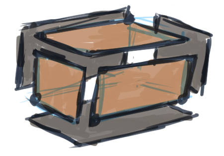

# 01: Introduction
[Where Do I Start? A Very Gentle Introduction to Computer Graphics Programming](https://www.scratchapixel.com/lessons/3d-basic-rendering/get-started)

## A Gentle Introduction to Computer Graphics Programming
* We live in a 3D world, but our **vision** views this world in 2D (images, flat screen, mirror)
  * **Foreshortening** (far-away things are smaller) in 2D gives the brain the illusion of 3D
  * **Stereoscopic vision** provides sense of depth
    * A flat image of a scene can look like the same experience of looking at the actual scene in-person
    * The eyes gets 2 images from slightly different angles to get the sense of depth
* "computer graphics is a mean by which we can create images of artificial worlds and present them to the brain (through the mean of vision), as an experience of reality"
  * I thought this was pretty 深い
  * **Photorealism**

## Describing Objects Making up the Virtual World
* Unlike humans, computers need an explicit description of the image to render it
  * One way: points or **coordinates** relative to an **origin** in a 3D coordinate system

* Describe box with an array of `Point`: `Point(width, height, depth)`
<br>
```
points = [
    Point(0, 0,  0), 
    Point(12, 0,  0), 
    Point(12, 8,  0), 
    Point(0, 8,  0), 
    Point(0, 0, 10), 
    Point(12, 0, 10), 
    Point(12, 8, 10), 
    Point(0, 8, 10), 
]
```
💁‍♀️ "Here you go" -> 💻
* To render an image, we need:
  1. **scene**: a collection of these object descriptions (ex. `list[Point]` is a scene)
        
  2. **topology**: instructions on how to connect these points to produce the faces/flat surfaces of the box (a **model**) 
     * Points are also called **vertices**
     * Any collection of flat surfaces that we are trying to create with these vertices = **polygons**
       * Ex. a bunch of flat triangles
     * These polygons form a **polygonal mesh**, **mesh**
       * Ex. The box is a polygonal mesh, made up of rectangles as its flat faces (polygons)
  3. A system that will project the image onto an imaginary canvas 
     * **perspective projection**

## Creating an Image of this Virtual World
