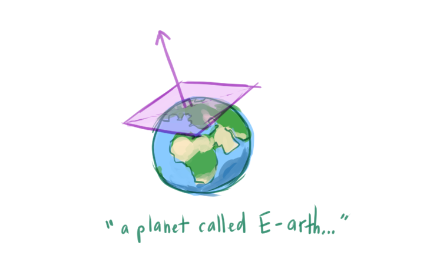

## [Points, Vectors, and Normals](https://www.scratchapixel.com/lessons/mathematics-physics-for-computer-graphics/geometry/points-vectors-and-normals)

> "Points, vectors, matrices and normals are to computer graphics what the alphabet is to literature"

## What is Linear Algebra? Introduction to Vectors
* **Linear algebra** the study of vectors
  * **Vector**/**tuple** an array of numbers
    * n-tuple: a tuple with `n` numbers
* In CG, vectors can represent position or direction in space, usually with a 3D vector
* A **linear transformation** is applied to change the contents of a vector
  * Operation preserves lines

## Points and Vectors
* A **point** is a **position** in 3D space
  * Represented by 3 numbers
* A **vector** usually means a *direction* with some magnitude
* Both points and vectors can be represented as `V(x, y, z)`
* **Homogenous points**: `P_H(x, y, z, w)`, used for mathematical convenience

## A Quick Introduction to Transformations
Linear transformations in CG:
* **Translation**: move an object around in space
  * Apply translation to a point to move it around
* Translation applied to a vector doesn't make sense
  * Doesn't change the vector's meaning because the vector only indicates direction
  * Instead we apply **rotation** to vectors (changes its direction)

We "transform" (`T`) a point `P` and a vector `V`:
```
P -> Translate -> P_T
V -> Rotate -> V_T
```

### Length/Magnitude of a Vector
* Vector with length 1 = **normalized**
* Normalizing a vector makes the vector's length 1 but does not change its direction
* If the length of a vector is meaningful, we don't want to normalize it
  * Ex. length indicating distance between two points, and the direction relative to one point
  ```
  A ----------> B
  ```
* Common bug: vector is/isn't normalized

## Normals
* A **normal**: describes the orientation of a surface of a geometric object at a point on that surface
  * A **surface normal** is a vector that describes the normal
  * Perpendicular to the surface
    
    

* One application, shading: compute the brightness of objects
* Normals do not transform the same way as other vectors do

## From Theory to C++
* Some libraries represent points, vectors, and normals each with their own class or represent all of them with 1 class
* Need to remember the special transformations for each type

