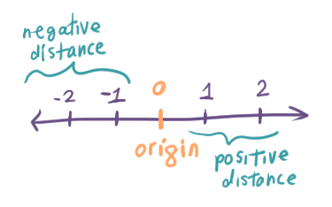
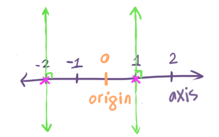
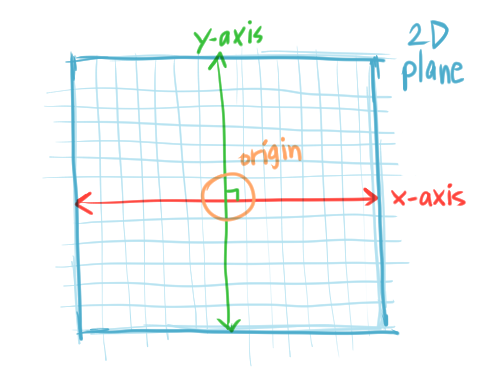
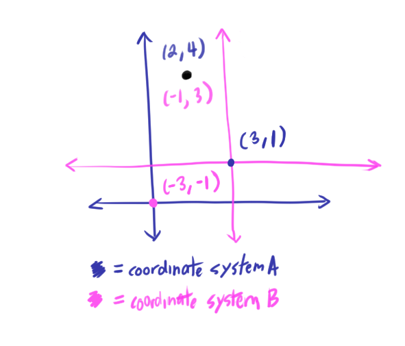
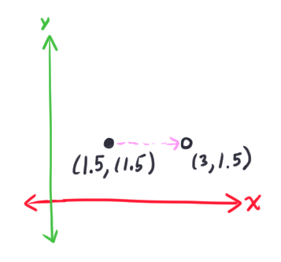
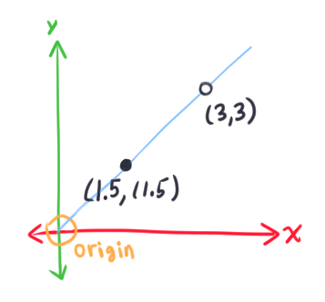

# [Coordinate Systems](https://www.scratchapixel.com/lessons/mathematics-physics-for-computer-graphics/geometry/coordinate-systems)

## Introducing Coordinate Systems
* Poiints and vectors are represented by three numbers. The **coordinate system** gives these numbers meaning
* Each number in a point/vector represents a **signed distanced** (or *coordinate*) from the origin to its position
* The **origin** is our point of reference to measure the distance of a point
    
    

* This "number line"/"ruler" is the **axis**.
* To add a new point to this axis:
  * Draw a line perpendicular to the axis
  * Mark where the perpendicular line intersects the axis to add the new point
  * The distance from the origin to the new point is the *coordinate*
  * We projected the point onto the axis using a vertical line
  
  

## Dimensions and Cartesian Coordinate Systems
* Horizontal ruler = **x-axis**
* Vertical ruler = **y-axis**
* We can find the x- and y- coordinates of a point by drawing a perpendicular line to that axis and measuring the distance from the origin to where the perpendicular line intersects (same exact process as previously above)
* The x- and y- axes (with regular intervals of unit length) create a 2D **plane** and define a **coordinate system**
  * If the x- and y- axes are *perpendicular* to each other, they create a **Cartesian coordinate system**

    

* Points written as **ordered pair**: `(x,y)`
* All points are unique and represent only one position in the plane

* You can define infinite coordinate systems (ex. move the origin).
  * A point would have different values in two different coordinate systems, but the point is *physically* in the same location
  
    

  * Point is defined as `P(2,4)` in coordinate system A and `P(-1, 3)` in coordinate system B
    * But are both physically the same point
* Transforming a point from one coordinate system to another is a common CG operation
  * Add `P(-3, -1)` to convert from coordinate system A `P(2,4)` to B: `P(-3,-1) + P(2,4) = P(-1, 3)`
  * Add `P(3,1)` to convert from coordinate system B (`P(-1,3)`) to A: `P(3,1) + P(-1, 3) = P(2, 4)`
  * **Additive inverse** (`P(3,1)` and `P(-3, -1)`), alter a coordinate's point in the opposite direction

Another operations within the *same* coordinate system:
* **Translation**: move a point to a different position
  
  
  `P(1.5, 1.5) + P(1.5, 0) = P(3, 1.5)`

* **Scale**: Move the point along a line drawn from the origin

  
  `P(1.5, 1.5) * 2 = P(3, 3)`

## The Third Dimension

