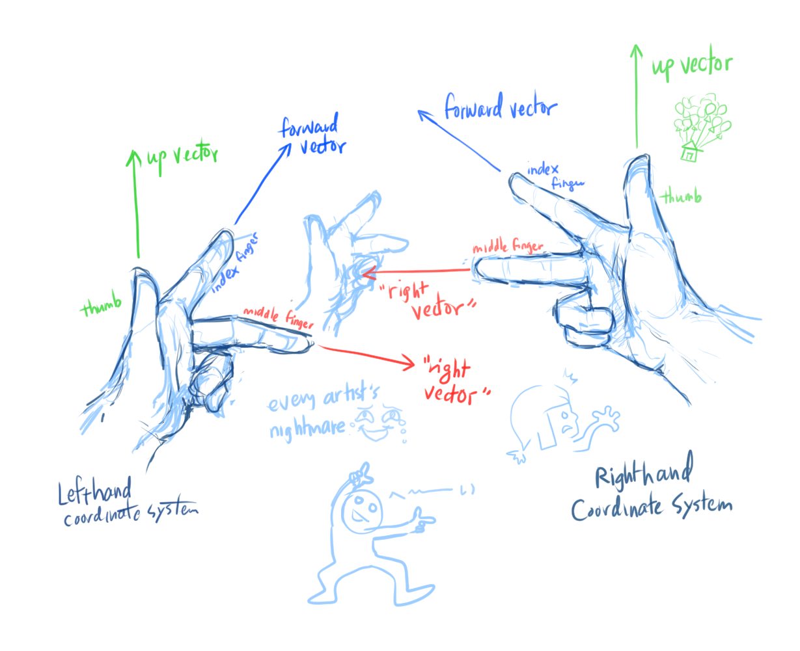

# [Coordinate Systems](https://www.scratchapixel.com/lessons/mathematics-physics-for-computer-graphics/geometry/coordinate-systems)

## Introducing Coordinate Systems
* Poiints and vectors are represented by three numbers. The **coordinate system** gives these numbers meaning
* Each number in a point/vector represents a **signed distanced** (or *coordinate*) from the origin to its position
* The **origin** is our point of reference to measure the distance of a point
    
    

* This "number line"/"ruler" is the **axis**.
* To add a new point to this axis:
  * Draw a line perpendicular to the axis
  * Mark where the perpendicular line intersects the axis to add the new point
  * The distance from the origin to the new point is the *coordinate*
  * We projected the point onto the axis using a vertical line
  
  

## Dimensions and Cartesian Coordinate Systems
* Horizontal ruler = **x-axis**
* Vertical ruler = **y-axis**
* We can find the x- and y- coordinates of a point by drawing a perpendicular line to that axis and measuring the distance from the origin to where the perpendicular line intersects (same exact process as previously above)
* The x- and y- axes (with regular intervals of unit length) create a 2D **plane** and define a **coordinate system**
  * If the x- and y- axes are *perpendicular* to each other, they create a **Cartesian coordinate system**

    

* Points written as **ordered pair**: `(x,y)`
* All points are unique and represent only one position in the plane

* You can define infinite coordinate systems (ex. move the origin).
  * A point would have different values in two different coordinate systems, but the point is *physically* in the same location
  
    

  * Point is defined as `P(2,4)` in coordinate system A and `P(-1, 3)` in coordinate system B
    * But are both physically the same point
* Transforming a point from one coordinate system to another is a common CG operation
  * Add `P(-3, -1)` to convert from coordinate system A `P(2,4)` to B: `P(-3,-1) + P(2,4) = P(-1, 3)`
  * Add `P(3,1)` to convert from coordinate system B (`P(-1,3)`) to A: `P(3,1) + P(-1, 3) = P(2, 4)`
  * **Additive inverse** (`P(3,1)` and `P(-3, -1)`), alter a coordinate's point in the opposite direction

Other operations within the *same* coordinate system:
* **Translation**: move a point to a different position
  
  
  
  `P(1.5, 1.5) + P(1.5, 0) = P(3, 1.5)`

* **Scale**: Move the point along a line drawn from the origin

  
  
  `P(1.5, 1.5) * 2 = P(3, 3)`

## The Third Dimension
* Add a third axis, called the z-axis, that is *orthogonal* to the x- and y- axis.
* z-axis represents *depth*
* In Scratchpixel notes:
  * x-axis points to the right
  * y-axis points up
  * z-axis points outward, outside the screen

    

  * In general, other conventions can be used though
* This 3D coordinate system is called the **Euclidean Space**

### Linear Algebra Terms
* The axes form a **basis** in that coordinate system
  * 1D coordinate system: x-axis
  * 2D coordinate system: x-axis and y-axis
  * 3D coordinate system: x-axis, y-axis, and z-axis
* A **basis** is a set of *linearly independent* vectors that can represent any vector/point (as a linear combination of these vectors) in a given vector space (the coordinate system)
* **Linearly independent** vectors are vectors that cannot be written as a linear combination of the vectors in that set
* **Change of basis** = change of coordinate system

## Left-Handed vs Right-Handed Coordinate Systems

* **Up vector** = thumb
* **Forward/down vector** = index finger
* **"Right vector"** = middle finger

Recall the Scratchpixel convention:
* x-axis points to the right
* y-axis points up
* z-axis points outward, outside the screen

The Scratchpixel convetion is taking the Right-Hand Coordinate System and rotating it so that the "right vector" actually points rightward.

* The handedness of coordinate systems is used in computing normals

## The Right, Up, and Forward Vectors

