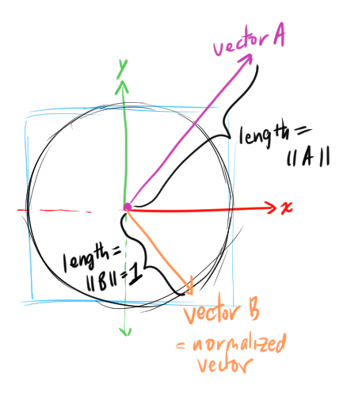
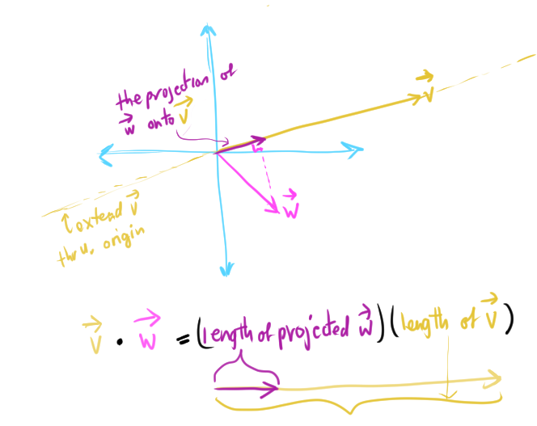
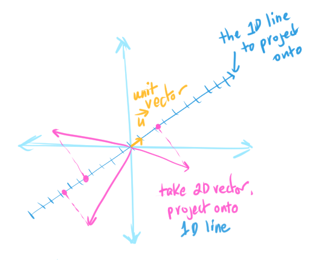
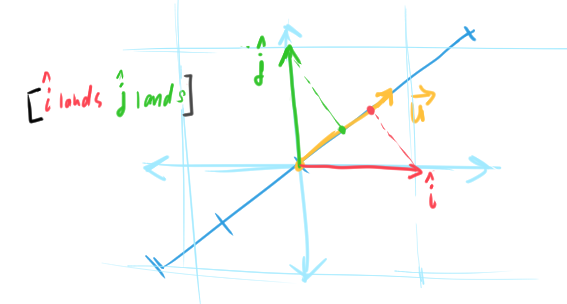
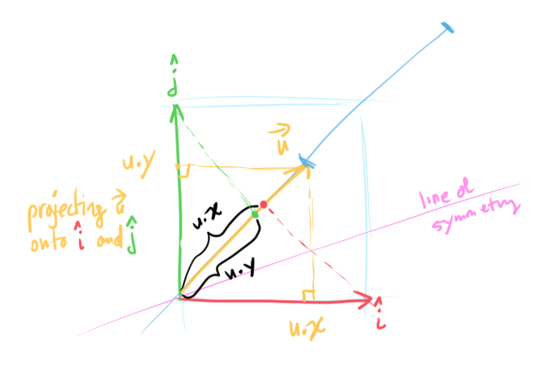
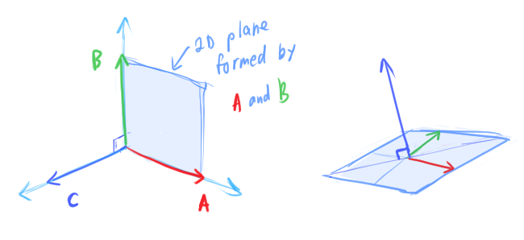
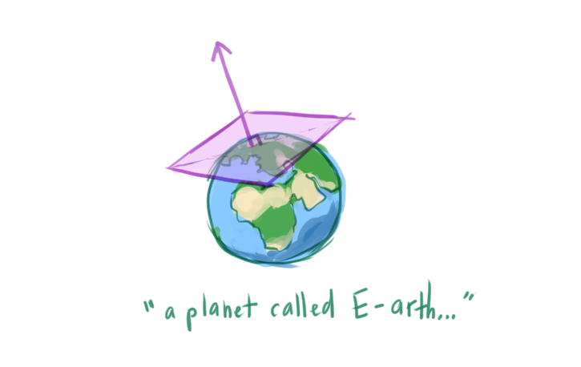

# [Math Operations on Points and Vectors](https://www.scratchapixel.com/lessons/mathematics-physics-for-computer-graphics/geometry/math-operations-on-points-and-vectors)

## Vector Length
A vector `V` indictates:
```
A ----------> B
```
* direction from point A to B
* distance/length between point A and B = `|| V ||`
    ```
    || V || = sqrt(V.x^2 + V.y^2 + V.z^2)
    ```
* In mathematics, double bar `||` indicates the **vector length**
  * Length is also called the **norm** or **magnitude**

* The axes of the 3D cartesian coordinate system are *unit vectors*

## Normalizing a Vector

* A **normalized vector**/**unit vector** is a vector whose length is 1 = ˆV
    * TIL: on a Mac: `Option + I + letter` = circumflex mark Û
* Normalize a vector by dividing the vector by its length:    
    ```
    ˆV = V / || V ||
    ```



* On a computer, multiplying is less costly than division
  * Better to compute `1/||V||` once and multiply with that value than dividing by `||V||` for each value

* **norm** can also mean the function that assigns a length/size/distance to a vector
* `ˆV = V / || V ||` is called the **Euclidean norm**

## Dot Product
* The **dot product** (a real number) is used to get information about the relationship between two vectors
  * The dot product alone can tell us many things:
    * If the dot product is 0, then `A` and `B` form a right angle (are perpendicular to each other)
    * If the dot product is -1, then `A` and `B` are pointing in the opposite direction
    * If the dot product is 1, then `A` and `B` are pointing in the same direction
  * The dot product can also be used with other operations to derive new pieces of information:
    * The magnitiude of the projectioin of `A` in the direction of `B` (scalar projection)
    * If neither `A` nor `B` is a unit vector
    * Get the angle between `A` and `B` if both vectors are normalized using `arccos()`
    * Find angle between vectors and the axes of the coordinate system
  * The dot product relates the two vectors to the *cosine* of the angle between the two vectors

### How to compute the dot product
The **dot product**/**scalar product** requires two vectors `A` and `B`
* The two vectors are projections of each other
* The result of the dot product is a real number



Dot product notation, either:
* `A⋅B`
* `<A, B>`

We multiply each element in vector `A` with its counterpart in `B`, then sum up the results.

For 3D vectors:
```
<A,B> = A.x*B.x + A.y*B.y + A.z*B.z
```
* Similar to computing vector length `||V||`
  * `sqrt(<A,B>)` is the length of the vector if `A` and `B` are equal
  * `||V|| = sqrt(V^2)`
    * Use this to normalize a vector

[3B1B video on dot products](https://www.youtube.com/watch?v=LyGKycYT2v0) ❤️
* Why is the dot product related to projection?
  * We can describe the linear transformation of going from 2D to 1D (for example) with a 1x2 matrix
    * Each element in this 1x2 matrix `[î ˆj]` tells you where the unit vector on the x-axis (î "i-hat") and the unit vector on the y-axis (ˆj "j-hat") lands on the 1D number line after the transformation
      * [video bookmark](https://www.youtube.com/watch?v=LyGKycYT2v0&t=319s)
    * matrix-vector product <=> dot product (recall that matrix multiplication is different...)
    * The transformation of any 2D vector ([video bookmark](https://www.youtube.com/watch?v=LyGKycYT2v0&t=341s)):
    ```
    num1
    num2
    ```
    to 1D can be described as: `num1*(where î lands on the 1D number line) + num2*(where ˆj lands on the 1D number line)`
    * *Projection* is the operation that allows us to take a 2D vector and map it onto a 1D line

        

      * There is a 1x2 matrix (which describes where i-hat and j-hat land on the 1D line) that defines how to do this transformation

        

    * This is just the coordinates of the unit vector û "u-hat", which is a unit vector on a 1D number line situated in a 2D plane. That number line is where all the vectors will land when we apply the 2D->1D transformation to that 1D number line ([video bookmark](https://www.youtube.com/watch?v=LyGKycYT2v0&t=449s))
      * Since "u-hat", "i-hat", and "j-hat" are unit vectors (length of 1), we can use symmetry to derive the transformation matrix another way:
        * Projection takes 2D vector and spits out 1 number
        * Symmetry here implies, projecting î onto û will produce the same value as projecting û onto î.
          * Projecting ˆj onto û will produce the same value as projecting û onto ˆj
        * Where i-hat lands (when it is projected onto vector û) is the same length as `u.x`
        * Where j-hat lands is the same length as `u.y`
        * `[where i-hat lands, where j-hat lands] = [u.x, u.y]`

        

    * There is a vector that describes that specific dot product operation
      * We think of vectors as "an arrow in space"
      * We can also think of a vector as "the physical embodiment of a linear transformation", "a conceptual shorthand for a certain transformation"
    * Honestly just rewatch the video instead of reading what I wrote here 笑

## Cross Product
* The dot product takes two vectors `A` and `B` and returns a single number
* The *cross product* takes two vectors and returns a vector `C`
  * Notation: `C = A X B`
  * The returned vector is actually perpendicular to plane defined by the two vectors
  * `A` and `B` don't have to be orthogonal to each other
  * If `A` and `B` are orthogonal to each other and have unit length, vectors `A`, `B`, and `C` form the *Cartesian coordinate system*

    

  * We can use the cross product to form other coordinate systems

## How to compute the cross product
* Review: [determinant (3B1B)](https://www.youtube.com/watch?v=Ip3X9LOh2dk&list=PLZHQObOWTQDPD3MizzM2xVFitgF8hE_ab&index=6) describes how much the area is scaled after a linear transformation and orientation ("flipping space over", "invert the orientation of space")
  * In 3D, describes how volume scales

[Way better explanation by 3B1B](https://www.youtube.com/watch?v=eu6i7WJeinw&list=PLZHQObOWTQDPD3MizzM2xVFitgF8hE_ab&index=10)
* `C = A X B`
* The length of `C` is the area of the plane formed by `A` and `B` (the *determinant*!)
* Use the *right-hand rule* to determine the direction of the cross product (since it can point above the plane or below the plane.
  * Align `A` and `B` with index finger and middle finger
  * The thumb indicates the direction of `C`
* `A X B != B X A` order matters
  * `A X B = (1,0,0) X (0,1,0) = (0,0,1)`
  * `B X A = (0,1,0) X (1,0,0) = (0,0,-1)`
  * The cross product is **anticommunitive**: swapping the position of any two arguments *negates* the result
    * If `A X B = C`, then `B X A = -C`
* The direction of the cross-product in a *representation* depends on the *handedness* of the coordinate system

```
Cx = Ay*Bz - Bz*By
Cy = Az*Bx - Ax*Bz
Cz = Ax*By - Ay*Bx
```

Review on normals from previous chapter:
* A **normal** describes the orientation of a surface of a geometric object at a point perpendicular to that surface
* A **surface normal** is a vector that describes the normal

    

More terms that will hopefully be explained later...
* The result of the cross-product is a **pseudovector**
* The order of the vectors when computing the cross product is important when computing the **surface normals** from the **tangent** and **bitangent**
  * The resulting normal can either be **inward-pointing normal** (pointing into the surface) or **outward-pointing-normal** (pointing outside the surface)

## Vector/Point Addition and Subtraction
* Some 3D APIs distinguish points, normals, and vectors (defining them as distinct C++ classes) since there are subtle differences when performing computations depending on what it is
* OpenEXR defines a standard image storage format in the motion picture industry.
  * Has one class for all three: points, normals, vectors

## Questions
* Why is division more expensive than multiplication?

