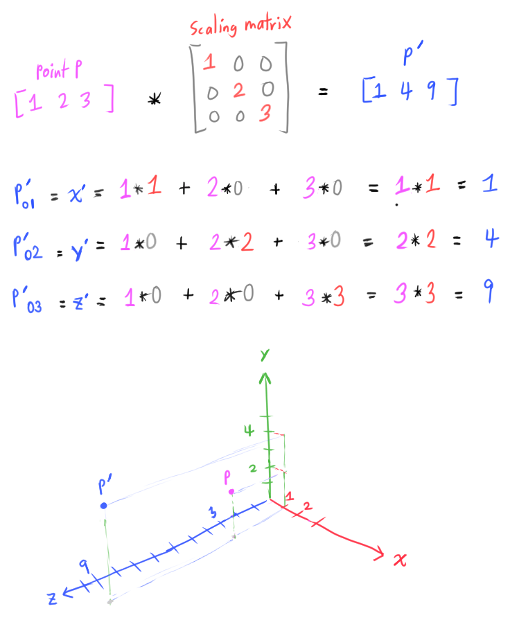
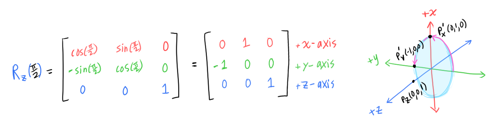
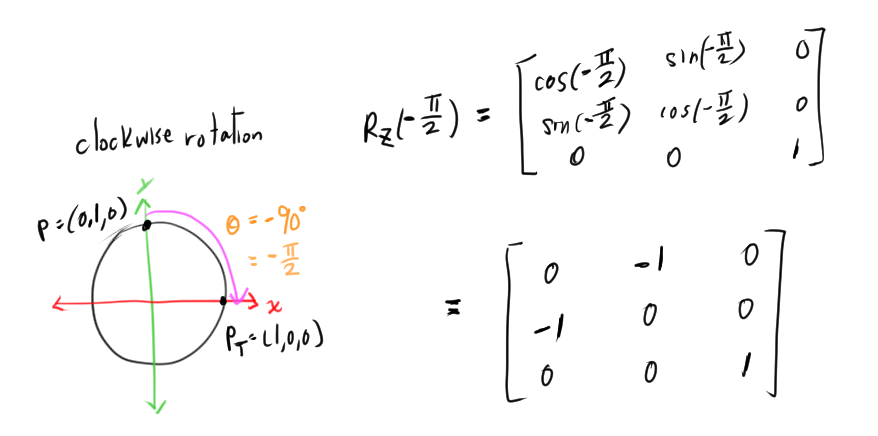
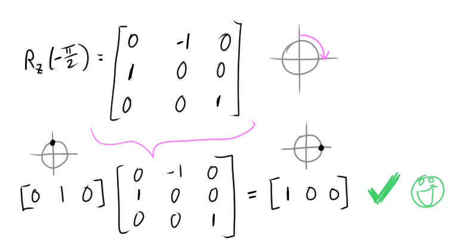
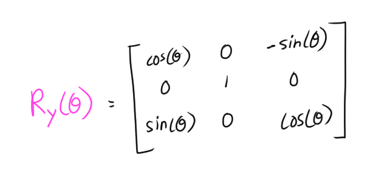
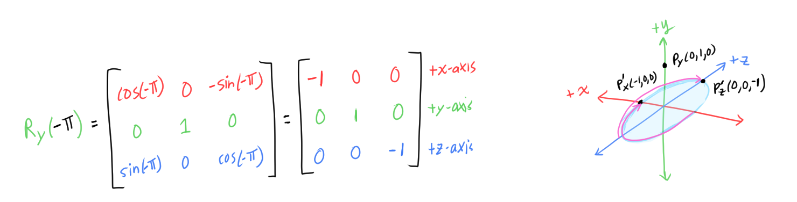

# [Matrices](https://www.scratchapixel.com/lessons/mathematics-physics-for-computer-graphics/geometry/matrices)

Matrices are essential for moving objects, light, and cameras, for creating the images you want!

## Introduction to Matrices: they make transformation easy!
A matrix is a way to combine all these transformations (scale, rotation, translation) on the points/vectors of an image.
* Multiplying a point/vector by a matrix applies the transformation, and returns the transformed point/vector
* Can combine transformations: scale, rotation, translation
  * Ex. we can create a matrix that:
    * Rotates a point 90 degrees along the x-axis
    * Scale a point by 2 long the z-axis
    * Translate the point (-2,3,1
  * Without matrices, we would have to write more code:
    ```
    # Define a bunch of constants
    point = (1,1,1)
    translate_val = (-1,2,4)
    scale_val = (1,1,2)
    axis = (1,0,0)
    angle = 90
    
    # Apply each transformation
    new_point = translate(point, translate_val)
    new_point = scale(new_point, scale_val)
    transformed_point = rotate(new_point, axis, angle)
    ```
  * *With matrices*, we only need to construct the matrix that performs these transformations:
    ```
    matrix = M(...)
    point = (1,1,1)
    transformed_point = point * matrix  # einfach!
    ```
    すごい🤯


## Matrices, what are they?
A **matrix** is a 2D array of numbers.
* An `m x n` matrix has `m` rows and `n` columns
* Rows are the horizontal lines of numbers, columns are the vertical ones

    

    

In CG, the entries in a matrix are called **matrix coefficients** (is also called "entry" or "element" in other fields).
* Indicate a matrix coefficient in the `i`th row and `j`th column.
* The matrix itself is usually written as a capital letter (ex. `M`)
* `M_ij` = the coefficient in matrix `M` in the `i`th row and `j`th column

CG mostly uses **square** matricies: the number of rows `m` and number of columns `n` are the same.
* Interested in `3x3` and `4x4` matrices

## Matrix Multiplication
### Where is it used

Multiplying matrices together is a core part in applying transformations to points and vectors.

The result of a matrix multiplication (also called **matrix product**) is another matrix.
```
M_3 = M_1 * M_2
```

A matrix defines the linear transformations that can be applied to points/vectors (scale, rotation, translation).

*Matrix multiplication* is a way to combine, in one matrix, the effect of other matrices.
* If `M_1` applies translation, and `M_2` applies scale:
  * We can combine `M_1` and `M_2` to create a new matrix `M3`: `M_1 * M2 = M3`
  * `M3` is a *single* matrix that applies translation *and* scale (in that order).
* There is a unique matrix for each particular transformation


Two matrices `M1` and `M1` can only be multipled if the number of colums in `M1` is equal to the number of rows in `M2`
* `M1 = M(3 x 4)`
* `M2 = M(4 x 3)`
* `M1 * M2` is allowed.
  * (3x**4**)(**4**x3) match!
* `M(mxp) * M(pxn) = M(mxn)`
* CG mostly use *square* matrices so we ususally won't have to care about this 👏

### How to multiply matrices
* (Arrays start at zero) (hooray)


* Matrix multiply is *not* commutative!
  * `M1 * M2` does not equal `M2 * M1`
  * We need to pay attention to the order that the matrices are mutliplied
    * Common bug

# [How Does Matrix Work: Part 1](https://www.scratchapixel.com/lessons/mathematics-physics-for-computer-graphics/geometry/how-does-matrix-work-part-1)

## Point-Matrix Multiplication
* We can think of a 3D point/vector as a `1x3` matrix, a matrix with `1` row and `3` columns
  * Point `P = [x, y, z]`
* We can multiply this 3D point/vector `P = [x, y, z]` with a matrix `M(3xn)`


* We want to transform a point, so a point multiplied by a matrix (applying the transformation) should also return a point
  * Given a 3D point `[x y z]` = `1x3` matrix, we can only multiply that point by a `3x3` matrix in order to get a new 3D point after the transformation 

## The Identity Matrix
The **identitiy matrix** (or **unit matrix**) is a *square* matrix whose coefficients/entries are all 0 except the coefficients along the diagonal, which have the value 1


* The result of point `P` multiplied by the Identity matrix `I` will give us point `P`:
  * `P * I = P`


## The Scaling Matrix
* When we multiplied point `P = [x, y, z]` by the Identity matrix `I`:
  * `x` was multiplied by `I_00` (the 0th row and 0th column of `I`)
  * `y` was multiplied by `I_11`
  * `z` was multiplied by `I_22`
* Another way to think about it: the Identity matrix scales each dimension (`x`, `y`, and `z`) by a scale of `1`
* We can create a **scaling matrix** by starting with the identity matrix and changing the values of the diagonal for each respective dimension `x`, `y`, and `z`:


* Example, to scale point `P(1,2,3)` by a scaling factor `S_x=1`, `S_y=2`, `S_z=3`



## The Rotation Matrix
The **rotation matrix** will rotate a point/vector around one axis in the Cartesian coordinate system, using trigonometry!
* We can technically use *translation* to achieve the same effect, but using rotation is easier


* Rotating point `P` **counterclockwise** by `90` degrees
* We want a matrix `R` such that `P_T = P * R`

The z-coordinate (depth) doesn't change when we rotate around the z-axis (`P.z == P_T.z`)


The x-coordinate goes from `1` to `0`, and 


the y-coordinate goes from `0` to `1`


## Using Trigonometry
We can compute the x- and y- coordinates of `P_T` (the point after rotating by angle `theta`):
* `x = cos(theta)`
* `y = sin(theta)`

`theta = pi/2` is equivalent to a rotation of `90` degrees counterclockwise
* `x = cos(pi/2) = 0`
* `y = sin(pi/2) = 1`


We can derive the general rotation matrix around the z-axis by any angle `theta`:


We can derive the matrix that rotates a point `90` degrees around the z-axis from the general rotation matrix:


### Making clockwise rotations work
Check if clockwise rotations work correctly.

First derive the matrix:


If this matrix is correct, it should take `P(0,1,0)` to `P_T(1,0,0)`:


It doesn't apply the clockwise 90 rotation correctly... The x-coordinate ends up being flipped (negative).
We know the first column of the matrix computes the x-coordinate of the transformed point `P_T`.  We need to make `sin(theta)` negative in the first column:


Let's check to make sure clockwise rotation works:


It works!! 🕺

Let's make sure the new matrix works for the original 90-degree *counterclockwise* rotation:


It works!! 💃

### Derive rotating around the x-axis


Let's try to figure out matrix `R_x`,  a matrix that performs a 90 degree rotation around the x-axis.

(I guessed and checked a lot... It seems to help when we first focus on the coordinate that *transforms to* a non-zero value).

The y-coordinate transforms from 0 to 1 after the rotation:


So `R_x` row 2, colum 1 is `-sin(theta)`.

The z-coordinate transforms from 0 to -1 after a **clockwise** rotation:


So `R_x`, row 1, colum 2 is `sin(theta)`.

`R_x` matrix so far:


#### Use trigonometry!


Let's to do a `pi/6` rotation from `pi/6 = 30 degrees` to `pi/3 = 60 degrees`. Then we can use the properties of 30-60-90 triangles.


Use the values of `cos(pi/6)` and `sin(pi/6)` to calculate the y- and z- coordinates of point `P` and `P_T`:


Now we know that rotating the point `P(0, 1/2, -1 * sqrt(3)/2)` with angle of `pi/6` in the counterclockwise direciton will result in point `P_T(0, sqrt(3)/2, -1/2)`. Note that the z-coordinate is negative.

We can now compute the missing coordinates in the `R_x` matrix in the same way that we did with the previous entries:


The final matrix that rotates a point around the x-axis with angle `theta`:


### Derive rotating around y-axis
We can apply the same logic for deriving the matrix that rotates around the y-axis.


Use `pi/2` and `-pi/2` rotations to obtain coordinates:


Matrix derived so far:


Use `pi/6` rotation from `P(sqrt(3)/2, 0, -1/2)` to `P_T(1/2, 0, -sqrt(3)/2)` to obtain the remaining matrix entries:


Final matrix for rotating around the y-axis:



### Handedness and summary
We can use the handedness to remember the direction of a positive rotation. If we align our thumb to the axis of rotation, the other fingers' direction will indicate the positive direction.

Summary of the rotation matrices and using the right-hand to see the direction of the position rotation:


### Combining rotations

We can create complex rotations by multiplying rotation matrices together.
For example, to construct a matrix that will rotate around the x-axis, `R_x`, then rotate around the y-axis, `R_y`, we can multiply the matrices `R_x` and `R_y` to get `R_xy`, which will perform both rotations:
```
R_xy = R_x * R_y
```

Order matters! It is not guarenteed to get the same resulting transformation if we switched the order of the matrices when multiplying them together.

### Rotate around an arbitrary axis
It is also possible to rotate around an arbitrary axis (will find out how, eventually?).

# [How Does Matrix Work: Part 2](https://www.scratchapixel.com/lessons/mathematics-physics-for-computer-graphics/geometry/how-does-matrix-work-part-2)

## Relationship Between Matrices and Coordinate Systems
Each row in a rotation matrix defines the *vector* that describes axis itself, with its direction in the positive direction). The vector in the first row corresponds to the x-axis, the second row corresponds to the y-axis, and the third row corresponds to the z-axis.

If we plug in `theta=0` into the matrix that rotates around the z-axis, `R_z`, we can see that each row describe a point in the coordinate system which indicates the positive direction of the axis:


When we apply a rotation to `R_z`, the axes (which are vectors) also rotate around the z-axis, and the matrix entries are redefined as such.

For example, if we rotated 90 degrees (`pi/2`) counterclockwise, the axes also rotate 90 degrees:


Some observations:
* We are rotating around the z-axis, so the direction of the z-axis is unchanged
* The x-axis vector (which points in the positive direction) rotated from `P_x(1,0,0)` to `P_x'(0,1,0)` after the 90-degree rotation.
* The y-axis vector (which points in the positive direction) rotated from `P_y(0,1,0)` to `P_y'(-1,0,0)` after the 90-degree rotation


This works for any rotation matrix. Let's try doing something similar to the `R_y` matrix (the matrix that rotates points around the y-axis).


The `R_y(0)` looks exactly like `R_z(0)` above 🤯.

Let's apply a `-pi` rotation (`-180` degrees = `180` *clockwise* rotation).



Some observations:
* We are rotating around the y-axis, so the direction of the y-axis is unchanged
* The x-axis vector rotated from `P_x(1,0,0)` to `P_x'(-1,0,0)` after the 180-degree *clockwise* rotation.
* The z-axis vector rotated from `P_z(0,0,1)` to `P_z'(0,0,-1)` after the 180-degree clockwise rotation

Key Ideas
* Each row in the matrix contains a *vector* which defines an axis (or the bases) of a coordinate system
  * This is important when we want to convert to different coordinate systems (change of basis)
    * To do this we replace each row with the axes (vectors) of the target coordinate system
* Matrices are just a way to store the coordinate system
  * The matrix is sometimes called the **orientation matrix**

*passive rotation*?

## Orthogonal Matrices
The matrices that we described so far (scale, rotation) are **orthogonal matrices**, which have the following properties:
* Is a square matrix
* Has *real* entries (as opposed to *imaginary* ?)
* Its columns and rows are **orthogonal unit vectors**
  * **Orthogonal** means perpendicular (90 degrees)
  * **Unit** means the vector has length 1 

### How do we know that these matrices are orthogonal matrices?

Recall, each row in the matrix represents an axis in the Cartesian coordinate system.
* *Unit vector*: we know the length of each row (each row defines a vector) is of length 1 because we use trigonometric functions `sin()` and `cosine()` to compute them, and these vectors are all on the *unit circle* (which has a radius of 1)
* *Orthogonal*: (welp, they don't explain this) but something to do with *linearly independent* I think... (so each row/axis/vector in the matrix cannot be described using the other rows/axes/vectors)

The rows of the *Identity matrix* defines the axes in the *World coordinate system*. 


The rotation matrix is a Cartesian coordinate system, which is initially aligned in the *World coordinate system*, and is rotated around one particular axis.

### An important property
The **transpose** of an orthogonal matrix is equal to its **inverse**.

If `Q` is an orthogonal matrix, then:
```
Q^T = Q^-1
```
```
Q * Q^T = I
```

where `Q^T` is `Q` transpose, `Q^-1` is the inverse of matrix `Q`, and `I` is the Identity matrix.

The significance of this is (hopefully) explained later...

## Affine Transformation
The term *affine transformations* may be used in place of matrix transformations.

**Affine transformations** is a transformation that preserves straight lines. The rotation/scaling matrices that we have seen so far are affine transformations.

Some affine transformations:
* Translation
* Rotation
* Shearing ("the shear" was in 3B1B!)

The above and their *combinations* are affine transformations.

The other type of transformation in CG is **projective transformation**.
* The **perspective transformation** is a type of *projective transformation*
* *Projective transformations* do not necessarily preserve parallel straight lines

## Summmary
* Each row in a matrix represent an axis in the Cartesian coordinate system
* "Orientation (rotation), size (scale), and position (translation) of the coordinate system represents the transformation that will be applied to the points when they are multiplied by the matrix"

Each row in the rotation matrix represents the axes in the new coordinate system `B`. The coordinates in point `P` "changes" because `P` is still defined in terms of the World coordinate system `A` (or any starting world coordinate system). But in the rotation matrix's coordinate system `B`, the point `P` is "still in the same place" relative to `B`'s axes.
* This is because point `P` is expressed in terms of coordinate system `A`
* Multiplying `P` (expressed in terms of `A`) with a matrix (whose axes represent coordinate system `B`) gives us a new point expressed in terms of coordinate system `A`


Order matters when multiplying these matrices together!

The matrices that define the axes in the coordinate system are also called **orientation matrices**.
