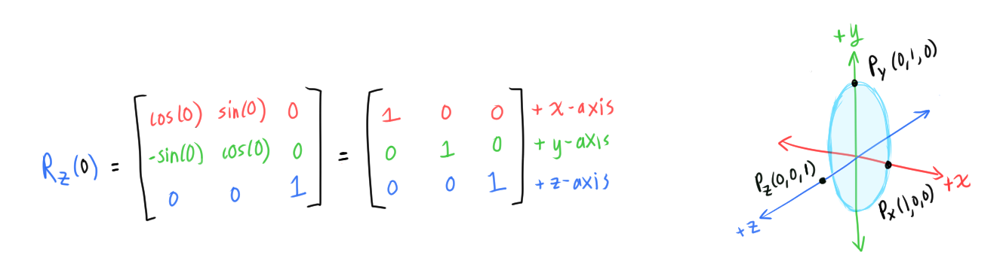
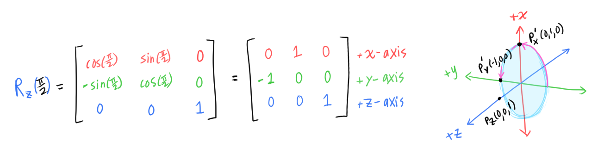
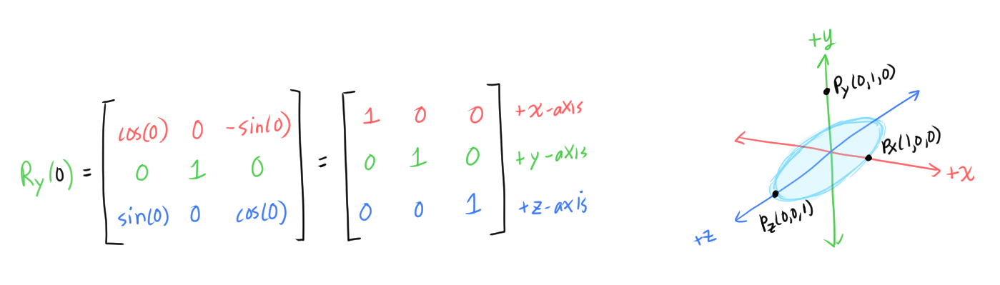
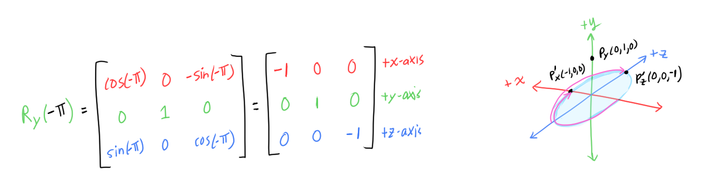

# [Matrices Part 2](https://www.scratchapixel.com/lessons/mathematics-physics-for-computer-graphics/geometry/how-does-matrix-work-part-2)

## Relationship Between Matrices and Coordinate Systems
Each row in a rotation matrix defines the *vector* that describes axis itself, with its direction in the positive direction). The vector in the first row corresponds to the x-axis, the second row corresponds to the y-axis, and the third row corresponds to the z-axis.

If we plug in `theta=0` into the matrix that rotates around the z-axis, `R_z`, we can see that each row describe a point in the coordinate system which indicates the positive direction of the axis:

When we apply a rotation to `R_z`, the axes (which are vectors) also rotate around the z-axis, and the matrix entries are redefined as such.

For example, if we rotated 90 degrees (`pi/2`) counterclockwise, the axes also rotate 90 degrees:

Some observations:
* We are rotating around the z-axis, so the direction of the z-axis is unchanged
* The x-axis vector (which points in the positive direction) rotated from `P_x(1,0,0)` to `P_x'(0,1,0)` after the 90-degree rotation.
* The y-axis vector (which points in the positive direction) rotated from `P_y(0,1,0)` to `P_y'(-1,0,0)` after the 90-degree rotation

This works for any rotation matrix. Let's try doing something similar to the `R_y` matrix (the matrix that rotates points around the y-axis).

The `R_y(0)` looks exactly like `R_z(0)` above 🤯.

Let's apply a `-pi` rotation (`-180` degrees = `180` *clockwise* rotation).

Some observations:
* We are rotating around the y-axis, so the direction of the y-axis is unchanged
* The x-axis vector rotated from `P_x(1,0,0)` to `P_x'(-1,0,0)` after the 180-degree *clockwise* rotation.
* The z-axis vector rotated from `P_z(0,0,1)` to `P_z'(0,0,-1)` after the 180-degree clockwise rotation

Key Ideas
* Each row in the matrix contains a *vector* which defines an axis (or the bases) of a coordinate system
  * This is important when we want to convert to different coordinate systems (change of basis)
    * To do this we replace each row with the axes (vectors) of the target coordinate system
* Matrices are just a way to store the coordinate system
  * The matrix is sometimes called the **orientation matrix**

### Unimportant Rant
It took me three days to understand what the f they were talking about this part. Why no use pictures?!

They (scratchapixel) actually don't say anything about the row describing the positive direction of the axis, that was just an observation I had. Maybe it's an incorrect fact, who knows...

I guess the benefit of poor explanations is that they force me to actually *try* to understand the concept, draw things out and play around with the theory myself by plugging and chugging in numbers... and figure it out myself.

I think the concept described above is called *passive rotation*? They could have mentioned that at least...

A doodle between frustrations:

