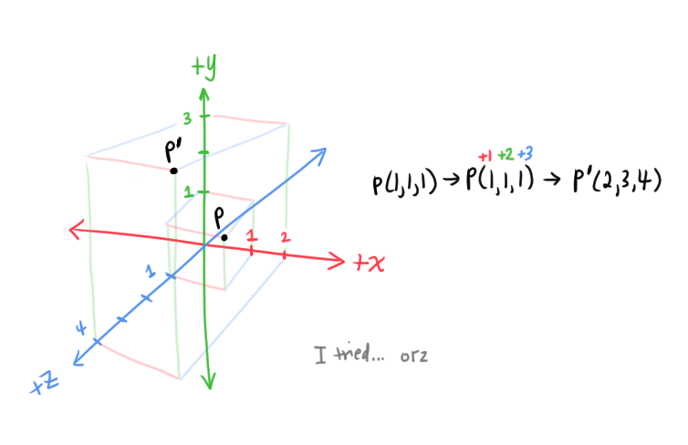
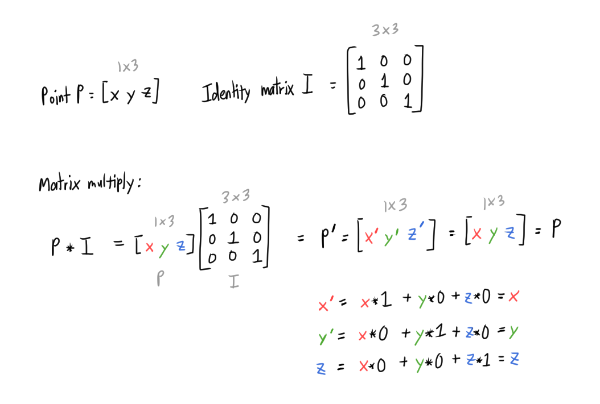

# [Transforming Points and Vectors](https://www.scratchapixel.com/lessons/mathematics-physics-for-computer-graphics/geometry/transforming-points-and-vectors)

## Transforming Points
*Transforming* points, meaning, *translation* (another linear operator).

Recall that *translation* is moving a point in the coordinate system. For example, *translating* point `P(1,1,1)` to `P'(2,3,4)` involves adding values `1`, `2`, and `3` to point `P`'s x-, y-, and z- coordinates, respectively.

Translation with matrix multiplication does not work with the 3x3 matrices we've been using thus far, like with rotation and scale matrices.

Recall: to matrix multiply two matrices, their sizes must be compatible:

* Matrix `M` is an `m x p` matrix
  * Matrix `M` has `m` rows and `p` columns
* Matrix `N` is a `p x n` matrix
  * Matrix `N` has `p` rows and `n` columns 
* `M * N = (m x p)(p x n)` ✅

Recall the `3x3` Identity matrix `I`. When a point `P` is multiplied with this matrix `I`, the point remains unchanged:

Looking at this, let's see how to get the translation operator to work with matrix multiplication.

### Getting Translation to work with matrix multiplication

3D point/vector can be viewed as a 1x3 matrix.
