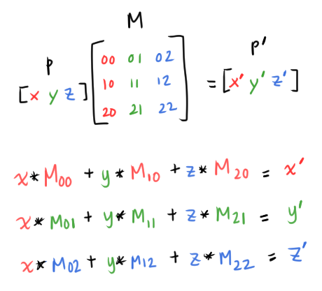
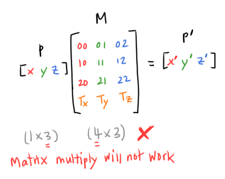
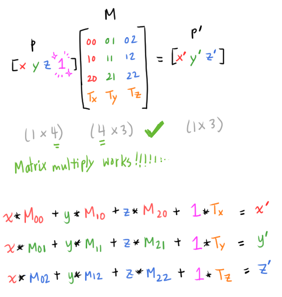

# [Transforming Points and Vectors](https://www.scratchapixel.com/lessons/mathematics-physics-for-computer-graphics/geometry/transforming-points-and-vectors)

## Transforming Points
*Transforming* points, meaning, *translation* (another linear operator).

Recall that *translation* is moving a point in the coordinate system. For example, *translating* point `P(1,1,1)` to `P'(2,3,4)` involves adding values `1`, `2`, and `3` to point `P`'s x-, y-, and z- coordinates, respectively.


Translation with matrix multiplication does not work with the 3x3 matrices we've been using thus far, like with rotation and scale matrices.

Recall: to matrix multiply two matrices, their sizes must be compatible:

* Matrix `M` is an `m x p` matrix
  * Matrix `M` has `m` rows and `p` columns
* Matrix `N` is a `p x n` matrix
  * Matrix `N` has `p` rows and `n` columns 
* `M * N = (m x p)(p x n)` ✅

Recall the `3x3` Identity matrix `I`. When a point `P` is multiplied with this matrix `I`, the point remains unchanged:


Looking at this, let's see how to get the translation operator to work with matrix multiplication.

### Deriving the translation matrix

Let's try to create the translation matrix `M`. Recall the notation, `M_12` means the coordinate in row `1` and column `2`


*Translation* adds a value (can be positive or negative) to each coordinate (x, y, and z) of a point `P`.

3D point/vector can be viewed as a 1x3 matrix. What we want: if we matrix multiply matrix `M` with a point `P`, we get `P'`:


We want the values of the translated point `P'`  to be:

```
P'.x = P.x + T_x
P'.y = P.y + T_y
P'.z = P.z + T_z
```

The current matrix multiplication would compute:



But what we want to achieve:


We need to encode `T_x`, `T_y` and `T_z` into our matrix...



This creates a `4x3` matrix, but we cannot matrix multiply this matrix with a `1x3` point.

We can simply add a column with the value `1` to the point `P` to create a `1x4` point:



Now the matrix multiply achieves our translation goal 💃

Our point `P` now looks like `P(x, y, z, 1)`. This point is called a **homogenous point** (or a point with **homogenous coordinates**).

Since the fourth value of `P` is always `1`, this is usually never explicitly stated in CG code. We only define `x`, `y`, and `z` values and assume the fourth value is `1`.

```
x' = x*M_00 + y*M_10 + z*M_20 + M_30 // M_30 = T_x
y' = x*M_01 + y*M_11 + z*M_21 + M_31 // M_31 = T_y
z' = x*M_02 + y*M_12 + z*M_22 + M_32 // M_32 = T_z
```

We created a `4x3` matrix, but how do we get a 4x4 *matrix* that is commonly used in CG?
* The fourth column is sometimes used for other transformations, like perspective projection and shear
* But it is usually set to `(0, 0, 0, 1)`
  * We need to know more about homogenous points to understand why, or what happens if the values of the fourth column change

## The Trick about Homogenous Points
A *homogenous point* is a point `P(0,0,0,w)`  where `w` is always `1`: `P(0,0,0,1)`.

(rant to textbook, don't say "w is always 1" without having said what w was 😑...)

`w` is usually not explicitly defined in CG libraries (in other words, only x, y, and z coordinates are explicitly defined).

If the fourth column of a matrix is always `(0,0,0,1)`, then the fourth coordinate of the transformed point `P'` is always `1`.


### When the matrix's 4th column is not (0,0,0,1)
The fourth column of the transformation matrix is not always `(0,0,0,1)`, for example, with *projection matrices* (matrices that project to the screen).

The result `P'.w` (`w` is the fourth coordinate of the transformed point `P'`) may not always be `1` (which is intentional).

In this case, to plot the transformed point `P'` on a Cartesian coordinate system, we need to *normalize* `P'.w` so that `w'` is `1`.

When we normalize `w'`, we must also divide the other coordnates by `w'`.

#### This is usually not the common case
We can check the value of `w'` to know when to normalize (if the value is not `1`, we have to normalize), but this check can be a waste of time since this isn't required *most* of the time.

CG libraries usually have a separate implementation for the special case where `w'` needs to be normalized.

## Transforming Vectors
*Translating* vectors.

Recall: *vectors* represent direction, whereas *points* represent a position in space.
* Therefore, **vectors do not need to be translated**, because their *position* is meaningless
* For vectors, we only care about their *direction* and their *length*

When translating vectors, we can simply ignore the translation part:

```
V.x' = V.x*M_00 + V.y*M_10 + V.z*M_20
V.y' = V.x*M_01 + V.y*M_11 + V.z*M_21
V.z' = V.x*M_02 + V.y*M_12 + V.z*M_22
```

## Transforming Normals
Transforming *normals* is not the same as tranforming vectors... More on this, eventually.

## Other ways to encode transformations
Matrices are not the only way to encode transformations.
* You can also represent a rotation with a vector and an angle (a method proposed by Euler)
* Another technique is proposed by [Benjamin Olinde Rodrigues](https://en.wikipedia.org/wiki/Olinde_Rodrigues), using an axis, angle, and point (provides a fancy formula)
* Can also use **quaternions** since matrices have their limitations
  * Rotating > 360 degrees
  * Gimbal lock problem
  * Rendering motion blur of objects

(unimportant side note) I happened to have watched 3B1B's SIGGRAPH 2021 talk *just yesterday*, where I first encountered the existence of a *quaternion*, coincidentally before reading this blurb in the textbook.

 ⏳ Time capsule moment: as of Jan 30, 2022, I don't really know what *quaternions* are nor understand how *quaternions* work. I only understood (from the talk) that they don't have the same edge-case weirdness that rotation matrices have. But apparently quaternions are fundamental to CG and most CG people know what they are. So.... hopefully a year from now I will understand 😖

*Quaternion* sounds like some final boss in some game...

*"Have you beaten Quaternion yet?"*

*"Nah, I haven't..."*

or some funky Eeveelution.

