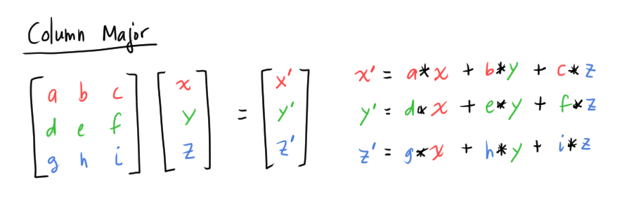

# [Row Major vs. Column Major Vector](https://www.scratchapixel.com/lessons/mathematics-physics-for-computer-graphics/geometry/row-major-vs-column-major-vector)

We could express our point/vector in **row-major** or **column-major**. Both ways are valid and it is just a matter of convention.


* **Row-major** order: express the vector as a row of three numbers (`1x3` vector)
* **Column-major** order: express the vector as a column of three numbers (`3x1` vector)

Note the matrix multiply constraint: `(mxp) * (pxn)`
* For column-major vectors (`3x1` vectors), we must place the vector on the *right* side of the transformation matrix (`3x3` matrix)
  * This is called a **right** or **post-multiplication**

    

* For row-major vectors (`1x3` vectors), we must place the vector on the *left* side of the transformation matrix (`3x3` matrix)
  * This is called a **left** or a **pre-multiplication**

    

## Terminology in CG Libraries
*Left/pre* and *right/post* multiplication describes the point/vector in relation to the transformation matrix
* Left/pre -multiplication: the vector is on the left of the matrix
* Right/post -multiplication: the vector is on the right of the matrix

Unfortunately, some libraries describe the multiplication relative to the vector/point instead (which is incorrect)
* For example, Maya describes this transformation `P * M = P'` as *post-multiplication*, even though it is actually a pre-multiplication (point `P` is on the *left* of matrix `M`).
* Great.

## Matrix Multiply and Major
Row/column major should not matter when we apply multiplications: we should get the same transformed point if we multiplied the vector with the same tranformation matrix.

Howeverm without any modifications, multiplying with a vector in row-major will *not* result in the same values as multiplying with a vector in column-major!




The values in the resulting vector are not the same:


To get the same vector after applying the tranformation, the matrix in the right/post multiply (the process that uses the *column-major* vector) needs to be **transposed**.


Now the resulting vector matches the resulting vector from the row-major multiplication:


## Order of transformations: row vs. column major
Let's say we want to apply a translation (with matrix `T`), a rotation around the z-axis (with matrix `R_z`), then a rotation around the y-axis (with matrix `R_y`) to the point `P`.

In *row-major*, we can read the transformations sequentially (reading order).
```
P' = P * T * R_z * R_y
```

In *column-major*, the order is *reversed*:
```
P' = R_y * R_z * T * P
```

Both conventions are correct and give the same results.
* Row-major feels more intuitive as a learner, since the transformation order is in the same the order that we read the sentence
* Column-major order is used in mathematics/physics since it follows the order of how function evaluation and composition are written

CG libraries may use either convention
* Maya, DirectX, RenderMan (and the Scratchpixel textbook) uses the row-major convention
* OpenGL uses the column-major convention

## Implications in Coding: Does it impact performance?

