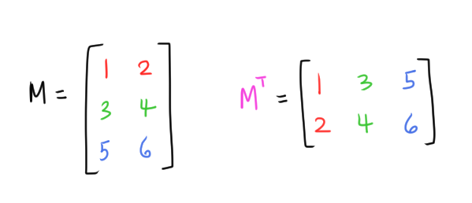

# [Matrix Operations](https://www.scratchapixel.com/lessons/mathematics-physics-for-computer-graphics/geometry/matrix-operations)

## Transpose
**Transposing** a matrix `M` gives us a matrix `M^T` where the rows of `M` become the columns of `M^T` (which is the same as saying the columns of `M` become the rows of `M^T`)



*Transpose* is used when we want to convert matrices from a 3D application using row-major matrices to column-major matrices (and vice-versa)

## Inverse
If we had a point `A` and matrix `M` and multiplying matrix `M` by point `A` gives us a new point `B`:
```
M * A = B
```

Then the **inverse** of `M`, which is written as `M^-1`, should be able to give us point `A` back:
```
M^-1 * B = A
```

Multiplying a matrix `M` by its inverse `M^-1` gives us the Identity matrix `I`:
```
M * M^-1 = I
```

Recall: **orthogonal matrix** is a square matrix whose rows and columns are orthogonal unit vectors.
* The transformation matrices we learned about (translation, rotation, scaling) are all orthogonal matrices

Recall that the *transpose* of an *orthogonal matrix* `Q` is its *inverse*:
```
Q^T = Q^-1
``` 

which implies that:
```
Q * Q^T = I
```
where `I` is the Identity matrix.

Matrix inversion is used to:
* Convert transformed points back to the original coordinate system
  * Testing for primitive-ray intersection 🤷‍♀️

## Determinant of a Matrix
(I will also write about this later I guess 笑)

