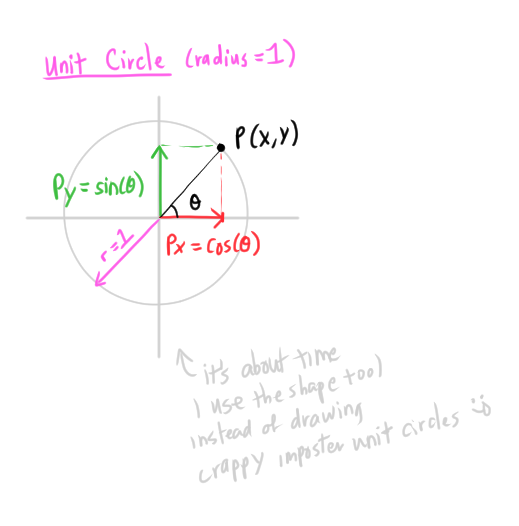
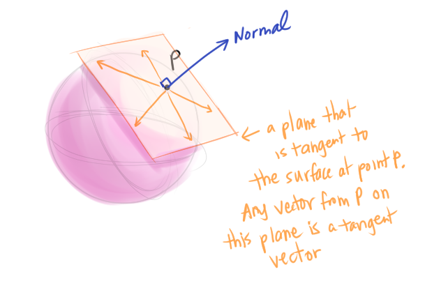
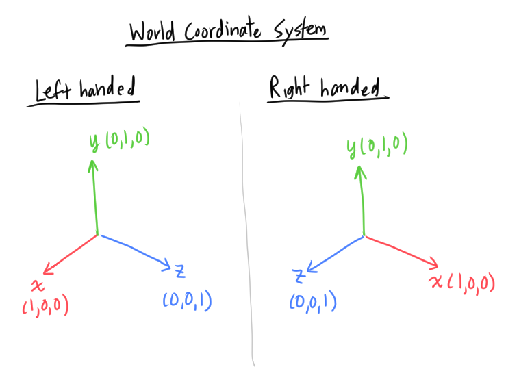
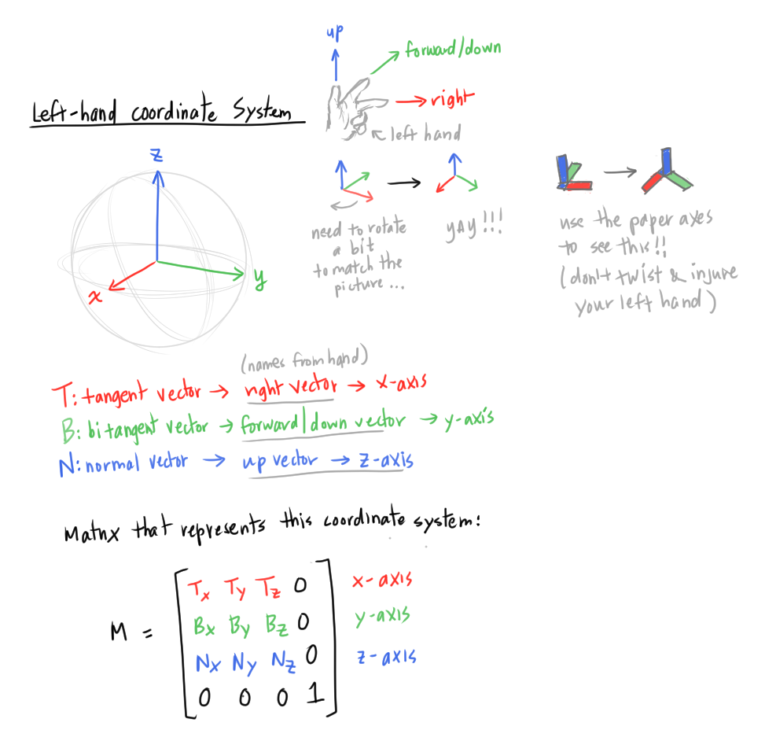
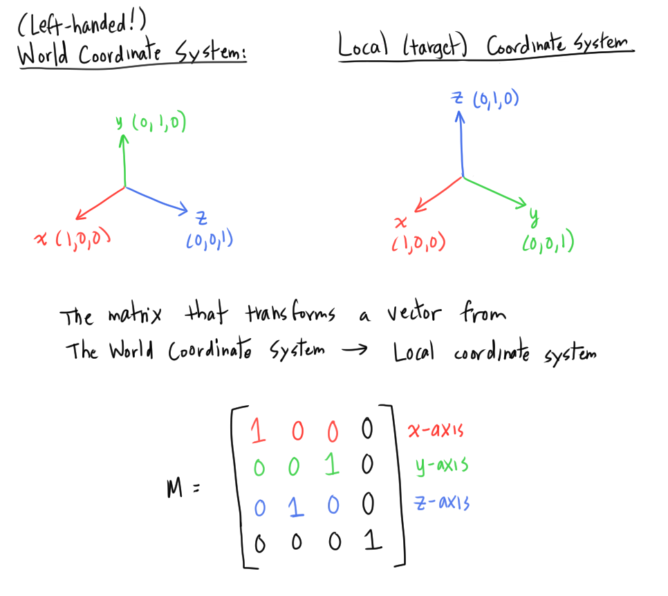
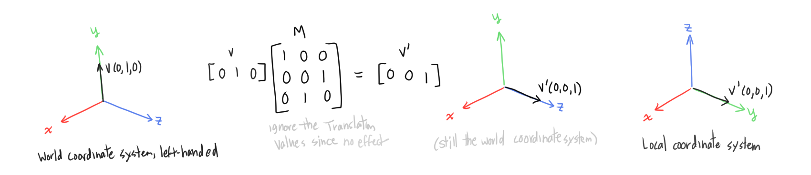

# [Spherical Coordinates and Trigonometric Functions](https://www.scratchapixel.com/lessons/mathematics-physics-for-computer-graphics/geometry/spherical-coordinates-and-trigonometric-functions)

To render images for easily, we need to express vectors in terms of *spherical coordinates*.
* Makes shading easier

## Trigonometric Functions

### The Unit Circle



* **unit circle** has a radius of 1
  * A point `P` on the unit circle with angle `theta` can be expressed as `P(x,y)`, where
    * The x-coordinate `x` = `cos(theta)`
    * The y-coordinate `y` = `sin(theta)`
* The angle `theta` is defined in **radians**
    * In code you have to convert angles to radians from *degrees*:
    ```
    A_radians = pi/180 * A_degrees
    ```
    * A complete lap around the unit circle = 360 degrees = `2*pi` radians

### Sine, Cosine, and Tangent and the right triangle

Sine, cosine, and tangent are defined from a relationship in a *right triangle*.


* `sin(theta) = opposite/hypotenuse = P_y`
* `cos(theta) = adjacent/hypotenuse = P_x`
* `tan(theta) = opposite/adjacent = P_y/P_x`
  * This is also the ratio of the y-coordinate over the x-coordinate

The inverses. If we pass in the result of the original function (`sin`, `cos`, `tan`), the inverse returns the angle `theta`:
* `theta = arccos(P_x)`
* `theta = arcsin(P_y)`
* `theta = arctan(P_y, P_x)`
    * Some arctan implementations have a separate version that takes sign (positive or negative) into account (ex. C++ has `atan()` and `atan2()`)

**The Pythagorean Theorem**:
```
hypotenuse^2 = adjacent^2 + opposite^2
```

## Representing Vectors with Spherical Coordinates
In a cartesian coordinate system, we represented a vector with three values `P(x, y, z)` (a value per axis).
* We can represent the same vector using only two values with spherical coordinates

(got completely lost here)
* Is this a typo? "vertical angle (in red)"
  * The red angle is clearly not vertical...

(sigh)
(just skip this part and go to the next one since the explanation is trashed later anyway)

## Conventions Again: Z is Up!

We were using the *right-hand coordinate system* until now, but spherical coordinates conventionally use the **left-hand coordinate system**.


This is the *physics* convention of labeing the angles... (as opposed to the *mathematics* convention, which flips the labels....)
* z-axis is defined as the **up vector**
  * The angle between the vector and the z-axis is `theta` (also called the **polar** angle)
* x-axis is defined as the **right vector**
  * After projecting the vector to the horizontal plane, the angle between the x-axis and the projection is angle `phi` (also called the **azimuth** angle)
* y-axis is defined as the **forward vector**

(I hate it when they tell you to "see the next chapter" in the middle of a chapter, like, why is the next chapter the prerequisite of this chapter... 😑)
* And with broken links 😡

(Wikipedia and other sources switch `theta` and `phi` UGHHH, there is no convention -cries-)
* [A Redditor asked the same damn question](https://www.reddit.com/r/Physics/comments/14rb66/why_are_theta_and_phi_switched_between/) !!!
    * [A brief paper on this problem](https://bridge.math.oregonstate.edu/papers/spherical.pdf)

# [Creating an Orientation Matrix or a Local Coordinate System](https://www.scratchapixel.com/lessons/mathematics-physics-for-computer-graphics/geometry/creating-an-orientation-matrix-or-local-coordinate-system)

(doesn't *formally* tell you what a normal is. It's been mentioned randomly but yeah, never defined. Thanks.)

A **normal** is a vector that is perpendicular to a give object (ex. a plane) ([from Wikipedia](https://en.wikipedia.org/wiki/Normal_(geometry)))

This chapter is about building a local coordinate system using a *normal*.
* We do this in rendering pipelines, to convert points that are in one coordinate system to another coordinate system

* [Review from coordinate systems chapter](../02-coordinate-systems/README.md#left-handed-vs-right-handed-coordinate-systems) on the meaning of up vector, forward/down vector, the right vector
  * Note foward/down (interchangeable, ugh)

(does not explain what a *tangent* or *bitangent* is 😑)
* [This OpenGL article explains it briefly](http://www.opengl-tutorial.org/intermediate-tutorials/tutorial-13-normal-mapping/)️
  * Is bitangent the same as binormal???? Another stupid lack of consensus?😵

To create a local coordinate system, we take a point `P`:
* The vector that is perpendicular to the point `P` is the **normal vector**. Let the *normal* at the point `P` to become an axis in the coordinate system
  * The normal is often aligned with the "up" vector

  

* The **tangent vector** is any vector on the plane that is tangent to point `P`:
  
  

  There are an infinite number of tangent vectors to choose from, from this tangent plane.

  We choose a vector of unit length on this tangent plane to serve as our tangent vector (choose any unit vector??? I guess)

* The **bi-tangent** vector is the tangent vector that is *orthogonal* to the tangent vector we chose earlier (the tangent and the bi-tangent form a right-angle)

  

* The *tangent* and *bi-tangent* vectors are sometimes referred to as **derivatives**
  * **dPdu** (tangent) and **dPdv** (bi-tangent)
    * Does not explain why these names....

The three vectors (the normal, tangent, and bi-tangent) should all be *orthogonal* and of *unit length* (length of 1).
* The cross product of the tangent vector and the bi-tangent vector should return the normal vector (review [previous section on cross-products](../03-math-operations-points-vectors/README.md#cross-product)).
  * Need to be careful here, because the cross product can return a vector that is pointing *inwards* into the object, not outward (which is what we want)

  

  [cross product review](../03-math-operations-points-vectors/README.md#how-to-compute-the-cross-product)


## Create the Orientation Matrix from the three vectors
Using the *normal*, *tangent*, and *bi-tangent*, we can create the (right-handed) coordinate system:
* Align the normal vector `N` to the *up vector*
* Align the tangent vector `T` to the *right vector*
* Align the bi-tangent vector `B` to the *down/forward* vector 


Recall that the label of "y-axis" and "z-axis" for the up vector may be flipped in different (coding) contexts. For example, shading tasks typically set the up vector to the z-axis:


The orientation matrices shown are in *row-major* format. If using the *column-major* format, each axis is defined in each column of the matrix.
* For example, if the z-axis was the up vector:
  * First column of the matrix = tangent vector `T` = "x-axis"
  * Second column of matrix = bi-tangent vector `B` = "y-axis" 
  * Third column of matrix = normal vector `N` = "z-axis"

## What do we do with this matrix?

If we had a vector `V` that is defined in the *world-coordinate system* (or any other system), multiplying `V` by the orientation matrix `M` that we constructed will give us a new vector `V_M` that is defined in terms of the local coordinate system that our matrix `M` describes (using the normal `N`, tangent `T`, and bi-tangent `B` vectors of that local coordinate system).
* There are no *translation* values in the orientation matrix (which are usually in the fourth column/row)
* This orientation matrix is only used with vectors, and typically used in *shading*, since expressing vectors in relation to some normal on a surface makes the shading computation easier

### Affine Space
* [Embree (a renderer from Intel)](https://www.intel.com/content/www/us/en/developer/articles/technical/embree-photo-realistic-ray-tracing-kernels.html) and other renderers may choose to matrices/transformations as *affine space*
  * An affine space uses a location in space and three axes (Vx, Vy, Vz) to describe its coordinate system

I wish I could have just handed in a programming assigment like this:
```
// insert code here
```

## (back to) Conventions Again: Z is up!

(now this makes sense...-er)

Recall the handedness of a coordinate system:



The coordinate values are the same for each axis, (ex. x-axis is labeled as `(1,0,0)` regardless of handedness).

In previous chapters, we've been using the right-hand coordinate system when we were describing things in the World Coordinate System.

But since the convention in shading uses the *left-hand coordinate system*, when we say we convert from the World Coordinate System (where the up vector is the y-axis) to the Local (target) coordinate system (where the up vector is the z-axis), the World Coordinate System is left-handed!!
* (the notes totally don't tell you this so I was so confused why the values were flipped in their calculations... 😑 UGH it sucks that you don't know if things are typos, because there are typos that show up often, or you're just stupid or what)
* (I also don't know if the above is the correct assumption, but whatever. Can't do anything about it...)
* ("scratchpixel uses the right-handed coordinate system" they said...)

The *local coordinate system* in the following sections will mean the *left-handed* coordinate system where:
* The right vector is the x-axis
* The forward/down vector is the y-axis
* The up vector is the z-axis

which is the convention used in shading.

### Orientation matrix of local coordinate system

To derive the orientation matrix that describes a local coordinate system where the up vector is the z-axis:
* Place the tangent vector `T` in the first row of the matrix (the x-axis)
* Place the bi-tangent vector `B` in the second row (the y-axis)
* Place the normal vector `N` in the third row (the z-axis)



### Matrix that transforms from world space to local coordinate system

*World space* labels the up vector as the y-axis and the local coordinate system labels the up vector as the z-axis. To derive the matrix that converts vectors from world space to the local coordinate system:
* The x-axis is the same in both world space and local, so the first row is still `(1,0,0)`
* The local coordinate system has the y-axis where the world coordinate system has the z-axis, which is at `(0,0,1)`, so this becomes the second row of the matrix, which becomes the y-axis in the local coordinate system.
* The local coordinate system has the z-axis where the world coordinate sytem has the y-axis, whcih is at `(0,1,0)`. so this becomes the third row of the matrix, which becomes the z-axis in the local coordinate system.



Let's apply a conversion of a vector in world space: `v = (0,1,0)`, which is aligned to the y-axis (the up vector) in world space:
```
v' = v * M
```

The matrix multiply (which applies the coordinate system conversion) results in `v' = (0,0,1)`, which is now parallel to the z-axis (the up vector in the local coordinate system).



(Their explanation is confusing because `(0,0,1)` is clearly *not* aligned with the up vector in either coordinate system was zum Teufel)

(The way I see it, which makes sense, is the y-axis in world space is `v=(0,1,0)`, and `v'=(0,0,1)` is the y-axis in the local coordinate system. Makes sense! Why is this not stated anywhere? Is this not the way to see this conversion??? -sigh- -cry-

Basically the conversion switches the y and z coordinates. <--- is what they say

