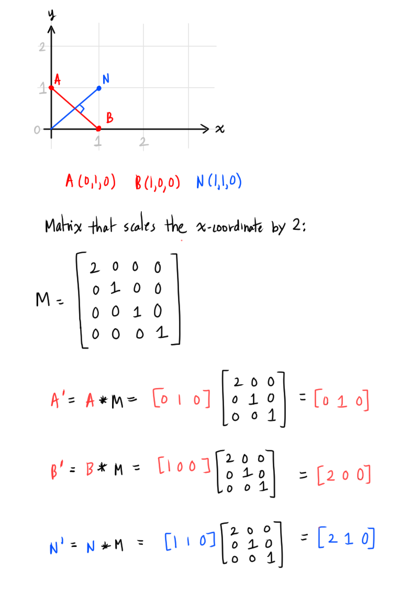

# [Transforming Normals](https://www.scratchapixel.com/lessons/mathematics-physics-for-computer-graphics/geometry/transforming-normals)

## What is a normal?

(*now* they define this....)

A **surface normal** from a surface at `P`, is a vector `N` that is perpendicular to the tangent plane to that surface at `P`.


* The *tangent* vector `T` and *bi-tangent* vector `B` define the *tangent plane*
* Vectors `N`, `T`, and `B` are orthogonal to each other, and form a Cartesian coordinate system 

We can compute the *surface normal* using the tangent and bi-tangent using the cross-product:
```
N = T X B
```

The cross-product is **anti-commutative**: switching the order of the arguments will negate the result.
```
T X B != B X T
T X B = N
B X T = -N
```

Need to be careful that the resulting normal `N` points *outside* the surface (not inwards).

## Transforming Normals

Why distinguish normals from any other vector?
* Transforming normals using matrix multiplication (which is what we do with other vectors/points) does not preserve its "perpendicular-ness" after the transform

For example, applying a non-uniform scale transformation:

([Review on scaling matrices](../04-matrices/README.md#the-scaling-matrix))

Let's say we had point `A(0,1,0)` and point `B(1,0,0)` and drew a line between `A` and `B`. And also we have a vector `N` that is perpendicular to the line `A-B`.

If we apply the matrix where the x-coordinate scales by 2:



The vector `N` is not perpedicular to the line between `A` and `B` anymore:


We have to use a different matrix when transforming normals: we need to use the **transpose of the inverse of the matrix**:
```
N' = N * M^-1T
```
(`^-1` means inverse, `^T` means transpose).

### Why does this work?
Recall
* Normals are vectors, so they represent *direction*
  * Normals are not affected by translation
    * We can ignore the fourth column and fourth row, and only look at the inner, upper-left 3x3 matrix that encodes rotation and scale
* The transpose of an *orthogonal matrix* is equal to its inverse
  * Rotation matrices are orthogonal
    * ([Review on orthogonal matrices](../04-matrices/README.md#orthogonal-matrices))
  * If we take the tranpose *twice* on a matrix, we can the original matrix:
    ```
    (M^T)^T = M
    ```
  * If matrix `Q` is an orthogonal matrix, then:
    
    ```
    Q^T = Q^-1
    Q = Q^((-1)T)
    ```
    The transpose of the inverse of an orthogonal matrix `Q` gives the matrix `Q`
      * We can apply the transformation on normals using this different matrix, which its entries have not changed (rotation is still retained)

### What happens to the diagonal values in scaling matrix?

What happens to the diagonal values in the scaling matrix after we take the transpose of its inverse?
* Transpose does not change the elements along the diagonal
* The inverse operation *does* change the diagonal value
  * If we scale by 4, the inverse is scaling by 1/4 (so we can revert the scale to a vector to the orignal value)
* The inverse of a scale matrix can be computed by taking the inverse of the scale values.


If we apply the new matrix `M^((-1)T)` on the normal, the result is still perpendicular to the line between `A` and `B`:


("imagine a sphere as a quadratic shape" <--- doesn't tell you what a quadratic shape is, and also there was a typo in the original)
* (so *now* they tell you that the tangent and bi-tangent is the deritvative at a point???? In some set-aside textbox?? -siigh-)

## Mathetmatical Proof on matrices for normals

Recall:
* The dot product of two orthogonal vectors is zero
  * The dot product gives us a single value

Every other vector `v` can simply be matrix multiplied by the transformation matrix `M` to get the result `v'`:
```
v' = v * M
```

But normals require the transpose of the inverse:
```
n' = n * M^((-1)T)
```

Goal: prove that the transpose of the inverse `M^(-1)T` is what is needed to transform normals.

Let's say we have two orthogonal vectors, `v` and `n`, both at point `p`.


(ugh, I feel like *not* having pictures in a CG explanation should be unacceptable 😤)

(ok, I guess the picture for this proof didn't add much, but I still agree with the above statement.)

Vector `v` and `n` are both a 1x3 matrices. The dot product between `v` and `n` is zero because they orthogonal to each other.

If we transpose `n` to get a 3x1 matrix `n^T`, we can apply matrix multiplication that does the exact same thing as the dot product:


We can add the transformation matrix `M` in the equation as `M * M-1`, which is equal to the identity matrix `I`. Multiplying by `I` does not change the result of the multiplication:


We continue to re-arrange this equation and carefully ensure the result does not change.

`v * M` is still in the same order. `v * M` is the transformation `M` applied to vector `v`, which gives us `v'`.

(assumption because they never explained it)

The second half, we swapped `M^-1` and `n^T`. First to swap them, we can use this property, which applies the transpose:
```
(AB)^T = B^TA^T
```

When applied:
```
M^-1 * n^T
# apply swap with transpose
(n^T)^T * M^((-1)T) = n * M^((-1)T)
```

Since we need to retain the result, we can apply the transpose again, which reverts the effect of the applied transpose:
```
(n * M^((-1)T))^T
```

("remember this rule that I never mentioned before!")

("also I won't tell you what this rule is called so you can't look it up")

(this part they totally don't explain so I have keine Ahnung if this was the correct assumption:

God. I thought I understood it until I took a closer look and like, nope. Right near the finish line too. Sheiße -cries-
)


We can see that `n * M^((-1)T)` gives us the transformed normal vector `n'`:
```
n' = n * M^((-1)T)
```

Now we can write:
```
v * n^T = v' * n'T
```


Other things they  mention for the first time...
* The dot product between `v` and `n` should be the same after the transformation because the dot product is *invariant* under linear transformations. Therefore, if:
```
(n * M^((-1)T))^T = n'T
```

then:
```
n' = n * M^((-1)T)
```

-sigh, wasn't left on an empowering note of understanding...-
