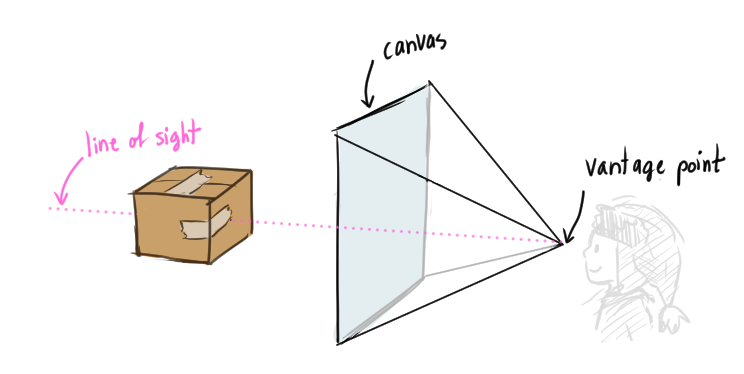
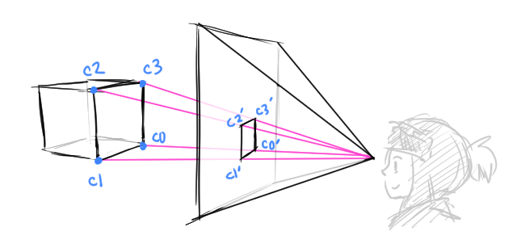
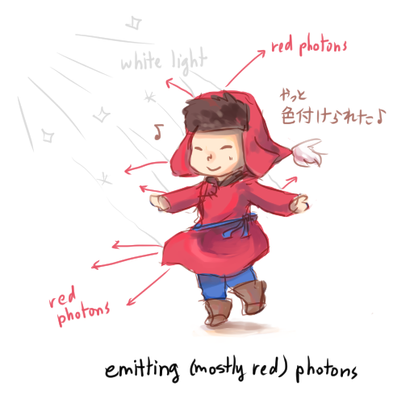

# [Introduction to Ray Tracing: A simple method for creating 3D images](https://www.scratchapixel.com/lessons/3d-basic-rendering/introduction-to-ray-tracing)

(ray tracing sounds like rail tracer)

How to convert a 3D scene into a 2-dimensional image.
* *ray-tracing* simulates physical phenomena that causes objects to be visible

## How does an image get created?
* We need a 2-dimensional surface where the image is generated
* Think of visualizing a picture on a slice of a pyramid, whose base is the *canvas* where the 2D image can be viewed
  * The pyramid's apex (the tip) is at our eye, which looks straight through the **line of sight** through the apex
    * The line of sight that hits the object we are seeing





The CG term of a painter's canvas (in the figure) is the **image plane**, which is a 2D surface to *project* our 3D scene onto

## Perspective Projection
How to draw a cube onto a canvas.
* Draw a line from each corner of the cube to the eye
  * Then mark on the *image plane*/canvas where the line from the corner intersects the image plane



Here we label the corners of the cube as `c0`, `c1`, `c2`, and `c3`:
* `c0'` is where the line between `c0` (from the cube) and the eye intersects the canvas
  * Same with the other points
* We connect points on the canvas if they form an edge

After this process, we get a 2D representation of the 3D cube on the canvas!

This process is called **perspective projection**.
* If we applied this process to all objects in the scene, then we can create the 2D image of the entire 3D scene that appears from the certain *vantage point* (where the eye is)
* Painters started to understand how this worked ~15 century

## Light and Color

After getting the outlines of our 3D objects onto our 2D canvas, we can now add color.

* An object's color/brightness is the result of lights interacting with the materials of the object
* Light is made up of **photons**
  * Travel and oscilate like sound waves, carry energy
  * Photons are emitted by light sources (ex. sun)

When photons hit an object, the photons can either be:
* absorbed
* reflected
* transmitted

The result can be a percentage of these (absorbed, reflected, transmitted) depending on the object material.
* An objects appearance on screen depends on how photons are effected when photons hit that object
* Regardless of the object, the number of photons hitting the object is always the sum of the number of photons absorbed, reflected, and transmitted
```
incoming_photons = absorbed_photons + reflected_photons + transmitted_photons
```

Two main categories of materials:
* **conductors** (...)
* **dielectrics**: electric insulators (ex. glass,plastic, wood, water)
  * Water is a pure electric insulator
  * Can be either transparent or opaque (not see-through, like wood)

All materials are transparent to some sort of electromagnetic radiation (ex. x-rays can pass through a body)

### How opaque and diffuse objects interact with light
* Simply, absorption of photos determine the object's color.
* White light is made up of "red", "green" and "blue" photons
  * When white light illuminates a red object, the absorption process filters out (or absorbs) the "green" and "blue" photons
  * We see this red object when these reflected "red" photons hit our eyes

    

Every point on the illuminated area on the object rediates (reflects) light rays in every direction
* Only one ray from each point strikes the eye *perpendicularly*, and therefore, the object can be seen by our eye

Our eyes are made of *photoreceptors* that converts light into neural signals
* Our brain can uses these signals to interpret the different shades and hues

More details in the [Mathematics of Shading(?)](https://www.scratchapixel.com/lessons/mathematics-physics-for-computer-graphics/mathematics-of-shading) (their link, like all their links, are broken...)

### The history of understanding light
* **Ibn al-Haytham** (c. 965-1039) was an Arab scientist who was the first to explain why we see objects
  * We can see objects because the light from the sun gets relfected off of objects and into our eyes, which forms images
*  We can simulate this process with a computer!

