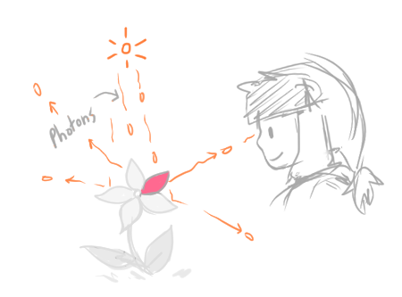
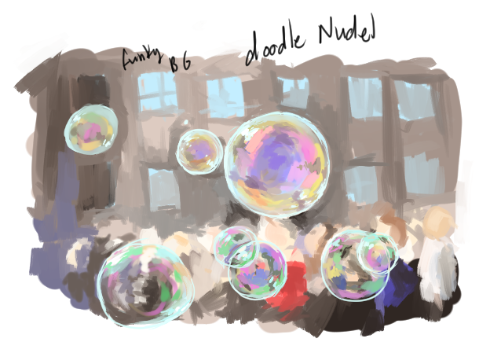
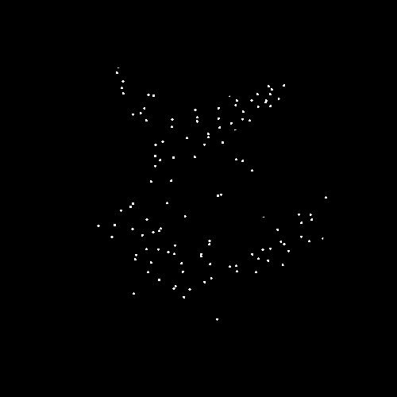
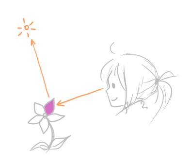
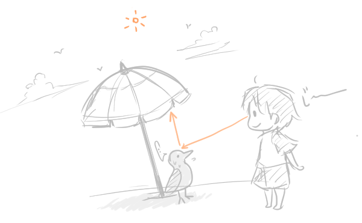
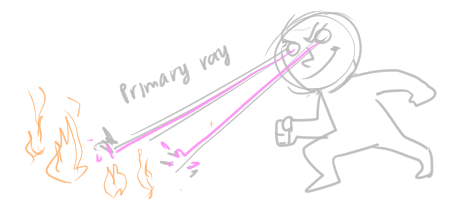

## [Raytracing Algorithm in a Nutshell](https://www.scratchapixel.com/lessons/3d-basic-rendering/introduction-to-ray-tracing/raytracing-algorithm-in-a-nutshell)

Ibn al-Haytham explains why we see objects, and two interesting remarks:
* Without light we cannot see objects
* Without objects in our environment, we cannot see light 🔦
  * Traveling through intergalactic space
  * If there is no matter around us, we cannot see photons (only darkness), even if photons are moving through space

(they never really formally explicitly tell you what ray-tracing *is*. **Ray tracing** is a CG technique that mimics the way light works in the real world ([from Nvidia](https://blogs.nvidia.com/blog/2018/08/01/ray-tracing-global-illumination-turner-whitted/)))

## Forward Tracing

Out of all the rays reflected by an object, only a select few of them ever reach our eyes.

Imagine a light source that emits a single photon at a time:
* The photon travels in a straight line until it hits that object (ignore photon absorption for now)
* The photon is then reflected in a random direction
* If that photon hits out eye, then we "see" that point on the object where that photon was reflected off of the object

Photons being reflected in "every possible direction" ~= "random"
* If we look at the *micro-structure" of an object that looks smooth to our eyes, it appears complex and not smooth at all
  * Photons are so small that they are affected by the micro-structure of an object

The *macro-structure* of an object can be organized into patterns, causing photons to be reflected in a certain  way. Interesting new terms to be visited later:
* anisotropic reflection
* iridescence
  * Rainbow-like play of color (bubbles, oil)

### "Seeing an object" in CG

In CG, our "eyes" translate to the *image plane* containing pixels.
* Emitted photons hit one of the many pixels on the image plane (analagous to a photon hitting our eye)
  * Each photon that hits a pixel will increase its brightness (value > 0)
* Process is repeated until all pixels are adjusted (? what does that mean)
* This entire process is called **forward ray tracing**
  * We follow the path of the photon *forward* from the light source to the observer

### Potential problems with forward ray tracing

In forward ray tracing, we assumed that all reflected photons hit our eye
  * Actual: rays are reflected in every possible direction, each having low chance of hitting our eye
    * Zillions of photons need to be emitted for at least one photon to hit our eye
    * This is how nature works but not practical to simulate on a computer
      * (Can QC do this? Well, I guess the classical side does it pretty amazingly anyway)
        * Ooooh [someone brought this question up in Blender](https://blenderartists.org/t/quantum-computing-for-raytracing-in-the-future/1269910/2)
        * [Quantum Supersampling (2016 SIGGRAPH)](https://vimeo.com/180284417)

Do we have to shoot photons in *all* random directions? Why not just in the direction of the "eye"?
* This only works for certain types of material where directionality is not impotant
  * Diffuse surfaces
  * A photon can be reflected in any direction within the hemisphere of the normal at that point
* *light-matter interaction* explains this further
* But we cannot use this method when
  * Ex. certain mirrors reflect photons in very precise directions

Even with diffuse surfaces, some areas may not get hit with a photon, and wouldn't be seen in the final image
* Shooting more photons will make the image more recognizable
* But no guarantee that *all* points on the object surface will get hit with a photon
  * In the programming perspective, we would have to check if all points have been hit to know when to stop the process, which is not realistic in a production setting
  * Finding ray-geometry intersections is also computationally expensive

Not all photons may hit the object, leaving points in the dark

(made with [ezgif](https://ezgif.com/))
* (takes me back to the deviantArt days,making those icons/avatars......., man I was such a copy-cat 😺)

**Forward ray-tracing**/**light tracing** (since we shoot rays from light) simulates the way light travels on a computer, but is not practical
* The seminal paper from 1980 ["An Improved Illumination Model for Shaded Display"](https://www.cs.drexel.edu/~david/Classes/Papers/p343-whitted.pdf) by Turner Whitted (an early CG pioneer) designed an approach that is better than forward tracing

## Backward Tracing

Instead of sending photons from light source to receptor (ex. eye), trace rays *backwards* from receptor to object.
* This is the *reverse* of what happens in nature
* This process is called **backward ray-tracing**, or **eye tracing** (since we shoot rays from our eyes)
* Need this process since trying to actually simulate nature on a computer isn't as fast/practical
  * This statement *screams* "QC to the rescue!"

Backward tracing process
* If ray hits an object, compute the amount of light the object receives at that point by throwing another ray (which can either be a **light ray** or a **shadow day**) from the hit point to the scene's light source
* If the "other ray" is obstructed by another object in the scene, the original hit point was in a *shadow*
  * No illumination (from light source) is received at the point
    * The "other ray" is then a **shadow ray** as opposed to a **light ray**

    

* The first ray that we shoot from our eye is called a **primary ray**/**visibility ray**/**camera ray**

### Terminology
Some authors may switch the name *forward tracing* to actually mean shooting rays from the eye, since it is the most common technique 😖 gr8.

* Better to explicitly call the technique "light and eye tracing" to avoid confusion
  * Often used in *bi-directional path tracing
    * See Light Transport chapter

## Conclusion
**path tracing**: shooting rays either from the light or from the eye

More fun phenomena
* *caustics*: when light rays are reflected and refracted from a surface
  * Glass of water
* *indirect illumination* reflection of light by other surfaces in the scene

