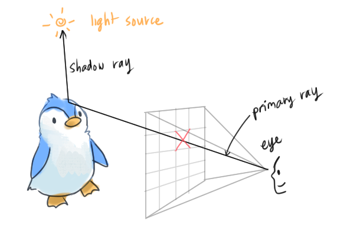
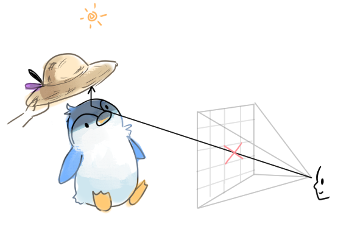

# [Implementing the Ray Tracing Algorithm](https://www.scratchapixel.com/lessons/3d-basic-rendering/introduction-to-ray-tracing/implementing-the-raytracing-algorithm)

The propagation of light in nature is many rays being emitted from light sources, being reflected off of objects until it reaches our eye
* A ray tracer simulates this effect in nature

Ray tracing algorithm
* Input: image made of pixels
  * For each pixel
    * Shoot a *primary ray* from the eye, through the center of the pixel, into the scene
      * This gives us the direction of the primary ray
    
        
    
    * Check if the primary ray intersects with any objects in the scene
      * Choose the intersected point of the other object that is closest to the eye
      * Then shoot a *shadow ray* from the intersection point to the light

        

    * If the ray does not intersect an object on its way to the light, the hit point is illuminated
      * Otherwise, cast a shadow ray

This technique was first described by [Arthur Appel (1969) "Some techniques for shading machine renderings of solids"](https://citeseerx.ist.psu.edu/viewdoc/download?doi=10.1.1.357.8940&rep=rep1&type=pdf)
* (OMGGG IBM Yorktown ああああああああ)
* Though the main drawback of this algorithm was its speed (also stated in the paper)
  * Most of the time is consumed in trying to find the point to point correspondence of the projection and the scene
* Very simple and easy to implement (as opposed to other renderers, like the scanline renderer)

Jim Kajiya, a pioneer in CG says "ray tracing is not slow - computers are".

* Ray-tracing is slower than the *z-buffer algorithm* (calculating the depth of an object)
  * But with today's computers, it's much better
    * A frame that used to take an hour to draw now takes a few minutes or less
  * Real-time and interactive ray-tracers are a big topic today

Rendering routine main processes:
1. *Visibility*: determine if a point is visible at a particular pixel
2. *Shading*

Many research beyond Appel's work tried to improve the performance of the ray-tracing algorithm
* New acceleration schemes + new technology helped make ray-tracing more practical and usable in production software
