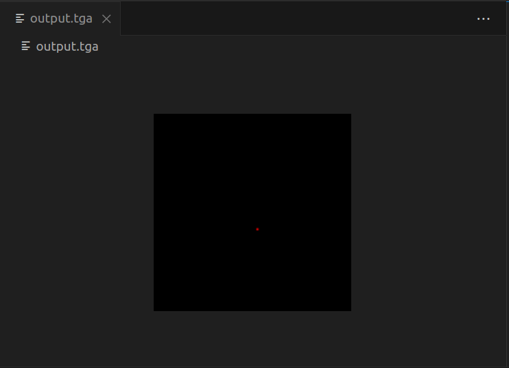

# Tinyrenderer

Following the [tinyrenderer tutorial](https://github.com/ssloy/tinyrenderer/wiki/Lesson-0:-getting-started): "How OpenGL works".

## [Lesson 0: Getting Started](https://github.com/ssloy/tinyrenderer/wiki/Lesson-0:-getting-started)

Download the files from [this commit](https://github.com/ssloy/tinyrenderer/tree/909fe20934ba5334144d2c748805690a1fa4c89f).

Make sure the code builds with `make`. Running the generated binary will create an image:

