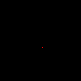
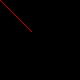
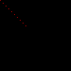
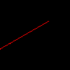

# Tinyrenderer

Following the [tinyrenderer tutorial](https://github.com/ssloy/tinyrenderer/wiki/Lesson-0:-getting-started): "How OpenGL works".

## [Lesson 0: Getting Started](https://github.com/ssloy/tinyrenderer/wiki/Lesson-0:-getting-started)

Download the files from [this commit](https://github.com/ssloy/tinyrenderer/tree/909fe20934ba5334144d2c748805690a1fa4c89f).

Make sure the code builds with `make`. Running the generated binary will create an image:

The top-left corner's coordinates is `(0,0)`. For an 100x100 pixel image, the bottom-right corner's coordinates is `(100, 100)`.

## [Lesson 1: Bresenham's Line Drawing Algorithm](https://github.com/ssloy/tinyrenderer/wiki/Lesson-1:-Bresenham%E2%80%99s-Line-Drawing-Algorithm)

### First Attempt with Step
`line_with_step`: Drawing a line from `(0,0)` and `(40,40)` with various step sizes between colored pixels.

With a step size of `0.01`:

With a step size of `0.1`:

Step size of `0.01` between `(0, 70)` and `(70,30)`:

